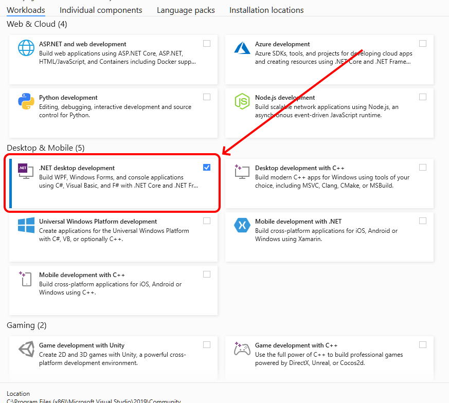
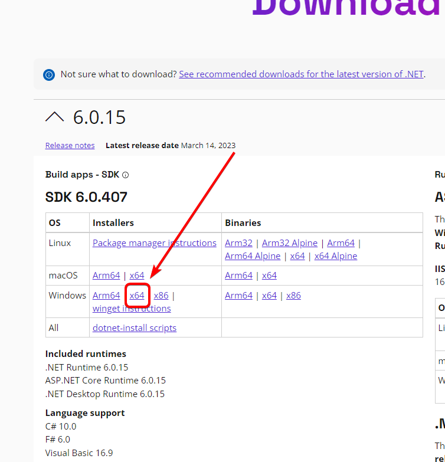

# 🖥️ Downloading FlatRedBall

### Prerequisites

#### 1 - Visual Studio 2022 or Newer

[https://visualstudio.microsoft.com/vs/community/](https://visualstudio.microsoft.com/vs/community/) Although it is possible to make games without Visual Studio or Rider, doing so requires advanced knowledge of MSBuild. We recommend downloading and installing Visual Studio Community which is free.


Mac and Linux users can use FlatRedBall, but in a code-only environment. The FlatRedBall Editor requires Windows.


At a minimum you need to install **.NET desktop development**.

#### 2. XNA 4.0 Redistributable

[https://www.microsoft.com/en-us/download/details.aspx?id=27598](https://www.microsoft.com/en-us/download/details.aspx?id=27598) Although this is not required to build and run FlatRedBall games, it is required to use Gum, which is the preferred FlatRedBall UI tool.

#### 3. .NET SDK

FlatRedBall projects are built with .NET 8 or newer:

[https://dotnet.microsoft.com/en-us/download/dotnet/8.0](https://dotnet.microsoft.com/en-us/download/dotnet/8.0)

You must also install the .NET 6 SDK even if you have .NET 8 installed. This may change in a future version of FlatRedBall:

[https://dotnet.microsoft.com/en-us/download/dotnet/6.0](https://dotnet.microsoft.com/en-us/download/dotnet/6.0)

Newer Versions of Visual Studio (as of version 17.5.1) install .NET SDK 7.0 or newer which have a bug preventing projects from being loaded in the FlatRedBall Editor. Therefore, you need to manually install .NET 6 SDK if you don't want to use .NET 8.

### Downloading FlatRedBall

The most common approach to making FlatRedBall games is to use the FlatRedBall Editor. The Editor can be downloaded from a pre-built .zip file, or it can be built from source. New users should download the pre-built .zip file.

### Downloading and Running FlatRedBall

1. Download the latest zip file from [https://files.flatredball.com/content/FrbXnaTemplates/DailyBuild/FRBDK.zip](https://files.flatredball.com/content/FrbXnaTemplates/DailyBuild/FRBDK.zip).&#x20;
   1. Alternatively, the FlatRedBall Editor (no additional tools) prebuilt can be downloaded from Github. This is not recommended for new users, but experienced users can replace the FlatRedball Glue folder with the contents from the built files: [https://github.com/vchelaru/FlatRedBall/actions](https://github.com/vchelaru/FlatRedBall/actions)
2. (Optional) Unblock the ZIP file.  This will prevent the windows protected your PC warning.\
   .png>)
   1. Right-click the ZIP file and chose Properties
   2. Check-mark the Unblock option and Click Apply
   3. Close the Properties window\

3.  Unzip the file after downloading

    <figure><figcaption>
Extract the FRBDK.zip file
</figcaption></figure>
4. Go to the folder where the .zip file unzipped to (by default called FRBDK)
5. Open the Run FlatRedBall.bat file (double click it)

If you see the **Windows protected your PC** dialog, click **More info** -> **Run Anyway**

The FlatRedBall Editor should appear.

