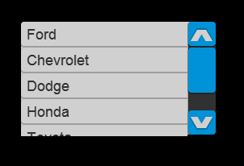
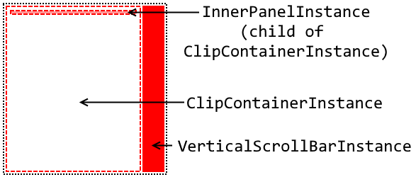

# ListBox

### Introduction

The ListBox is a scrollable view which displays multiple ListBoxItem instances. When one ListBoxItem is selected, the previously-selected ListBoxItem becomes deselected.

<figure><figcaption><p>ListBox Example</p></figcaption></figure>

ListBox inherits from [ScrollViewer](scrollviewer.md).

### Layout Requirements

The ListBox control requires:

* An object named **VerticalScrollBarInstance** which implements ScrollBarBehavior (is a ScrollBar)
* An object named **InnerPanelInstance** of any type (typically a Container)
* An object named **ClipContainerInstance** of any type (typically a Container with **ClipsChildren** set to true)

<figure><figcaption></figcaption></figure>

The requirements for the ListBox are identical to the requirements for the ScrollViewer control. For more information on requirements, see the ScrollViewer page: [http://flatredball.com/documentation/tutorials/flatredball-forms/forms-layout-in-gum/scrollviewer/](../../../documentation/tutorials/flatredball-forms/forms-layout-in-gum/scrollviewer.md)

### InnerPanelInstance and Children Layout

The ListBox control typically handles the creation and positioning of ListBoxItem instances. The InnerPanelInstance in the list box Gum component will typically use a **Children Layout** value of **TopToBottomStack.**

<figure><figcaption></figcaption></figure>

Alternatively the InnerPanelInstance can use a **Children Layout** value of **LeftToWriteStack** with the **Wraps Children** value set to true.


### Items

Items represents the data that the ListBox is managing. Items can either contain regular types (such as strings, ints, or classes representing data in your game like data for a car in a racing game), or instances of ListBoxItems. Whenever an object is added to the Items collection the list box will automatically update its visuals to display the newly-added object. If the newly-added object is a regular type, then the ListBox will internally construct a new ListBoxItem.

The most common types of items added to a ListBox are

* Strings - these display in the ListBox. Usually strings are used in ListBoxes when first learning how to use ListBoxes, to diagnose problems related to displaying items in a ListBox, or to add debug information to a game
* ViewModel - for final implementations, using ViewModels is recommended when populating ListBoxes.

### Items.Add with ListBoxItemGumType

Any object type can be added to a ListBox. The following code shows how to add strings to the Items property, resulting in the list box displaying a single entry for each item.

```csharp
var listBox = Forms.ListBoxInstance;

listBox.Items.Add("Ford");
listBox.Items.Add("Chevrolet");
listBox.Items.Add("Dodge");
listBox.Items.Add("Honda");
listBox.Items.Add("Toyota");
listBox.Items.Add("Mitsubishi");
```

### Customizing ListBoxItems using VisualTemplate

ListBoxItems can be customized using the VisualTemplate to customize how items in a ListBox are displayed. For more information on how to use Visual Template, see the [ListBox Templates](../../../tutorials/flatredball-forms/data-binding/03-templates.md) page.

### Selection

The selected item can be controlled using a number of properties.

#### SelectedItem

The SelectedItem property gets and sets the selected item. Setting this value will select the first matching instance found in the Items property. The following code example adds three strings, then selects the second one:

```csharp
listBox.Items.Add("a");
listBox.Items.Add("b");
listBox.Items.Add("c");

listBox.SelectedItem = "b";
```

Items can be deselected by setting the SelectedItem to null;

```csharp
listBox.SelectedItem = null;
```

SelectedIndex The SelectedIndex property gets and sets the index of the currently selected item. A value of -1 indicates no selection. The following code example shows how to deselect the selected item in a ListBox:

```csharp
listBox.SelectedIndex = -1;
```

### SelectionChanged Event

The SelectionChanged event is raised whenever a selection changes due to a mouse click or code change of the SelectedItem or SelectedIndex. The event provides a list of newly-selected items and deselected items. Note that at the time of this writing only a single item can be selected at a time, but future versions of FlatRedBall.Forms may add multi-selection support. The following code example shows how to react to the selection changing on a ListBox:

```csharp
void CustomInitialize()
{
    var listBox = Forms.ListBoxInstance;

    // Adding items omitted from example

    listBox.SelectionChanged += HandleSelectionChanged;
}

private void HandleSelectionChanged(object sender, SelectionChangedEventArgs args)
{
    foreach(var removed in args.RemovedItems)
    {
        FlatRedBall.Debugging.Debugger.CommandLineWrite("Deselected " + removed.ToString());
    }
    foreach (var added in args.AddedItems)
    {
        FlatRedBall.Debugging.Debugger.CommandLineWrite("Newly Selected " + added.ToString());
    }
}
```

<figure><figcaption></figcaption></figure>

The event handling the selection changing can also use the SelectedItem property, as shown in the following code:

```csharp
void CustomInitialize()
{
    var listBox = Forms.ListBoxInstance;

    // Adding items omitted from example

    listBox.SelectionChanged += HandleSelectionChanged;
}

private void HandleSelectionChanged(object sender, SelectionChangedEventArgs args)
{
    var listBox = sender as ListBox;
    
    // This is casted as an object, so you may need to cast it back to the expected type
    var selectedItem = listBox.SelectedItem;

}
```

### ScrollIntoView

The ScrollIntoView method scrolls the ListBox so that the argument item is in view. The argument object should be one of the items in the ListBox's Items property.

The following code shows how to bring an item into view, assuming ItemToBringIntoView is a valid instance inside the ListBox's Items list.

```csharp
Forms.ListBoxInstance.ScrollIntoView(ItemToBringIntoView);
```

