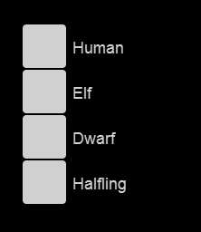
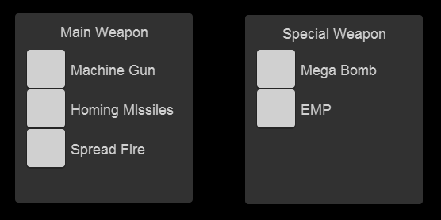

# RadioButton

### Introduction

The RadioButton control can be used to select from a number of options. RadioButton instances are grouped according to their parent and a group name. Only one RadioButton in a parent/group combination can be selected at once. Selecting another RadioButton in the same group will deselect other RadioButton instances.

<figure><figcaption></figcaption></figure>

### Layout Requirements

The RadioButton control has no requirements – an empty container is sufficient. [](../../../media/2017-12-img\_5a485e78076db.png)

### TextInstance

The RadioButton control can optionally include a Text instance named **TextInstance**. Setting the RadioButton control’s **Text** property changes the **TextInstance’s** displayed string.

### Groups and Parents

The default Group for RadioButton instances is an empty string. Therefore, all grouping is done by parent. This is sufficient for most cases as groups of radio buttons may need to be visually separated from one another, and this is often done by assigning different parents in Gum.

<figure><figcaption></figcaption></figure>

### Handling Events

The RadioButton class provides events for whenever it is checked, unchecked, or clicked (similar to the CheckBox class). The Checked and Unchecked events can be handled to respond to the specific state changing, as shown in the following code example:

```lang:c#
void CustomInitialize()
{
    var radioButton = TutorialScreenGum
        .GetGraphicalUiElementByName("RadioButtonInstance")
        .FormsControlAsObject as RadioButton;

    radioButton.Checked += HandleRadioButtonChecked;
    radioButton.Unchecked += HandleRadioButtonUnchecked;
}

private void HandleRadioButtonChecked(object sender, EventArgs e)
{
    // Perform checked-related logic
}

private void HandleRadioButtonUnchecked(object sender, EventArgs e)
{
    // Perform unchecked-related logic
}
```

RadioButton also exposes the more general Click event which can be used to handle any click regardless of IsChecked state, as shown in the following example:

```lang:c#
void CustomInitialize()
{
    var radioButton = TutorialScreenGum
        .GetGraphicalUiElementByName("RadioButtonInstance")
        .FormsControlAsObject as RadioButton;
 
    radioButton.Click += HanleRadioButtonClick;
}
 
private void HanleRadioButtonClick(object sender, EventArgs e)
{
    // Perform click-related logic
}
```
