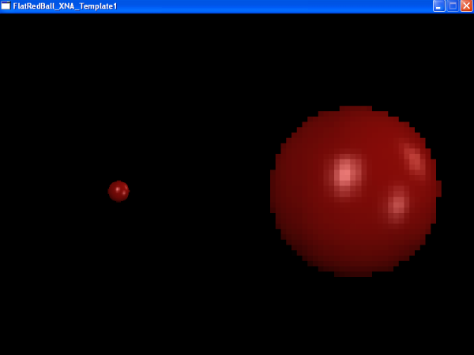

# camera

### Introduction

The Camera encapsulates functionality to simplify and control the display of a FlatRedBall application to the user. The camera controls view position, rotation, and background color. If the Camera is 3D, it can also control, field of view, and viewable distance. By default the camera in FlatRedBall looks down the negative Z axis - that is negative Z points away from the camera. Increasing the Camera's Z moves it backwards while decreasing moves it forward. Of course, if the Camera is rotated, the forward and backward directions change. Most games can change camera properties through the [FlatRedBall Editor's Camera Window](../../../glue-reference/camera.md). Alternatively, the Camera can be modified in code.

### Accessing the Camera

FlatRedBall projects automatically create a Camera which can be accessed by [Camera.Main](../../../frb/docs/index.php). The following code moves the Camera to X = 5:

```
Camera.Main.X = 5;
```

For more information see the [Camera.Main](../../../frb/docs/index.php) page. In most cases you will never need to create your own Camera - this one is the default camera that all single-Camera games use.

### Controlling the Camera

The camera inherits from the [PositionedObject](../../../frb/docs/index.php) class so it shares the same interface for positioning, rotation, and attachment. Camera movement is not noticeable without something visible in the scene to compare the movement against. The following code can be added to a Screen such as an empty Screen created in the FlatRedBall Editor: Add the following using statements:

```
using FlatRedBall.Input;
using Microsoft.Xna.Framework.Input;
```

Replace CustomInitialize and CustomActivity with the following code:

```
void CustomInitialize()
{
    // create a single Circle so we can see movement:
    var circle = new Circle();
    circle.Radius = 32;
    circle.Visible = true;

}

void CustomActivity(bool firstTimeCalled)
{
    float velocityMagnitude = 200;

    if (InputManager.Keyboard.KeyDown(Keys.Right))
        Camera.Main.XVelocity = velocityMagnitude;
    else if (InputManager.Keyboard.KeyDown(Keys.Left))
        Camera.Main.XVelocity = -velocityMagnitude;
    else
        Camera.Main.XVelocity = 0;

    if (InputManager.Keyboard.KeyDown(Keys.Up))
        Camera.Main.YVelocity = velocityMagnitude;
    else if (InputManager.Keyboard.KeyDown(Keys.Down))
        Camera.Main.YVelocity = -velocityMagnitude;
    else
        Camera.Main.YVelocity = 0;

}
```


<figure><figcaption></figcaption></figure>


### 2D Cameras and Pixels

For information about 2D coordinates and how to create 2D scenes, see the [2D In FlatRedBall tutorial](../../../frb/docs/index.php). To convert between world and pixel coordinates, see the [World and Screen Coordinates page](../../../frb/docs/index.php#World_and_Screen_Coordinates).

### Camera Edges

For information on finding the absolute coordinates of the edges of the Camera, see the [RelativeXEdgeAt](../../../frb/docs/index.php) article.

### Multiple Cameras

FlatRedBall supports multiple cameras for different viewports (split screen). The following code creates a Sprite and views it from two different cameras. In Initialize

```
 // Add a Sprite
 SpriteManager.AddSprite("redball.bmp");

 // We have one camera already made, so only one more is needed for split screen.
 string contentManagerName = "YourContentManager";
 Camera camera = new Camera(contentManagerName);
 // Put it as part of the SpriteManager's list
 SpriteManager.Cameras.Add(camera);

 // Now we adjust the viewports:
 SpriteManager.Cameras[0].SetSplitScreenViewport(Camera.SplitScreenViewport.LeftHalf);
 SpriteManager.Cameras[1].SetSplitScreenViewport(Camera.SplitScreenViewport.RightHalf);   

 // Move the camera on the right closer
 SpriteManager.Cameras[1].Z = 5;
```

 For info on the [content manager argument](../../../frb/docs/index.php) see the [FlatRedBall Content Manager wiki entry](../../../frb/docs/index.php).

#### Manually Setting Destination Rectangle

Every camera has a DestinationRectangle which defines where on the window it draws. When specifying the DestinationRectangle the top-left of the window is 0,0 and positive Y moves down. Assuming the window is 800 pixels wide and 600 pixels tall the following code creates a 50 pixel border around the DestinationRectangle:

```
// Will work with any camera but for this sample we'll use the default Camera
Camera camera = Camera.Main;
// 50 pixel border on each side decreases the dimensions by 100.
// 600 - 100 = 500
// 800 - 100 = 700
camera.DestinationRectangle = new Rectangle(50, 50, 700, 500);
```

For more information, see the [DestinationRectangle entry](../../../frb/docs/index.php).

### Related Tutorials

* [3D Camera Setup](../../../frb/docs/index.php)

### Extra Information

* [2D In FlatRedBall tutorial](../../../frb/docs/index.php)
* [Camera Layers](../../../frb/docs/index.php#Camera_Layers) - Camera Layers can be used to render objects to only one camera, such as HUDs.

\[subpages depth="1"]
