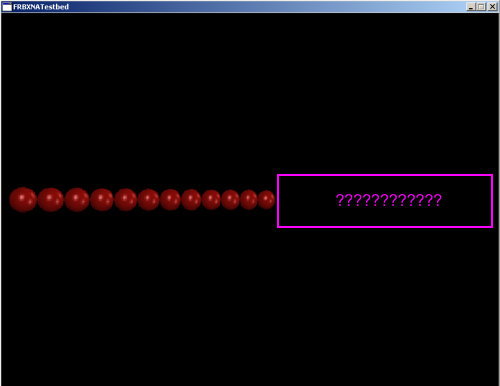

# CameraCullMode

### Introduction

The CameraCullMode property controls how the Camera _culls_ objects such as [Sprites](../sprite/). The process of culling is the removal of objects from rendering calls. Culling can improve your game's performance by not drawing objects which are out of view. However, culling may not be desirable if your game supports a rotated camera.

By default, CameraCullMode is set to CameraCullMode.UnrotatedDownZ, which means that the Camera will not draw objects which are outside of the calculated view of an un-rotated camera. If your game requires a rotating camera (such as a 3D game), then you may need to set CameraCullMode to None

CameraCullMode only culls objects based on their angle relative to the camera. It does not affect drawing as related to distance. For more information on distance-based culling, see the [FarClipPlane page](farclipplane.md).

### Available values

* UnrotatedDownZ (default)
* None

### CameraCullMode and multiple Cameras

Camera-based culling is performed just before rendering, which means an object can be culled in one Camera and not in another. In other words, culling will work appropriately with multiple Cameras when using split screens.

### Example

FlatRedBall XNA assumes that the current scene is being viewed directly down the negative Z axis (the default). With this assumption the engine culls out Sprites which do not fall in this visible area. The following code creates 200 Sprites which extend down the positive X axis. Because of culling only a few are visible. The camera is rotated to view into the distance. Notice that as it views to the right, sprites are not drawn.

```csharp
for (int i = 0; i < 200; i++)
{
    Sprite sprite = SpriteManager.AddSprite(RedBallTexture);
    sprite.X = i * 2;
}

Camera.Main.RotationYVelocity = -.1f;
```

<figure><figcaption><p>Sprites which are not drawn due to culling</p></figcaption></figure>

To fix this the Camera's CameraCullMode can be changed to None:

```csharp
for (int i = 0; i < 200; i++)
{
    Sprite sprite = SpriteManager.AddSprite("redball.bmp");
    sprite.X = i * 2;
}

Camera.Main.RotationYVelocity = -.1f;
Camera.Main.CameraCullMode = CameraCullMode.None;
```


