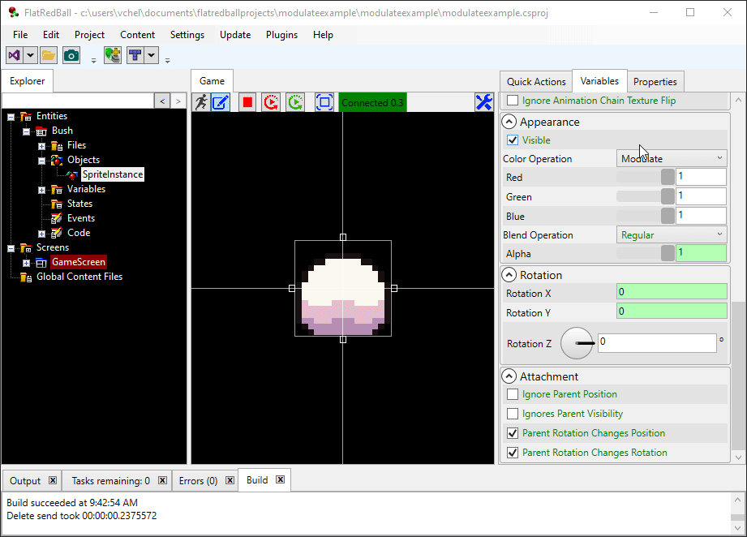

# Modulate

### Usage Example - Coloring Grayscale Image

Images which are grayscale can be colored using the Modulate color operation. This is a fast way to create variety for entities such as enemies or equipment. The following animation shows tinting using the FlatRedBall Editor on a Sprite with Modulate color operation.

<figure><figcaption></figcaption></figure>

### Code Example - Darkening

The following code creates 10 bears, starting with a color of pure black (0,0,0) and ending with white (1,1,1). The bears start dark (as if in shadow), then become progressively brighter.

```csharp
 Camera.Main.UsePixelCoordinates();
 Camera.Main.BackgroundColor = Color.Gray;

 for (int i = 0; i < 10; i++)
 {
     Sprite sprite = SpriteManager.AddSprite("Content/Bear.png");
     sprite.TextureScale = 1;
     sprite.X = -200 + 40 * i;

     sprite.ColorOperation = ColorOperation.Modulate;
     sprite.Red = i / 9.0f;
     sprite.Green = i / 9.0f;
     sprite.Blue = i / 9.0f;
 }
```


### Code Example - Tinting

The ColorOperation.Modulate option makes the drawn object "multiply" all of its texture color values by the Red, Green, and Blue of the IColorable. Setting a Modulate with Red, Green, Blue values of 1,1,1 will result in the object drawn regularly. Setting the values to .5, .5, .5 will result in the object being drawn at half-brightness. Setting values to 1,0,0 will result in only red values being drawn. Blue and green will draw as black. The following code example renders the Bear.png graphic with no Modulate operation, then with 3 different values to show how Modulate works. Image used: 

```csharp
// This makes it easier to see the blue bear:
Camera.Main.BackgroundColor = Color.Gray;

Sprite originalSprite = SpriteManager.AddSprite("Content/Bear.png");
originalSprite.Y = 60;

Sprite redSprite = SpriteManager.AddSprite("Content/Bear.png");
redSprite.TextureScale = 1;
redSprite.ColorOperation = ColorOperation.Modulate;
redSprite.Red = 1;
redSprite.Green = 0;
redSprite.Blue = 0;
redSprite.X = -60;

Sprite greenSprite = SpriteManager.AddSprite("Content/Bear.png");
greenSprite.TextureScale = 1;
greenSprite.ColorOperation = ColorOperation.Modulate;
greenSprite.Red = 0;
greenSprite.Green = 1;
greenSprite.Blue = 0;

Sprite blueSprite = SpriteManager.AddSprite("Content/Bear.png");
blueSprite.TextureScale = 1;
blueSprite.ColorOperation = ColorOperation.Modulate;
blueSprite.Red = 0;
blueSprite.Green = 0;
blueSprite.Blue = 1;
blueSprite.X = 60;
```


