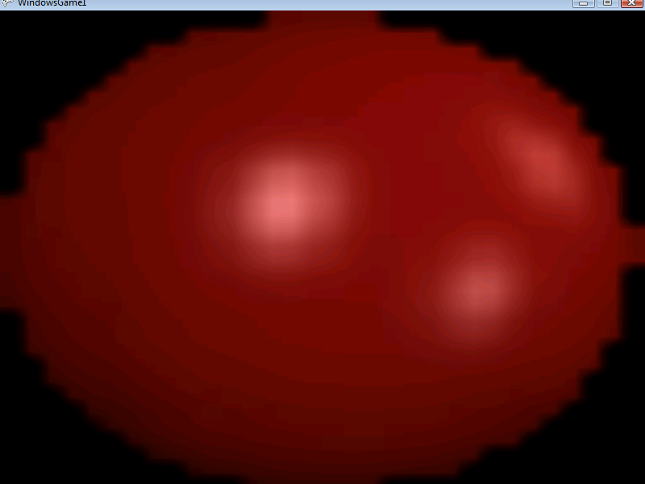

# TextureFilter

### Introduction

Filtering is the process of modifying how a texture is drawn to reduce the effect of pixellation when viewing a texture at a large size on screen.

If you are using the FlatRedBall Editor, then the default TextureFilter depends on the setting in the Display Settings. If you are using pure code, then the default is Linear.&#x20;

The GraphicsOptions.TextureFilter property can be used to control the default project-wide texture filter. Individual [Sprites](../../sprite/) can overwrite this value. For more information, see [the Sprite TextureFilter page](../../sprite/texturefilter.md).

### Code Example

Filtering can be controlled through the GraphicsOptions class. The following code creates a large Sprite which takes up the entire screen. Pressing the space key toggles the filtering between Linear (on) and Point (off).

```csharp
Sprite sprite = SpriteManager.AddSprite("redball.bmp");
sprite.Width = SpriteManager.Camera.RelativeXEdgeAt(0) * 2;
sprite.Height = SpriteManager.Camera.RelativeYEdgeAt(0) * 2;
```

**Add the following to Update:**

```csharp
if (InputManager.Keyboard.KeyPushed(Keys.Space))
{
    // If filtering is off
    if (FlatRedBallServices.GraphicsOptions.TextureFilter == TextureFilter.Point)
    {
        // Turn the filtering on so it smooths things
        FlatRedBallServices.GraphicsOptions.TextureFilter = TextureFilter.Linear;
    }
    else // If it's on
    {
        // Turn the filtering off so things look pixellated.
        FlatRedBallServices.GraphicsOptions.TextureFilter = TextureFilter.Point;
    }
}
```

TextureFilter.Linear:

&#x20;&#x20;

<figure><figcaption></figcaption></figure>

TextureFilter.Point:

&#x20;

<figure><figcaption></figcaption></figure>

### TextureFilter.Point and Tile Maps

If you are using tile maps (such as loading a .tmx file) then you will most likely need to set the texture filter to point. Otherwise you may see lines between your tiles:

```csharp
 FlatRedBallServices.GraphicsOptions.TextureFilter = TextureFilter.Point;
```
