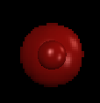

# Layer

### Introduction

Layers can be used to control the order of visual objects on screen. Typically objects with a larger Z value appear on top of objects with smaller Z values, but this relationship is only true if the objects are on the same layer.

Layers take priority over the Z value of objects when performing rendering. Typically Layers are used to force groups of visual objects to draw on top of other objects. For example, a HUD layer can be used to force HUD UI such as score and health bars to appear on top of everything else in a game regardless of Z value.&#x20;

Layers can be added in the FlatRedBall Editor or in code through the SpriteManager. For information on how to use Layers in the FRB Editor, see [the FlatRedBall Editor Layer page](../../../../glue-reference/objects/object-types/glue-reference-layer/).

### Example - Creating a Layer in FlatRedBall Editor

To create a new Layer:

1. Expand the Screen which should contain a layer. Note that layers are usually added to GameScreen and not Level screens unless you need to have a layer specific to a level.
2. Right-click on the **Objects** folder and select **Add Object**
3. Find the **Layer** type
4. Enter a name for the Layer
5. Click **OK**

<figure><figcaption><p>Adding a new Layer object to the GameScreen</p></figcaption></figure>

### Layer-able Types

The following types can be added to Layers:

* [FlatRedBall.Graphics.IDrawableBatch](../drawablebatch/)
* [FlatRedBall.Graphics.Text](../text/)
* [FlatRedBall.Math.Geometry.AxisAlignedCube](../../math/geometry/axisalignedcube/)
* [FlatRedBall.Math.Geometry.AxisAlignedRectangle](../../math/geometry/axisalignedrectangle/)
* [FlatRedBall.Math.Geometry.Capsule2D](../../math/geometry/capsule2d.md)
* [FlatRedBall.Math.Geometry.Circle](../../math/geometry/circle/)
* [FlatRedBall.Math.Geometry.Line](../../math/geometry/line/)
* [FlatRedBall.Math.Geometry.Polygon](../../content/polygon/)
* [FlatRedBall.Math.Geometry.Sphere](../../math/geometry/sphere.md)
* [FlatRedBall.Sprite](../../sprite/)

Additionally, Entities can be added to shapes through the FlatRedBall Editor, or through their MoveToLayer method.

### Understanding the purpose of Layers

Layers are used **only** to control the drawing order of objects. This means that layers have nothing to do with the position of the objects that they contain. For example, objects in an entity which are attached to the root entity can span multiple layers despite having their positions controlled by the parent/child relationship. For example we can consider a typical entity which is made up of three (3) objects:

* The Entity itself
* The visible representation which is attached to the Entity, such as a Sprite
* The collision object which is also attached to the Entity, such as an AxisAlignedRectangle

Of these three, only the visible representation needs to be layered. You **can** add the collision to a Layer, but this **does not have any impact on the behavior of your collision**. The only reason you might want to add the collision object to a layer is so it will be drawn if on the same layer as the visible representation if you desire to have it drawn for debugging reasons. To clarify, adding the collision to a Layer does not impact collision. Two entities on different Layers will still be able to have their collision objects collide. The collision objects do not consider Layers when performing collision.

### Code Example - Using Layers

In code, layers are created through the [SpriteManager](../../spritemanager/). The following code creates a layer and two [Sprites](../../sprite/). Although the [Sprite](../../sprite/) named nearSprite is closer than the [Sprite](../../sprite/) named farSprite, farSprite is not hidden by nearSprite.

```csharp
 Layer layer = SpriteManager.AddLayer();

 Texture2D texture = FlatRedBallServices.Load<Texture2D>("redball.bmp");

 Sprite nearSprite = SpriteManager.AddSprite(texture);
 nearSprite.Z = 20; // Brings it closer to the camera.

 Sprite farSprite = SpriteManager.AddSprite(texture);
 SpriteManager.AddToLayer(farSprite, layer); 

 // This puts the farSprite behind the nearSprite.
 farSprite.Z = -5;
```



### AddToLayer Method

* [SpriteManager.AddToLayer](../../../../frb/docs/index.php) - Responsible for adding SpriteFrames, Sprites, and IDrawableBatches to Layers.
* [TextManager.AddToLayer](../../../../frb/docs/index.php) - Responsible for adding Texts to Layers.

### Removing Objects from Layers

There are two ways to remove objects from Layers:

1. Completely remove the object from the engine and its Layer(s)
2. Remove the object **just from the Layer but keep it in the engine**

For reference, let's use the following setup to discuss this point:

```csharp
Texture2D texture = FlatRedBallServices.Load<Texture2D>("redball.bmp", "Global");
Layer layer = SpriteManager.AddLayer();

Sprite sprite = SpriteManager.AddSprite(texture, layer);
Text text = TextManager.AddText("I'm on a layer", layer);
```

#### 1. Completely remove the object

This is the most common method of removing an object. It's usually what you'll do if you're manually handling the removal of your objects (as opposed to letting Glue do it for you). To do this, simply use the manager removal methods:

```csharp
// Here's how to remove the Sprite
SpriteManager.RemoveSprite(sprite);

// Here's how to remove the Text object
TextManager.RemoveText(text);
// Everything is now gone from the engine and Layer
```

In other words, remove your objects just like normal - they'll automatically get removed from their Layers too.

#### 2. Remove the object just from the Layer

Objects can be removed from Layers through the Remove method.

```csharp
layer.Remove(sprite);
layer.Remove(text);
```

Now the [Sprite](../../../../frb/docs/index.php) and [Text](../../../../frb/docs/index.php) object are no longer on the layer, so they will not be drawn. However, the two objects have not been removed from their respective managers so they are still in memory and still managed every frame!

### Using Multiple Layers

Multiple layers can exist at a given time. Calling AddLayer multiple times creates multiple layers. The newest layer is always on top while the oldest is on bottom.

### Sorting objects within Layers

This section discusses sorting objects (such as [Sprites](../../../../frb/docs/index.php) within a Layer. For information on how to control the order that Layers are drawn, see [the SpriteManager MoveToBack and MoveToFront page](../../../../frb/docs/index.php). While Layers represent Lists in some ways, they cannot sort objects that they hold (like [SpriteLists](../../../../frb/docs/index.php) or [PositionedObjectLists](../../../../frb/docs/index.php)). The reason for this is because the internal [SpriteList](../../../../frb/docs/index.php) that a Layer references is used directly by the engine to draw the Layer. The engine may perform sorting on this list to ensure proper overlapping and to improve runtime performance so user-controlled sorting of the SpriteList may disrupt this behavior. If objects in a Layer need to be sorted they should be added to a separate [SpriteList](../../../../frb/docs/index.php) and sorted there.

### Camera Layers

See [FlatRedBall.Camera.Layers](../../camera/layers.md).

### Adding an Entity to a Layer

If you are using [Glue](../../../../frb/docs/index.php) then you can add an Entity to a Layer. See [this article](../../../../frb/docs/index.php#Adding_an_Entity_to_a_Layer) for information on this.

### Controlling Destination Rectangle

Layers will render to the full screen by default. Layers can be adjusted to only render to part of the Screen. For more information see [the LayerCameraSettings destination coordinate page](../../../../frb/docs/index.php).

### Adding Gum Screens to Layers

For more information, see the [Adding Gum Components to Layers](../../../../gum/how-to-add-components-to-layers.md) page.

