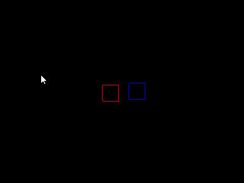

# RepositionDirections

### Introduction

The RepositionDirections member controls which direction colliding objects will be repositioned. Specifically,RepositionDirections is relevant when calling [CollideAgainstMove](../../../../../frb/docs/index.php) and [CollideAgainstBounce](../../../../../frb/docs/index.php). RepositionDirections is also used by CollisionRelationships when using platformer collision. By default standalone AxisAlignedRectangles have all directions active, meaning the rectangle will reposition objects in all directions (up, down, left, right). AxisAlignedRectangles which are part of TileShapeCollections automatically have their RepositionDirections adjusted to prevent snagging.

### Diagram Examples

The default value is _All_, which means that any objects colliding with the AxisAlignedRectangle can be moved in any of the four directions (Up, Down, Left, and Right) as shown in the following diagram:


RepositionDirections can be changed to any of the four cardinal directions, as shown in the following code:

```csharp
RectangleInstance.RepositionDirections = RepositionDirections.Up;
```

The code above results in all objects being moved upward:


RepositionDirections can be combined with the | (or) operator, as shown in the following code:

```csharp
RectangleInstance.RepositionDirections = RepositionDirections.Left | RepositionDirections.Down;
```


### Code Example - RepositionDirections on Static Rectangle

This example shows how RepositionDirections modifies the CollideAgainstMove method. It uses two rectangles:

* RedRectangle
* BlueRectangle

These are created in Glue so the screen starts as shown in the following image:


**RepositionDirections** value can be adjusted in code or in Glue. Typically this property is adjusted in code, so this example uses the following code:

```csharp
void CustomInitialize()
{
    BlueRectangle.RepositionDirections = RepositionDirections.Left;
}

void CustomActivity(bool firstTimeCalled)
{
    var keyboard = InputManager.Keyboard;
    keyboard.ControlPositionedObject(RedRectangle);
    RedRectangle.CollideAgainstMove(BlueRectangle, 0, 1);
}
```

Notice that when the first rectangle is moved (with the keyboard), it will only be repositioned to the left.

<figure><figcaption></figcaption></figure>

### AxisAlignedRectangle vs. AxisAlignedRectangle

If two AxisAlignedRectangle instances are colliding against each other, then the RepositionDirection of both rectangles are considered. For example, consider the following situation:


For this example the red rectangle on the left will be called RedRectangle and the blue rectangle on the right will be called BlueRectangle. We'll assume that the BlueRectangle's RepositionDirection value is set to RepositionDirection.All. We'll also use the following collision code between the two:

```csharp
// The red has a mass of 0, so it will get pushed, blue will stay in the same place
RedRectangle.CollideAgainstMove(BlueRectangle, 0, 1);
```

By default, the red rectangle will be pushed to the left so it no longer overlaps the blue rectangle. Of course, this depends on the following two conditions:

1. That BlueRectangle has a RepositionDirection including RepositionDirection.Left
2. That RedRectangle has a RepositionDirection including RepositionDirection.Right

For the default separation to occur, the blue must be able to reposition to its left and the red must be able to reposition to its right. In other words, both rectangles must have opposing RepositionDirection values for a reposition to occur. If either is missing, then other directions will be checked. For example, consider the following code:

```csharp
BlueRectangle.RepositionDirection = RepositionDirection.Right;
```

This code would result in BlueRectangle only being able to reposition to the right when a collision occurred, resulting in RedRectangle being moved all the way to the right side of BlueRectangle.

### Cloud Collision

Setting a RepositionDirection of Up can help with cloud collisions. Assuming MyPlatform is a valid AxisAlignedRectangle:

```csharp
MyPlatform.RepositionDirections = RepositionDirections.Up;
```

### None and CollideAgainstMove/CollideAgainstBounce

RepositionDirections defines which direction objects will move in when either CollideAgainstMove or CollideAgainstBounce are called. If a value of _None_ is set, then CollideAgainstMove and CollideAgainstBounce will not change the position or velocity of either of the colliding objects.

### RepositionDirections and TileShapeCollections

The use of RepositionDirections is critical for proper collision when using TileShapeCollections. For simple situations, a developer does not need to understand the RepositionDirections behavior that is happening when creating TileShapeCollections. This section discusses the behavior of RepositionDirections in TileShapeCollections. To begin, consider a TileShapeCollection which contains a single AxisAlignedRectangle. In this case, the rectangle will have all four RepositionDirections as shown by red arrows.


If a second rectangle is added to the first, then both of them remove their _inward_ reposition directions. This is important to prevent _collision snagging_ - the stopping of a moving object when moving across a smooth surface created by multiple rectangles.


As more rectangles are added, the TileShapeCollection adjusts the RepositionDirections of each to prevent snagging. Usually this happens automatically and no custom code is needed.


### Code Example - Detecting Corners

The RepositionDirections property on AxisAlignedRectangles in a TileShapeCollection can tell you if a rectangle is a corner or part of a flat surface. As shown above, corners have at least two adjacent reposition directions. Since RepositionDirections is a bitfield, then the logical or can be used to test if an AxisAlignedRectangle is a corner, as shown in the following code.

```csharp
bool IsCorner(AxisAlignedRectangle rectangle)
{
    var repositionDirections = rectangle.RepositionDirections;

    return 
        // Top-left corner:
        (repositionDirections.HasFlag(RepositionDirections.Up) && repositionDirections.HasFlag(RepositionDirections.Left)) ||
        // Bottom-left corner:
        (repositionDirections.HasFlag(RepositionDirections.Left) && repositionDirections.HasFlag(RepositionDirections.Down)) ||
        // Bottom-right corner:
        (repositionDirections.HasFlag(RepositionDirections.Down) && repositionDirections.HasFlag(RepositionDirections.Right)) ||
        // Top-right corner:
        (repositionDirections.HasFlag(RepositionDirections.Right) && repositionDirections.HasFlag(RepositionDirections.Up));
}
```
