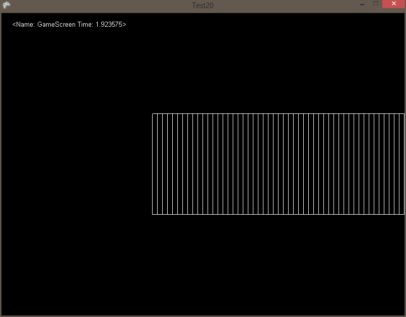
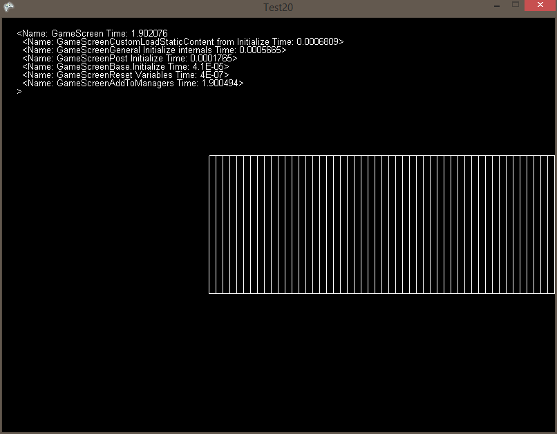
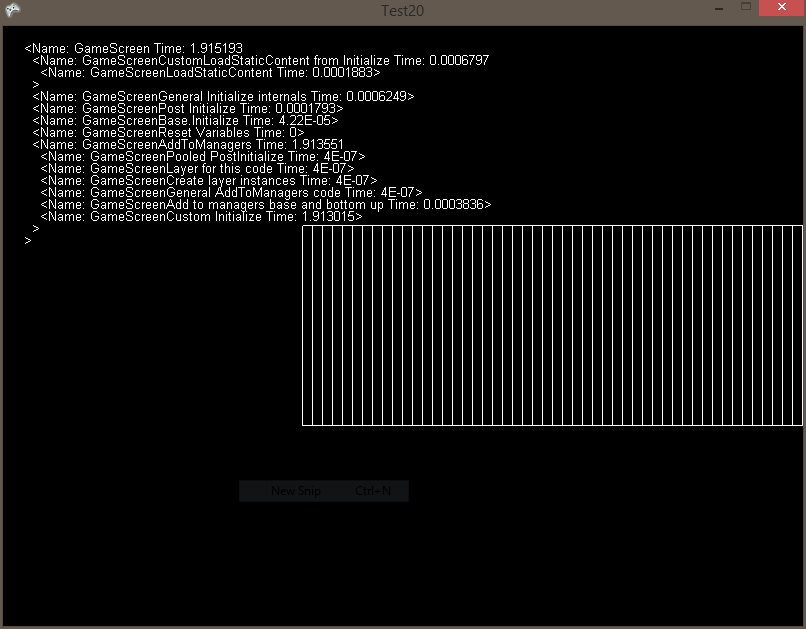

# ToStringVerbose

### Introduction

ToStringVerbose returns information about the Section that the function is being called on. This can be used to get information about the Section in a human-readable format similar to XML.

### depth parameter

You can use the depth parameter to limit how much information is being displayed. The following shows how this works:

```
mSection.ToStringVerbose(1);
```



```
mSection.ToStringVerbose(2);
```



```
mSection.ToStringVerbose(3);
```


