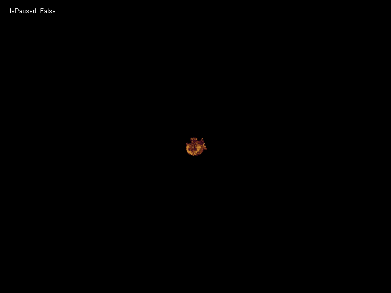

# PauseThisScreen

### Introduction

PauseThisScreen can be used to implement pausing. In many cases, this function will effectively provide pause implementation for games.

### Example Usage - Pausing With the Keyboard

The following code shows how to pause and unpause the screen using a gamepad's Start button.

```csharp
void CustomInitialize()
{
    // start spinning the sprite
    SpriteInstance.RotationZVelocity = 3;
}

void CustomActivity(bool firstTimeCalled)
{
    FlatRedBall.Debugging.Debugger.Write("IsPaused: " + this.IsPaused);
    if (InputManager.Xbox360GamePads[0].ButtonPushed(Xbox360GamePad.Button.Start))
    {
        if(IsPaused)
        {
            UnpauseThisScreen();
        }
        else
        {
            PauseThisScreen();
        }
    }
}
```

When the game is paused, the Sprite automatically stops rotating and resumes when the game is unpaused.

<figure><figcaption><p>FlatRedBall Sprite pausing by stopping RotationZVelocity</p></figcaption></figure>

### Applying Movement After Pause

When a Screen is paused, the underlying engine logic does not stop. Rather, the velocity of all objects is stopped and stored in instructions. When the screen is unpaused, all velocity values are re-applied. This means that if a velocity is changed after a screen is paused, the object which has been given velocity (or acceleration) will continue to operate while everything else remains paused. Furthermore, whenever a Screen is paused, its CustomActivity continues to be called every frame even while paused. Therefore, you can perform additional logic after a pause.

### Example - Applying Movement After Pause

The following code assumes an Entity named Ball. Clicking the cursor creates a new Ball which falls. Pressing the Space toggles pause. Notice that pausing the game will pause all existing entities, but new entities created after a pause will fall normally.

```csharp
void CustomInitialize()
{
    FlatRedBallServices.Game.IsMouseVisible = true;
}

void CustomActivity(bool firstTimeCalled)
{
    var cursor = GuiManager.Cursor;

    if(cursor.PrimaryClick)
    {
        var position = cursor.WorldPosition.ToVector3();
        var ball = BallFactory.CreateNew(position);
        ball.YAcceleration = -50;
    }

    if(InputManager.Keyboard.KeyPushed(Microsoft.Xna.Framework.Input.Keys.Space))
    {
        if(this.IsPaused)
        {
            UnpauseThisScreen();
        }
        else
        {
            PauseThisScreen();
        }
    }
}
```

<figure><figcaption><p>Circles added after pausing continue to fall</p></figcaption></figure>

### Example - Playing Gum Animations After Pausing

Gum animations internally create Tweeners on the TweenerManager. When the Screen is paused, all Tweeners are paused. If your game includes a Gum object which animates when the game is paused (such as a menu sliding on the screen), you can play the animation after the PauseThisScreen call and the animation will still play normally.

The following code animates a button on-screen after the game is paused.

```csharp
void CustomInitialize()
{
    GumScreen.CurrentButtonPositionState = GumRuntimes.GameScreenGumRuntime.ButtonPosition.OffScreen;
}

void CustomActivity(bool firstTimeCalled)
{
    if (InputManager.Keyboard.KeyPushed(Microsoft.Xna.Framework.Input.Keys.Escape))
    {
        if (IsPaused)
        {
            UnpauseThisScreen();
            GumScreen.SlideOffAnimation.Play();
            Forms.ButtonInstance.Text = "Unpaused";
        }
        else
        {
            PauseThisScreen();
 
            // The animation must be played after the screen is paused
            // or else it gets paused too.
            GumScreen.SlideOnAnimation.Play();
            Forms.ButtonInstance.Text = "Paused";
        }
    }
}
```

<figure><figcaption><p>Button animating after the screen is paused</p></figcaption></figure>

If you have animations which should persist through pausing, see the ObjectsIgnoringPausing section below.

### InstructionManager.ObjectsIgnoringPausing

Objects which do not inherit from the PositionedObject class can be added to the InstructionManager.ObjectsIgnoringPausing so they are ignored during pausing. For a detailed discussion of when to use ObjectsIgnoringPausing, see the [ObjectsIgnoringPausing](../../instructions/instructionmanager/objectsignoringpausing.md) page.

### Example - Playing Gum Animations when Paused

Calling PauseThisScreen also pauses the TweenerManager, which inturn pauses all Gum animations. Animations can be excluded from this pausing by adding the animation to the InstructionManager.ObjectsIgnoringPausing. Note that the animation must be added, not the Gum or Forms object.

The following code begins a Button's looping animation in CustomInitialize. Its animation is added to InstructionManager.ObjectsIgnoringPausing which results in the button continuing to animate even if the game is paused.

```csharp
void CustomInitialize()
{
    GumScreen.ButtonInstance.GrowShrinkAnimation.Play();
    InstructionManager.ObjectsIgnoringPausing.Add(
        GumScreen.ButtonInstance.GrowShrinkAnimation);

    // Forms.ButtonInstance is the Forms wrapper for the 
    // GumScreen.ButtonInstance.
    Forms.ButtonInstance.Text = "Unpaused";
}

void CustomActivity(bool firstTimeCalled)
{
    if (InputManager.Keyboard.KeyPushed(Microsoft.Xna.Framework.Input.Keys.Escape))
    {
        if (IsPaused)
        {
            UnpauseThisScreen();
            Forms.ButtonInstance.Text = "Unpaused";
        }
        else
        {
            PauseThisScreen();
            Forms.ButtonInstance.Text = "Paused";
        }
    }
}
```

<figure><figcaption><p>Pausing the screen does not stop the button's animation</p></figcaption></figure>

Notice that when the game is paused the player's movement stops but the Button continues to animate.
