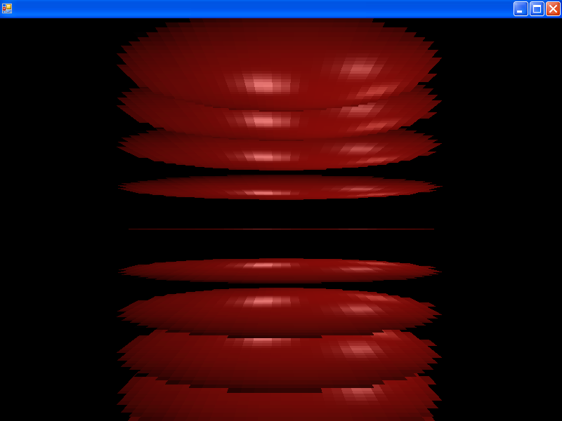

# OrderedSortType

### Introduction

The OrderedSortType property controls how [Sprites](../../sprite/) and [IDrawableBatches](../../graphics/drawablebatch/) are ordered when they are drawn. [Z Buffered Sprites](../../../../frb/docs/index.php) do not use this property when drawing. The following available options exist:

|                            |                                                                                                                                                                                                                                                                                                                                                         |
| -------------------------- | ------------------------------------------------------------------------------------------------------------------------------------------------------------------------------------------------------------------------------------------------------------------------------------------------------------------------------------------------------- |
| SortType                   | Description                                                                                                                                                                                                                                                                                                                                             |
| None                       | No sorting will be performed. Objects will be drawn in the order that they have been added to the SpriteManager.                                                                                                                                                                                                                                        |
| Z                          | **(Default)** Objects will be sorted by their Z value. Objects further away (negative Z) will appear first in the list.                                                                                                                                                                                                                                 |
| DistanceFromCamera         | Objects will be sorted by their distance from the [Camera](../../../../frb/docs/index.php)                                                                                                                                                                                                                                                              |
| DistanceAlongForwardVector | Objects will be sorted by their distance from the [Camera](../../../../frb/docs/index.php) along a projection that is parallel to the [Camera's](../../../../frb/docs/index.php) forward vector. This is useful for sorting billboarded [Sprite](../../../../frb/docs/index.php) properly when the [Camera](../../../../frb/docs/index.php) is rotated. |
| ZSecondaryParentY          | Sorts objects primarily by their Z value then secondarily by their [TopParent's](../../../../frb/docs/index.php) Y value. This can be used to control how [Sprites](../../../../frb/docs/index.php) overlap in 3/4 view games. See below for more information on sorting between Sprite and IDrawableBatch instances.                                   |
| CustomComparer             | Sorts objects based off of the [Renderer's](../../../../frb/docs/index.php) SpriteComparer property. If CustomComparer is used but no SpriteComparer is set, then the default SortType.Z will be used.                                                                                                                                                  |

### Usage

The following code sets the SpriteManager's OrderedSortType to sort by distance from camera:

```csharp
SpriteManager.OrderedSortType = SortType.DistanceFromCamera;
```

### Code Example

The following code creates 10 [Sprites](../../../../frb/docs/index.php), rotates them on the X axis, and sizes them to be a little larger so they overlap. Setting the OrderedSortType to DistanceFromCamera results in the [Sprites](../../../../frb/docs/index.php) overlapping properly whether the [Camera](../../../../frb/docs/index.php) is above or below the [Sprites](../../../../frb/docs/index.php).

```
 for (int i = 0; i < 10; i++)
 {
     Sprite sprite = SpriteManager.AddSprite("redball.bmp");
     sprite.Y = - 15 + 3 * i;
     sprite.ScaleX = sprite.ScaleY = 12f;
     sprite.RotationX = 1.57f;
 }

 SpriteManager.OrderedSortType = SortType.DistanceFromCamera;
```


### ZSecondaryParentY Details

The ZSecondaryParentY sort type is useful for top down and 3/4 view games. It allows moving objects (such as character entities) to be sorted based on their Y.


This is recommended for top-down and 3/4 view games. Note that Sprites use this sorting type only if they have the same Z. Therefore, if your entities have mulitple sprites with different Z values, they will interlace with other instances of the same entity.

For example if a character has a BodySprite and ShadowSprite, the ShadowSprite may have a Z value of -0.1 so that it always sorts behind the BodySprite of all other instances of the same entity type.

The following code shows how to set the OrderedSortType to ZSecondaryParentY:

```csharp
SpriteManager.OrderedSortType = SortType.ZSecondaryParentY;
```

#### Using Entities to Set Sprite Origin

For Sprites, the sorting is performed according to the sprite's parent. This allows sorting to be performed at a point other than the Sprite's origin (center) for more natural sorting. For example, consider a game with units with different sizes. In this situation, developers are advised to align the Sprite objects to the bottom of the entity. For example, the red X marks the origin of the entity:


If these origins are used, then units will sort properly according to where they are "standing" as shown in the following image:


#### IDrawableBatch Sorting Details

The name ZSecondaryParentY suggests that objects are sorted by their Z value, then secondarily by their parents' Y value. Using a parent object (such as an entity) to control the sorting of a Sprite is useful (as shown above). Although IDrawableBatch implementations can have parents (especially if inheriting PositionedObject), IDrawableBatches are not required to have a parent. Therefore, the secondary sorting for IDrawableBatch instances is done by the Y property. While this limitation prevents using entities to set the origin of an IDrawableBatch, this can be resolved by offsetting the rendering of an IDrawableBatch so that its position marks its bottom. Furthermore, IDrawableBatch instances and Sprite will sort within the same category using Y values, but then Sprite vs. IDrawableBatch rendering is only performed by the Z value, even if the sort type is set to ZSecondaryParentY. If your game requires sorting Sprite vs. IDrawableBatch instances, you may need to adjust their Z value to force a particular sorting rather than relying on the Z value, or you may need to move all of your rendering to one type of object (either all Sprite or all IDrawableBatch).

### Example with default OrderedSortType

The default OrderedSortType is SortType.Z. This sort type will result in [Sprites](../../../../frb/docs/index.php) overlapping incorrectly with the above example. To see the difference, replace the above code with:

```csharp
 for (int i = 0; i < 10; i++)
 {
     Sprite sprite = SpriteManager.AddSprite("redball.bmp");
     sprite.Y = - 15 + 3 * i;
     sprite.ScaleX = sprite.ScaleY = 12f;
     sprite.RotationX = 1.57f;
 }

 // SortType.Z is the default value, but we'll explicitly set it anyway
 SpriteManager.OrderedSortType = SortType.Z;
```

&#x20;

<figure><figcaption></figcaption></figure>

Since all [Sprites](../../../../frb/docs/index.php) have an equal Z value (default of 0), then they are drawn in the order that they were added to the SpriteManager; from bottom-up. That means that the [Sprites](../../../../frb/docs/index.php) seen from below (at the top of the screen) will appear to overlap incorrectly.

### CustomComparer

The SortType.CustomComparer allows you to define custom sorting logic for your Sprites. The following shows how to create and use an IComparer that sorts all ordered Sprites along their X axis: Add the following using statement:

```csharp
using FlatRedBall.Graphics
```

Add the following to Initialize after initializing FlatRedBall:

```csharp
for (int i = 0; i < 500; i++)
{
    Sprite sprite = SpriteManager.AddSprite("redball.bmp");
    sprite.ScaleX = 3;
    sprite.ScaleY = 3;
    SpriteManager.Camera.PositionRandomlyInView(sprite, 40, 40);
}

SpriteManager.OrderedSortType = SortType.CustomComparer;
Renderer.SpriteComparer = new SortByX();
```

Define the SortByX class:

```csharp
public class SortByX : IComparer<Sprite>
{
    public int Compare(Sprite first, Sprite second)
    {
        return first.Position.X.CompareTo(second.Position.X);
    }
}
```

```csharp
SpriteManager.OrderedSortType = SortType.DistanceFromCamera;
```


### Sort Type Performance

For simple games (or on faster platforms) the OrderedSortType will not have much impact on performance. However, it may be useful to adjust your sort type if possible for performance if you suspect that the sort type is impacting your frame rate. The fastest sort type is OrderedSortType.Z. This is a stable sorting algorithm performing O(n) operations, and each operation is simply a comparison of Z values. The next fastest is OrderedSortType.ZSecondaryParentY which is a stable sorting algorithm which performs simple comparisons, but it must do two passes to sort first along Z, then along the Parent Y. OrderedSortType.DistanceFromCamera is a stable sort also performong O(n) operations, but requies math operations for comparison. The slowest sort type is OrderedSortType.DistanceAlongForwardVector. Due to floating point errors this is not guaranteed to be a stable sort which hurts its performance. It must also perform numerous math operations per Sprite prior to performing sorting so it can be expensive. The performance of custom sorting is not defined because any type of sorting can be performed in custom code; however, this type of sorting is not stable and uses a binary sorting algorithm meaning it performs O(n\*log(n)) operations.
