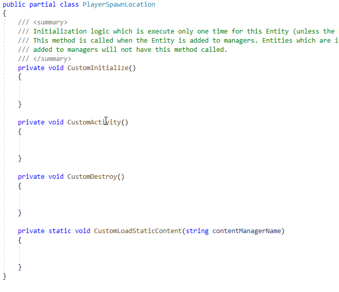

# EditorVisuals

### Introduction

The EditorVisuals class provides a way to display information on screen. Examples of common EditorVisuals usage include:

* Displaying the contents of a treasure chest as an image or text
* Displaying an object's name to differentiate objects with similar visuals
* Displaying error text if an object is configured incorrectly
* Displaying the connection between two instances, such as a switch and door
* Displaying an enemy's movement path
* Displaying triggers

EditorVisuals provides a simple interface for displaying common FlatRedBall objects such as Sprites, Lines, and Text objects. Despite the name EditorVisuals suggesting edit mode, this class can be used to provide visuals whether in debug mode or not. Keep in mind that EditorVisuals may have a slightly higher overhead compared to adding objects directly to entities in the FlatRedBall Editor, so it should only be used during development and not in the final product.

### Setup

To view EditorVisuals:

1.  Your game must have edit mode enabled

    
2.  (Optionally) Your game can be running in edit mode. As mentioned above, EditorVisuals can be used when the game is running normally as well

    

If you are creating visuals which are specifically for edit mode, you can make your calls in CustomActivityEditMode in either screens or entities. For example, the following image displays information about the Spawner and the direction that newly-spawned enemies appear in game:


### CustomActivityEditMode

Every entity and screen can support displaying information in edit mode. The first step is to add a CustomActivityEditMode method. Generated code is already prepared to call this (it is a partial method), so once it is added, it will be called in edit mode. Visual Studio will help create this method if the word **partial** is written in a screen or entity.

<figure><figcaption><p>CustomActivityEditMode is a partial method which can be implemented in any Screen or Entity</p></figcaption></figure>

Once the CustomActivityEditMode method has been added, calls to EditorVisuals can be used to display information in the game when it is running in edit mode. For example, the following can be added to an entity to display its name:

```csharp
partial void CustomActivityEditMode()
{
    var whatToDisplay = this.Name;
    if(this.Name == null)
    {
        whatToDisplay = "<no name>";
    }
    GlueControl.Editing.EditorVisuals.Text(whatToDisplay, this.Position);
}
```

If the entity is viewed in edit mode, it displays "\<no name>".


If instances of this entity are added to a screen, the name will be displayed for each instance.


### Code Example - Optionally Displaying Information Using the Keyboard

CustomActivityEditMode has access to all FlatRedBall calls. For example, the following code uses the keyboard and cursor to display the cursor position.

```csharp
// This is added to a Screen 
partial void CustomActivityEditMode()
{
    if(InputManager.Keyboard.KeyDown(Microsoft.Xna.Framework.Input.Keys.C))
    {
        var cursor = GuiManager.Cursor;
        var text = $"{cursor.WorldX}, {cursor.WorldY}";

        GlueControl.Editing.EditorVisuals.Text(text, cursor.WorldPosition.ToVector3());
    }
}
```

<figure><figcaption></figcaption></figure>
