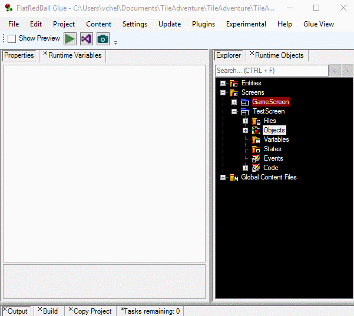

# text

### Introduction

FlatRedBall Text objects can be used to display information to the player such as current score or character dialog. Glue supports creating and editing Text objects in screens and entities.

### Creating a Text Object

To create a Text object in Glue:

1. Right-click on the Object item in a screen or entity
2. Select Add Object
3. Select the "FlatRedBall or Custom Type" option
4. Scroll down and select the "Text" type
5. Click OK

 To see the Text object:

1. Select the Text object
2. Set its Display Text value to some value like "Hello"
3.  Click the **Preview** checkbox in Glue

    

### Common Text Usage

Since Text objects are usually used for game UI, the following properties are usually set in Glue:

* [LayerOn](layeron.md) - Text objects are usually placed on a UI or HUD layer
* [AttachToCamera](glue-reference-attachtocamera.md) - Text objects are usually displayed in a fixed position on screen

&#x20;
