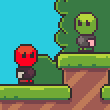
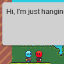
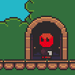
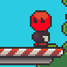

# tutorials

### Introduction

[Introduction to FlatRedBall](introduction-to-flatredball.md) This guide explores concepts in FlatRedBall. Start here if you want to know what it's all about! &#x20;

###

### Step-by-Step Game Tutorials

These tutorials walk you through creating a full game from scratch.

[Beefball](beefball.md) Beefball is a local multi-player game similar to air hockey. This tutorial provides step-by-step instructions for creating your first FlatRedBall project. &#x20;

### Platformer tutorials

Combine Tiled with a platformer entity to create a platformer game.

[Platformer Basics](platformer-plugin/platformer-basics.md) Introduction to working with platformers in Glue. &#x20;

[Ground Type and Water Movement](platformer-plugin/ground-type-and-water-movement.md) Change platformer player’s movement in response to various ground types (such as ice). &#x20;

[Animation and Platformer Values](platformer-plugin/platformer-animations-values.md) Control platformer animation and change values according to input (such as a run button and ducking). &#x20;

[Enemy Movement](platformer-plugin/enemy-movement.md) Create enemy movement in a platformer game. &#x20;

[Multiple Players](platformer-plugin/multiple-players.md) Walkthrough of a local multiplayer platformer. &#x20;

[NPC Dialog](platformer-plugin/npc-dialog.md) Walkthrough of creating NPCs with dialog boxes. &#x20;

[Doors](platformer-plugin/doors.md) Walkthrough of creating doors to move between different parts in a level. &#x20;

[Climbing Ladders](platformer-plugin/climbing-ladders.md) Walkthrough of adding ladder climbing. &#x20;

[Moving Platforms](platformer-plugin/moving-platforms.md) Platforming on entities with velocity. &#x20;

[Checkpoint and Level End](platformer-plugin/checkpoint-and-level-end.md) Checkpoints entities to respawn the player and midpoint and end of level entities for moving to the next level. &#x20;

[Dealing Damage](platformer-plugin/dealing-damage.md) Create enemies which receive damage from player bullets. &#x20;

[Breaking Blocks](platformer-plugin/breaking-blocks.md) Add breakable blocks to your platformer game. &#x20;

<figure><figcaption></figcaption></figure>

Wall Jumping Wall sliding and jumping.

###

### Technology-Specific Tutorials

Technology-specific tutorials cover a single technology

[Tiled Tutorials](../tools/tiled-plugin/using-the-tiled-plugin.md) Learn to work with Tiled, the most popular tile map editing program.   [Gum Tutorials](../tools/gum/tutorials.md) Use Gum to define and lay out flexible graphical layouts in your FlatRedBall game for HUDs and other UI. &#x20;

[FlatRedBall.Forms Tutorials](flatredball-forms.md) FlatRedBall.Forms is a layer on top of Gum for creating standard forms UI such as TextBoxes and Buttons. &#x20;

[Animation Editor Tutorials](../tools/animationeditor/glue-gluevault-component-pages-animationeditor-plugin.md)

The AnimationEditor simplifies the creation of frame-flipping animations.   &#x20;

### All Tutorials

\[subpages depth="1"]
