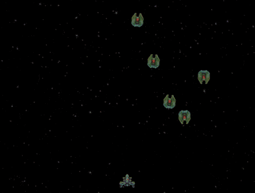

# star-blaster

### Introduction

Star blaster is a top-down shoot-em-up game (also known as shmups). 

### Creating the Project

Star Blaster is available fully open-source through github, and is fully integrated into Glue. The easiest way to use the starter project is through Glue:

1. Open Glue
2. Select File->New Project
3.  Select the **Sarter Projects** category

    
4.  Select **Star Blaster**

    
5.  &#x20;Enter a name for your new project:

    
6. Click **Make my project!**

The project will be created and will be automatically loaded in Glue.


To see the game running, click the Play button.


### StarBlaster Input

#### Keyboard Controls

By default StarBlaster uses the following input:

* W - Move Up
* A - Move Left
* S - Move Down
* D - Move Right
* Space - Shoot

This input is assigned in PlayerShip.AddKeyboardControls  as shown in the following snippet:

```lang:c#
internal void AddKeyboardControls()
{
    movementInput = InputManager.Keyboard.Get2DInput(Keys.A, Keys.D, Keys.W, Keys.S);

    shootInput = InputManager.Keyboard.GetKey(Keys.Space);
}
```

Notice that the keys for movement are assigned in the Get2DInput  and GetKey  methods. The keys can be changed. For example, the following code shows how the Get2DInput could be changed to use the arrow keys instead of W, A, S, D:

```lang:c#
movementInput = InputManager.Keyboard.Get2DInput(Keys.Left, Keys.Right, Keys.Up, Keys.Down);
```

The two fields used for input use the FlatRedBall input interface classes. These classes allow using any input hardware without changing the logic to read the input. For more information, see the [I2DInput](../../api/flatredball/input/i2dinput.md) and [IPressableInput](../../api/flatredball/input/ipressableinput.md) pages.

#### Movement Acceleration

The PlayerShip uses acceleration to speed up to its movement speed from a standstill, and to slow down to a standstill when the user lets go of all movement keys. This code is implemented in PlayerShip.ApplyInput .

```lang:c#
private void ApplyInput()
{
    float desiredXVelocity = movementInput.X * MaxMovementSpeed;
    float desiredYVelocity = movementInput.Y * MaxMovementSpeed;

    float xDifference = desiredXVelocity - this.XVelocity;
    float yDifference = desiredYVelocity - this.YVelocity;

    const float threshold = 1;

    if (System.Math.Abs(xDifference) < threshold)
    {
        this.XAcceleration = 0;
        this.XVelocity = desiredXVelocity;
    }
    else
    {
        float xAccelerationSign = Math.Sign(xDifference);
        var oldXAccelerationSign = Math.Sign(this.XAcceleration);
        this.XAcceleration = xAccelerationSign * (MaxMovementSpeed / AccelerationTime);
    }

    if(System.Math.Abs(yDifference) < threshold)
    {
        this.YAcceleration = 0;
        this.YVelocity = desiredYVelocity;
    }
    else
    {
        float yAccelerationSign = Math.Sign(desiredYVelocity - this.YVelocity);
        var oldYAccelerationSign = Math.Sign(this.YAcceleration);
        this.YAcceleration = yAccelerationSign * (MaxMovementSpeed / AccelerationTime);
    }


    if (this.shootInput.WasJustPressed)
    {
        ShootBullet();
    }
}
```

ApplyInput  uses Glue variables to simplify tuning. Specifically, the variables for movement can be found in the PlayerShip entity in Glue:


These variables show how to define coefficients in Glue and use them in code. Defining variables in Glue simplifies tuning a game, and allows non-programmers to safely work on the game without risk of unintentionally modifying other parts of the game. Despite these variables being defined in Glue, the are accessed the same as variables defined in code - because ultimately Glue converts these variables into generated code. The following variables impact movement:

* Max Movement Speed: This controls the maximum speed (in pixels per second) of the player ship. Increasing this value makes the ship move faster, but it can also make precise movements more difficult.
* Acceleration Time: This is the amount of time the ship takes to transition from a standstill to moving at full speed. Notice that the value is very small, which maks the ship's acceleration seem nearly instant. A small value helps the ship movement feel more natural, but a large value will make it feel unresponsive.

Tuning variables is very easy in Glue - simply change the value and press the play button in Glue. Of course, if you prefer to debug in Visual Studio, you can also change the values and run the program in Visual Studio.

### Bullets

The creation and behavior of player bullets can be modified in a number of places in the project.

#### BulletVelocity

As shown in the previous section, the variable which controls bullet velocity (speed) can be modified on the PlayerShip entity:


Increasing this value increases how fast bullets travel after being fired. This code is applied in PlayerShip.ShootBullet :

```lang:c#
private void ShootBullet()
{
    foreach (var offset in GetBulletOffsets())
    {
        var bullet = BulletFactory.CreateNew();
        bullet.Position = this.Position + offset;
        bullet.YVelocity = BulletVelocity;

        BulletCreated?.Invoke(bullet);
    }
}
```

Since the BulletVelocity value is accessed every time a bullet is created, it can be adjusted at runtime. For example, a power-up may upgrade the player's bullets, which may cause the bullets to travel faster. This could be adjusted as follows (assuming the code is in the PlayerShip  class):

```lang:c#
// Could be increased from its current value:
this.BulletVelocity += 50;
// Or if a variable is keeping track of power-ups:
this.BulletVelocity = 700 + PowerUpLevel * 50;
```

#### Number of Bullets

The number of bullets fired is controlled by the PlayerShip's GetBulletOffsets  method and gunLevel  field:

```lang:c#
private IEnumerable<Vector3> GetBulletOffsets()
{
    switch(gunLevel)
    {
        case 0:
            yield return new Vector3(0, 20, 0);
            break;
        case 1:
            yield return new Vector3(10, 10, 0);
            yield return new Vector3(-10, 10, 0);
            break;
    }
}
```

By default the gunLevel is set to 1:

```lang:c#
int gunLevel = 1;
```

 Changing gunLevel to 0 reduces the number of bullets fired:

```lang:c#
int gunLevel = 0;
```


New gun levels can be added to the GetBulletOffsets  method:

```lang:c#
private IEnumerable<Vector3> GetBulletOffsets()
{
    switch(gunLevel)
    {
        case 0:
            yield return new Vector3(0, 20, 0);
            break;
        case 1:
            yield return new Vector3(10, 10, 0);
            yield return new Vector3(-10, 10, 0);
            break;
        case 2:
            yield return new Vector3(20, 0, 0);
            yield return new Vector3(10, 10, 0);
            yield return new Vector3(0, 20, 0);
            yield return new Vector3(-10, 10, 0);
            yield return new Vector3(-20, 0, 0);

            break;
    }
}
```

Changing gunLevel  to 2 changes the bullet pattern to fire five bullets.


###

### Game Visuals

StarBlaster uses a number of entities which appear on screen visually. These entities show a variety of ways to use PNGs to display graphics.

### Background

The Background entity includes a single .png file called **SpaceBackgroundReduced.png**.


The file can opened by double-clicking it in Glue, or right-clicking and selecting **View in explorer**. If the file is edited and saved, the game will display these changes the next time it is run.


### Bullet

Unlike the Background entity, the Bullet references a large image for its visuals called **EffectsReduced.png**. This .png file contains a variety of visual effects which can be used in StarBlaster.


Since this file contains many visual effects, the Bullet class must specify which portion of the image to use. This is done through an **AnimationChain**, defined in a .achx file.


The Animation can be edited by hand (XML file) or using the AnimationEditor plugin, which can be installed from GlueVault: [http://www.gluevault.com/plug/51-animationeditor-glue-plugin](http://www.gluevault.com/plug/51-animationeditor-glue-plugin) For information on using the AnimationEditor Plugin, see the [AnimationEditor page](../tools/animationeditor/glue-gluevault-component-pages-animationeditor-plugin.md). The bullet appearance can be changed by changing the first (and only) frame in PlayerBullet:


Changing the animation chain may change the size of the bullet. The collision may need to be resized so that collision is triggered accurately. To do this:

1.  Check the Preview checkbox

    
2. Expand the Bullet entity
3. Expand the Objects folder
4. Select the AxisAlignedRectangleInstance object. This is the object used for collision.
5.  Check the "Visible" property so it appears in the Preview window

    
6.  Adjust he Width and Height to fit the new size of the sprite

    

### Conclusion

The starter project is intended to be a project for learning how to use FlatRedBall and testing out new ideas. The best way to learn is to experiment and try changing different parts of the game.
