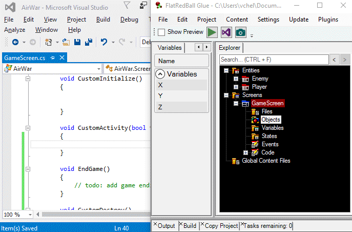
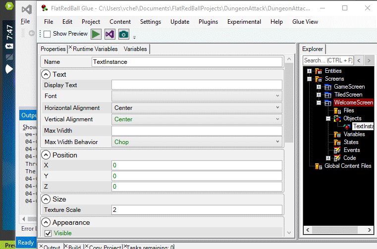

# features

### FlatRedBall Makes Game Development Faster

* Work on your game and see changes in real time.
* Click play and your game starts in seconds.
* Add files, tune variables, and create events in Glue - the FlatRedBall visual editor.

***

&#x20;

### FlatRedBall Works with the Best Game Development Tools

* Easy integration with Tiled, Texture Packer, Spriter, and more!
* Plugin system allows adding additional content types with minimal effort - 3rd party tools behave like 1st party tools.

***

### Need to make content? We've got you covered!

* Use Gum to define UI components and lay out screens visually.
* Built-in support for sprite animations, custom data formats, particles, and splines.
* No project management necessary. Add content and it automatically shows up in game.

***

### Write Game Code with No Compromises

* Use the latest Visual Studio and C# features and the full power of the .NET Framework.
* Glue’s generated code is optimized to reduce load times.
* Full engine and tool source available on Github.

***

### Need Custom Data? No Problem!

* Create custom content and load it in game without writing any code.
* Full auto-complete support for data. No more magic strings, no more wondering if content changes have broken your game.

***

&#x20;

### Effortlessly Move Your Game to New Platforms

* Add new platforms at any point in development.
* FlatRedBall handles all the nitty gritty - nearly 100% code and content shared across all platforms.
* Develop for PC, Windows tablets, iOS, Android, and more...for free!
