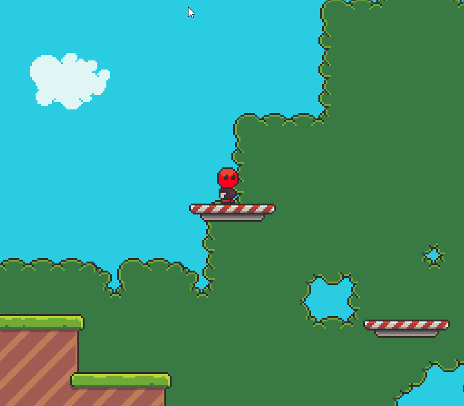

# ✨ FlatRedBall Features

### Introduction

FlatRedBall is a set of technology for creating games on a variety of platforms. FlatRedBall focuses primarily on creating 2D games, although it does provide 3D support and full access to the underlying XNA-like system (MonoGame, FNA, Kni) for creating full 3D games.

FlatRedBall has been used to create dozens of commercial games on a variety of platforms. FlatRedBall's ultimate goal is to boost your productivity as a game developer and to help you ship your game on your target platform.

### FlatRedBall Editor

The FlatRedBall Editor is a visual tool for creating and organizing screens, entities, and files.&#x20;

<figure><figcaption><p>FlatRedBall Editor</p></figcaption></figure>

### Project Setup Wizard

Use the wizard to get your game up and running in seconds.

<figure><figcaption><p>The Project Setup Wizard can be used to start making a game in seconds</p></figcaption></figure>

### Tiled Integration

Tiled maps can be drag+dropped into the FlatRedBall Editor and loaded with no extra code. Use Tiled to define visuals, collision, and add entity instances.

<figure><figcaption><p>Tiled Map in the FRB Editor</p></figcaption></figure>

### Gum UI Integration

FlatRedBall provides full integration with the Gum tool. Gum projects are added to your project and loaded by generated code, enabling the creation of UI from the very first click.

<figure><figcaption><p>Gum UI Title Screen</p></figcaption></figure>

### Game Live Edit

Run your game in edit mode to make changes in real time.

<figure><figcaption><p>Live edit in FRB</p></figcaption></figure>

### Hot Reload Files

Make changes to files such as Tiled (.tmx), Textures (.png), and spreadsheet (.csv) files and see the changes update in realtime.

<figure><figcaption><p>Changes in Tiled update a game in realtime</p></figcaption></figure>

### Aseprite Integration

Native support for .aseprite files enables creating animated characters by drag+dropping files into the FlatRedBall Editor.

<figure><figcaption><p>.aseprite file in FlatRedBall as an Animated Character</p></figcaption></figure>

### Easy-to-use Editor with Clean Design and Theme support

FlatRedBall Editor supports customizing accent colors and changing between light and dark mode.

<figure><figcaption><p>FlatRedBall Editor in Dark Mode</p></figcaption></figure>

### Platformer Controls and Physics

Creating a platformer has never been easier. Mark your entity as a Platformer or use the new project wizard to get production quality platformer physics and movement.

<figure><figcaption><p>FRB provides platformer physics and controls</p></figcaption></figure>

### Built-in Damage System

The flexible damage system simplifies and standardizes dealing damage and reacting to receiving damage.

<figure><figcaption><p>FRB Damage system simplifies combat code</p></figcaption></figure>

### Pathfinding

Create node networks from Tiled maps or in code to navigate maps.

<figure><figcaption><p>Enemies navigating a map and chansing the player with their path visualization enabled</p></figcaption></figure>

### AnimationEditor Integration

Use the AnimationEditor to define animations for your characters using individual files or sprite sheets. Preview animations, adjust timing, and add shapes for collision or defining key positions.

<figure><figcaption><p>FRB AnimationEditor</p></figcaption></figure>

### FlatRedBall.Forms

FlatRedBall.Forms is a flexible UI system similar to WPF and MAUI. It is fully integrated with Gum and has MVVM support.

<figure><figcaption><p>FlatRedBall.Forms Contros</p></figcaption></figure>

### SkiaSharp Integration

Use SkiaSharp to render GPU-accelerated vector graphics in your game. Perform layout purely in code or use Gum.

<figure><figcaption><p>SkiaSharp provides vector art rendering support</p></figcaption></figure>

### Spine Integration

Use all features in the Spine tool including defining skeletons, animations, and events.

<figure><figcaption><p>Animated character in Spine</p></figcaption></figure>

Spine files can be dropped in to your project and loaded with no code. Play animations at runtime in response to input or game events.

<figure><figcaption><p>Animated character using Spine</p></figcaption></figure>

### Tweening (Interpolation)

Use built-in interpolation systems to move, resize, rotate, and color objects over time.

<figure><figcaption><p>Sprites scaling up using "elastic" interpolation</p></figcaption></figure>

### Physics

Physics engine handles collision between circles, rectangles, polygons, and lines.

<figure><figcaption><p>Circles colliding against rectangles, polygons, and other circles</p></figcaption></figure>

### Collision Relationships

Define collision relationships in UI or code to add physics, damage dealing, and custom events.

<figure><figcaption><p>CollisionRelationship in FRB</p></figcaption></figure>

### Display Settings

Set your initial game's resolution, whether it supports resizing, aspect ratio, and more.

<figure><figcaption><p>Display Settings in FRB</p></figcaption></figure>

### Camera Controlling Entity

The camera controlling entity can follow one or more targets, supports zooming, provides customizable tweening, and respects map bounds.

<figure><figcaption><p>Camera controlling entity following targets and zooming</p></figcaption></figure>

### Realtime File Reference Tracking

Turn difficult-to-find runtime errors into clear in-editor errors the moment a file is changed or removed.

<figure><figcaption><p>Missing file references are reported in the FRB error tab</p></figcaption></figure>

### MonoGame/FNA and NAudio Music

MonoGame and FNA Song support included out of the box. For more flexibility song files can be loaded using NAudio.

<figure><figcaption><p>Song settings in FRB</p></figcaption></figure>

### CSV and Open Office/Libre Office Integration

Use CSV files or open office spreadsheet files to define your game data. FlatRedBall automatically generates the classes for loading your data and deserializes the files in geneated code.

<figure><figcaption><p>Creating a CSV automatically generates a class with matching properties</p></figcaption></figure>

### Flexible Input

FRB input supports mouse, keyboard, touchscreen, and a variety of gamepads (Xbox, Switch, PlayStation, and PC) including direct and abstract access through a variety of interfaces.

```csharp
ShootingInput = gamePad.RightTrigger.
    // primary is the A/B button, which is usually for jumping
    // shooting is usually X/Y
    Or(gamePad.DefaultSecondaryActionInput);

ReviveInput = gamePad.DefaultPrimaryActionInput;

PreviousWeaponInput = gamePad.GetButton(Xbox360GamePad.Button.LeftShoulder);
NextWeaponInput = gamePad.GetButton(Xbox360GamePad.Button.RightShoulder);
```

### Localization Support

Add multiple languages to your game using a simple spreadsheet. Localization is automatically loaded and can be accessed through a LocalizationManager static class. Include multiple pages per string ID and add custom columns for your game's specific needs.

<figure><figcaption><p>Example Localization File</p></figcaption></figure>

### Multiple Platforms

Target multiple platforms with the same code and content. FRB games can run on Windows, Mac, Linux, Android, and iOS. By using FNA and Native AOT, FlatRedBall can also run on consoles such as Switch.

<figure><figcaption><p>Target multiple platforms with FRB</p></figcaption></figure>

### Full .NET C# (not scripted)

FlatRedBall projects are regular .NET projects with full access to modern C# syntax, the full .NET library, and NuGet packages. FlatRedBall Projects are regular Visual Studio project, enabling you to use your favorite IDE and debugger.

<figure><figcaption><p>Write any valid C# including LINQ and async code</p></figcaption></figure>

### Open Source

FlatRedBall is fully open source using the MIT License. It is built using libraries which themselves are also open source. You can build your games without the worry of future inconveniences caused by license changes.

<figure><figcaption><p>FlatRedball uses the MIT license</p></figcaption></figure>

### All Data is Text

All data created by FlatRedBall is in text format. The FlatRedBall Editor saves .json files and generates pure C# code files. Never worry about binary file conflicts wiping out your work again.

<figure><figcaption><p>FRB data is text so you can inspect, debug, and diff easily</p></figcaption></figure>

### XNA-Like Foundation

FlatRedBall was built in the early days of XNA and has continued to grow, adding support for MonoGame and FNA. Your FlatRedBall game is a MonoGame/FNA game, and the full flexibility of these libraries is available to you.

<figure><figcaption><p>Fusion Sentient - a FlatRedBall game using XNA Models for 3D graphics</p></figcaption></figure>

### Async Programming

FlatRedBall provides a syncrhonization context and multiple methods returning Tasks to simplify async programming.&#x20;

```csharp
private async Task DoRepeatablePhase2Logic(CancellationToken token)
{
    while(true)
    {
        await ShakeAndSpawnAnglerFish();
        await DoSpawnPhase2Groups(token);
     
        await TimeManager.DelayUntil(() => 
           EnemyList.All(item => item is not AnglerFish));

        await TimeManager.DelaySeconds(SecondsAfterAnglerFishToRespawn);

        if (DagonPhase2Instance.ShouldSplitAfterSlideUp)
        {
            phase2CancellationTokenSource.Cancel();
            break;
        }
    }
}

```
