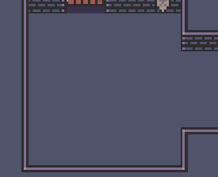

# ✨ FlatRedBall Features

### FlatRedBall Editor

The FlatRedBall Editor is a visual tool for creating and organizing screens, entities, and files.&#x20;

<figure><figcaption><p>FlatRedBall Editor</p></figcaption></figure>

### Integration with Tiled

Tiled maps can be drag+dropped into the FlatRedBall Editor and loaded with no extra code. Use Tiled to define visuals, collision, and add entity instances.

<figure><figcaption><p>Tiled Map in FlatedBall</p></figcaption></figure>

### Integration with Gum UI tool

FlatRedBall provides full integration with the Gum tool. Gum projects are added to your project and loaded by generated code, enabling the creation of UI from the very first click.

<figure><figcaption><p>Gum UI Title Screen</p></figcaption></figure>

### AnimationEditor for Building Frame-Based Animations

Use the FlatRedBall AnimationEditor to define animations for your characters using individual files or sprite sheets. Preview animations, adjust timing, and add shapes for collision or defining key positions.

<figure><figcaption><p>FRB AnimationEditor</p></figcaption></figure>

### FlatRedBall.Forms Simplifies UI Creation

FlatRedBall.Forms is a flexible UI system similar to WPF and MAUI. It is fully integrated with Gum and has MVVM support.

<figure><figcaption><p>FlatRedBall.Forms Contros</p></figcaption></figure>

### SkiaSharp Integration

Use SkiaSharp to render gpu-accelerated vector graphics in your game. Perform layout purely in code or use Gum.

<figure><figcaption><p>SkiaSharp provides vector art rendering support</p></figcaption></figure>

### Spine Integration

Use all features in the Spine tool including defining skeletons, animations, and events.

<figure><figcaption><p>Animated character in Spine</p></figcaption></figure>

Spine files can be dropped in to your project and loaded with no code. Play animations at runtime in response to input or game events.

<figure><figcaption><p>Animated character using Spine</p></figcaption></figure>

### Efficient and Convenient Collision Relationship Support

Define collision relationships in UI or code to add physics, damage dealing, and custom events.

<figure><figcaption><p>CollisionRelationship in FRB</p></figcaption></figure>

### Display Settings for Resolution and Resize Management

Set your initial game's resolution, whether it supports resizing, aspect ratio, and more.

<figure><figcaption><p>Display Settings in FRB</p></figcaption></figure>

### CSV and Open Office/Libre Office Integration

Use CSV files or open office spreadsheet files to define your game data. FlatRedBall automatically generates the classes for loading your data and deserializes the files in geneated code.

<figure><figcaption><p>Creating a CSV automatically generates a class with matching properties</p></figcaption></figure>

### Localization Support

Add multiple languages to your game using a simple spreadsheet. Localization is automatically loaded and can be accessed through a LocalizationManager static class. Include multiple pages per string ID and add custom columns for your game's specific needs.

<figure><figcaption><p>Example Localization File</p></figcaption></figure>

### Full .NET C# (not scripted)

FlatRedBall projects are regular .NET projects with full access to modern C# syntax, the full .NET library, and NuGet packages. FlatRedBall Projects are regular Visual Studio project, enabling you to use your favorite IDE and debugger.

<figure><figcaption><p>Write any valid C# including LINQ and async code</p></figcaption></figure>

### Async Programming Simplifies Scripting and State Machines

FlatRedBall provides a syncrhonization context and multiple methods returning Tasks to simplify async programming.&#x20;

```csharp
private async Task DoRepeatablePhase2Logic(CancellationToken token)
{
    while(true)
    {
        await ShakeAndSpawnAnglerFish();
        await DoSpawnPhase2Groups(token);
     
        await TimeManager.DelayUntil(() => 
           EnemyList.All(item => item is not AnglerFish));

        await TimeManager.DelaySeconds(SecondsAfterAnglerFishToRespawn);

        if (DagonPhase2Instance.ShouldSplitAfterSlideUp)
        {
            phase2CancellationTokenSource.Cancel();
            break;
        }
    }
}

```
