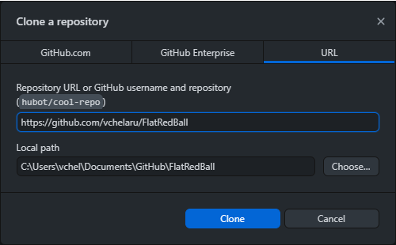

# 🏗️ Building FlatRedBall From Source

### Introduction

All of FlatRedBall, including the editor and the core engine, is open source. If you are using FlatRedBall in your game, you may want to use source. Specifically you may want to:

1. Build the FlatRedBall Editor (aka Glue) from source to get the most up-to-date features and code generation
2. Link your game to source to improve debugging

### Building FlatRedBall from source is not required to use FlatRedBall.&#x20;

Most users do not need to follow the steps outlined in this section. New users are encouraged to skip this and head over to the Tutorials section. If you would like to build FlatRedBall to do more advanced debugging, contribute to the project, or out of pure curiosity then feel free to continue through this section.

If you are interested in using FlatRedBall in a code-only project, see the [Code-Only](tutorials/code-only-project-tutorial/) Projects page.

### Downloading FlatRedBall and Gum Source

You first need to clone FlatRedBall and Gum (two separate repositories) whether you are going to run the FlatRedBall or link your game to source.

Currently all development is being done on the NetStandard branch:

* [FlatRedBall on Github](https://github.com/vchelaru/FlatRedBall)

If you plan on using FlatRedBall FNA, be sure that you include all submodules when pulling FlatRedBall. This may automatically happen if you are using some Git clients (such as GitHub Desktop), but you may need to perform additional configuration if using a client that doesn't pull submodules by default (such as Rider).

FlatRedBall uses Gum UI including at runtime. This is also open source and can be found on GitHub:

* [Gum on Github](https://github.com/vchelaru/Gum)

Both repositories should be cloned to the same folder to make linking easier.

### Installing Multi Platform Workloads

FlatRedBall Editor (Glue) links a version of FlatRedBall which builds for multiple platforms including Android and iOS. You must have an installiation that supports these platforms even if you are only building the FlatRedBall Editor.

Be sure to install both workloads:

* .NET Multi-platform App UI development
* .NET desktop development

<figure><figcaption><p>Required installation to build FlatRedBall Editor (Glue)</p></figcaption></figure>

### Downloading FlatRedBall Source

The easiest way to download and keep FlatRedBall source up to date is to use a Github client such as Github for Desktop. To download source using Github for Desktop:

1. Install Github for Desktop
2.  Select File -> Clone Repository

    <div align="left" data-full-width="true"></div>
3. Select the URL tab
4. Enter the FlatRedBall URL: https://github.com/vchelaru/FlatRedBall. Keep the default folder as **FlatRedBall**
5. Click the Clone button\
   
6.  Switch to the appropriate branch. The default branch is NetStandard

    

After FlatRedBall is cloned, you will have a local copy on your machine.


### Downloading Gum Source

You will also need to download Gum source, as FlatRedBall games which link against source also reference Gum files. To do this (assuming Github for Desktop):

1. Select File -> Clone Repository
2. Select the URL tab
3. Enter the Gum source: https://github.com/vchelaru/Gum . Keeping the default folder is recommended, but if not, be sure to use the same root as the FlatRedBall clone above.

### Building the FlatRedBall Editor (Glue)

Verify that you have .NET 6 SDK installed [https://dotnet.microsoft.com/en-us/download/dotnet/thank-you/sdk-6.0.309-windows-x64-installer](https://dotnet.microsoft.com/en-us/download/dotnet/thank-you/sdk-6.0.309-windows-x64-installer)

To build the FlatRedBall Editor (also referred to as Glue):

1. Download the FlatRedBall repository (either clone it or download the .zip file from Github) following the steps above
2.  Download the [Gum repository](https://github.com/vchelaru/Gum) following the steps above. Make sure to download it to the same folder where you downloaded the FlatRedBall repository, and name the folder Gum. See below for an example. If you do not do this, you will have reference errors when opening the solution.

    
3.  Open the file **\<FlatRedBall Root>\FRBDK\Glue\Glue with All.sln.**

    
4.  To rebuild Glue with all plugins, select **Build** -> **Build Solution** in Visual Studio. You must **Build or Rebuild** the first time you run FlatRedBall. If you make further changes to any plugins, you must either build the entire solution, or build the project that contains the plugin. Simply building the Glue project, or pressing F5 to build and run Glue, will not build all plugins.\\

    <figure><figcaption><p>Build Solution menu item in Visual Studio</p></figcaption></figure>
5. Set **Glue** as the **Startup Project**

<figure><figcaption><p>Set Glue as the Startup Project</p></figcaption></figure>

6. Building the solution creates an .exe from which the FRB editor can be run. You can find this .exe at \<your git repo location>\FlatRedBall\FRBDK\Glue\Glue\bin\Debug\GlueFormsCore.exe. Alternatively, you can start up the FRB editor from Visual Studio. Doing so in **Debug Mode** allows you to see error messages in case the FRB editor throws an exception.

<figure><figcaption></figcaption></figure>

For Rider users, you will need to set Glue as the project to run in the Configuration dialog.\
\
.png>)\\

<figure><figcaption></figcaption></figure>

<figure><figcaption></figcaption></figure>

It's important that Gum and FlatRedBall are checked out to the same folder. For example, you may have:

* c:/MyDocuments/FlatRedBall
* c:/MyDocuments/Gum

### Troubleshooting

#### Gum Project References Broken

The Glue project references Gum projects, so the two project folders must be in the same root folder. To verify:

1. Open **Glue with All.sln**
2. Open the Solution Explorer
3. Expand the GumProjects folder

If the references are correct, your window should look similar to the following image:


If your references are broken, then you may see something similar to the following image:

<figure><figcaption></figcaption></figure>

Notice that the projects are marked as **unloaded**. To solve this make sure that both of the projects (FlatRedBall and Gum) are in the same root folder. If you unzipped the files, then they may need to be moved up one folder.

#### Microsoft.Windows.UI.Xaml.CSharp.targets was not found...

When opening the project, you may get a message which states:

```
The imported project "C:\Program Files (x86)\MSBuild\Microsoft\WindowsXaml\v14.0\8.1\Microsoft.Windows.UI.Xaml.CSharp.targets" was not found. Confirm that the path in the <Import> declaration is correct, and that the file exists on disk. C:\Program Files (x86)\MSBuild\Microsoft\WindowsXaml\v14.0\Microsoft.Windows.UI.Xaml.CSharp.targets
```

For information on how to solve this problem, see the following link: [http://www.c-sharpcorner.com/UploadFile/8a67c0/visual-studio-2015-feature-shared-project-part-2/](http://www.c-sharpcorner.com/UploadFile/8a67c0/visual-studio-2015-feature-shared-project-part-2/)

####
