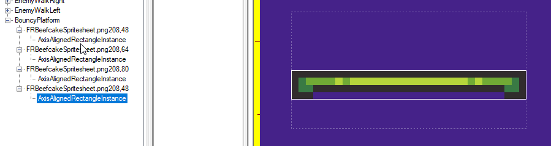
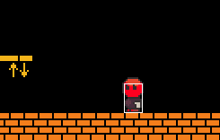

# Animation Shapes and Collision

### Introduction

Collision shapes can be controlled through the AnimationEditor. This allows collision to align with animation frames.

### Adding Collision to an Animation

The simplest setup for using collisions from an animation requires an animated collidable entity. For example, such an entity would contain a Sprite and an AxisAlignedRectangle as shown in the following entity creation dialog:


Of course, existing entities (such as Player) can also be animated using collision so long as they contain an animated Sprite and they implement ICollidable.


For this example we will use the Player object as an example, but these concepts can be applied to any entity. Animation collisions can be defined in the AnimationEditor. Each frame can contain one or more shapes. To add a shape to a frame:

1. Open the AnimationEditor
2. Select a frame which should have collision
3.  Right-click on the frame in the tree view and select **Add AxisAlignedRectangle**. Note that at the time of this writing only AxisAlignedRectangles are supported, but future versions of shapes will be added.

    
4.  Once added, the AxisAlignedRectangle displays in the bottom preview window

    
5. The AxisAlignedRectangle's properties can be modified in the property grid

<figure><figcaption></figcaption></figure>

Changes to shapes will automatically be saved to disk. The example above shows an animation with a single frame, but since each frame can contain rectangles, then this allows the collision size to change frame-by-frame.

<figure><figcaption></figcaption></figure>

### Setting Animation Collision Through FlatRedBall Editor

If you have an animated Sprite, you can automatically tell FlatRedBall to generate code which will update the entity's Collision object by checking the **Set Collision From Animation** property.

To do this:

1. Add a Sprite to your collidable entity
2. Add an animation to the Sprite
3. Check the Set Collision From Animation checkbox

<figure><figcaption></figcaption></figure>

This automatically generates code which updates the collision. If you would like to perform this manually, see the next section.

### Setting Animation Collision in Code

Once an animation contains shapes, the shapes can be used at runtime. The easiest way to implement this is to use the SetValues method on the frame's ShapeCollection as shown in the following snippet:

```
private void CustomActivity()
{
    this.SpriteInstance.CurrentFrame?.ShapeCollectionSave?.SetValuesOn(
        this.Collision, this, createMissingShapes:true);

    // This is needed if you want to see the rectangle visibly. It is not necessary
    // for proper collision functionality.
    this.ForceUpdateDependenciesDeep();

}
```

This code automatically updates the collision to match how it is laid out in the AnimationEditor.


#### Names Matching

Entities and animation frames can each contain multiple shapes. To use the SetValuesOn method, the names between the two must match. In the example above, the rectangles on the animation and entity are both called AxisAlignedRectangleInstance (the default name).


Using matching names is especially important if you intend to have multiple shapes per frame of animation.

#### Missing Shape Behavior

Animation frames which do not have any shapes will not affect the collision in the entity. In the example above the CharacterIdleRight animation contains a frame which defines a rectangle. When this animation plays, the rectangle size will be applied. When other animations are played, the rectangle will remain the same size as was set by CharacterIdleRight. Keep this in mind, as creating animations which only have some frames defining a rectangle may result in unexpected behavior. The following animation shows the behavior of the rectangle when only the idle right animation defines the shape. Notice that the rectangle grows when the player faces to the right, and then remains the same size for all other animations:

<figure><figcaption></figcaption></figure>

### Multiple Shapes per Frame

As mentioned above, multiple shapes can be added per frame. This can be useful if you have different subcollision behaviors in your game. For example, your Player may have a shape for its entire body, and one shape for feet so the player can stomp on enemies.


In this case you would want to also add the same shapes in your entity so that the code shown above could be used to automatically manage the rectangle positions and sizes.


### Troubleshooting

If your shapes in game are not modified by the shapes in the AnimationEditor you can check a few things to locate the problem.

#### SetCollisionFromAnimation in Generated Code

If your Sprite is set up properly, you should see the `SetCollisionFromAnimation` method being called on a Sprite. This method should appear in your Activity method in generated code.

<figure><figcaption><p>SpriteInstance.SetCollisionFromAnimation called in generated code</p></figcaption></figure>

If this does not appear, verify that the following are true:

* Your entity is an ICollidable entity, or implements ICollidable recursively. This should be true if you added shapes to the entity when it was first created.
* Your .gluj file version is greater than or equal to 45. For more information see the [FileVersion (.gluj)](../glue-reference/glujglux.md) page.
* You have a Sprite in the entity
* The Sprite's Set Collision From Animation is set to true
* You are playing the animation in your game
