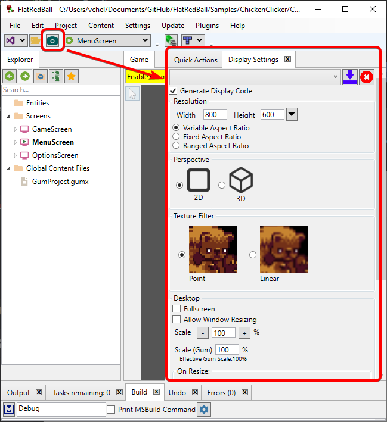
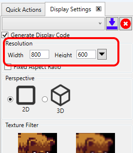
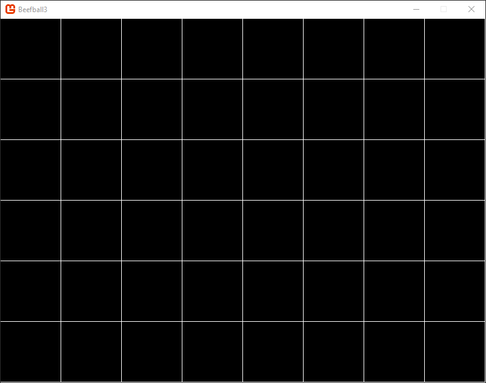
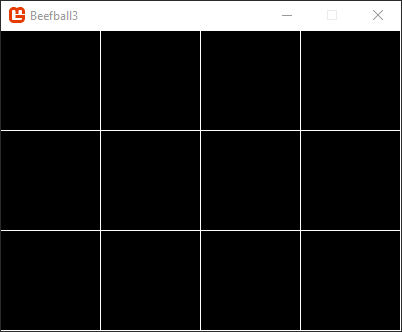
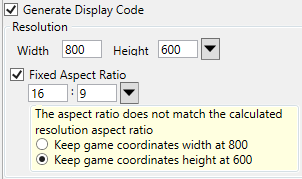
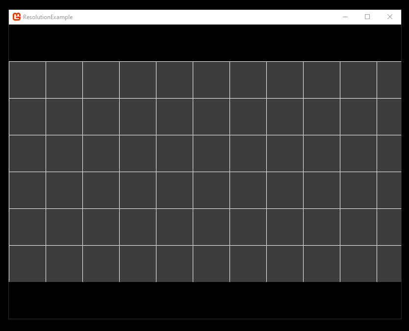
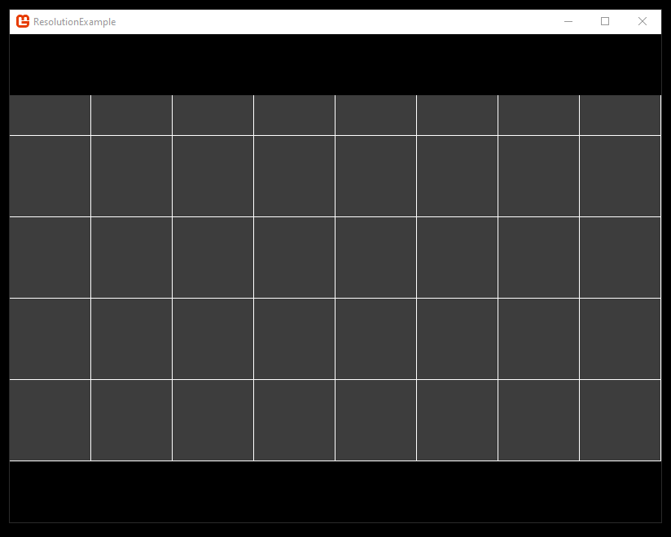
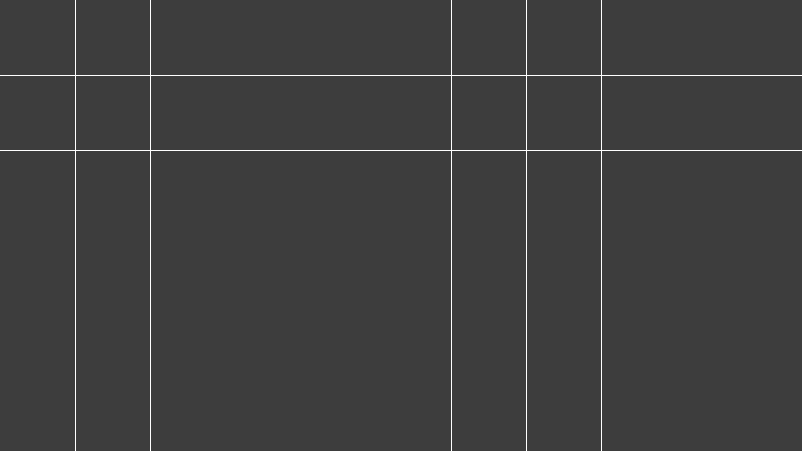
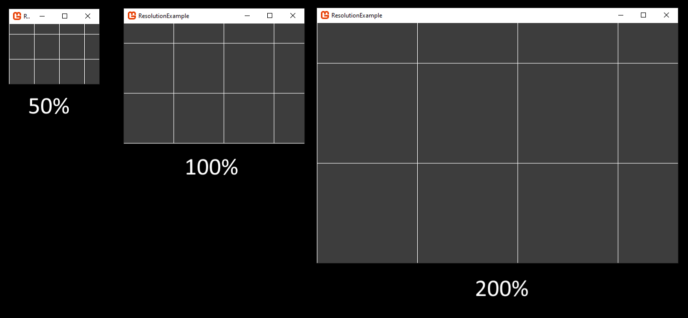
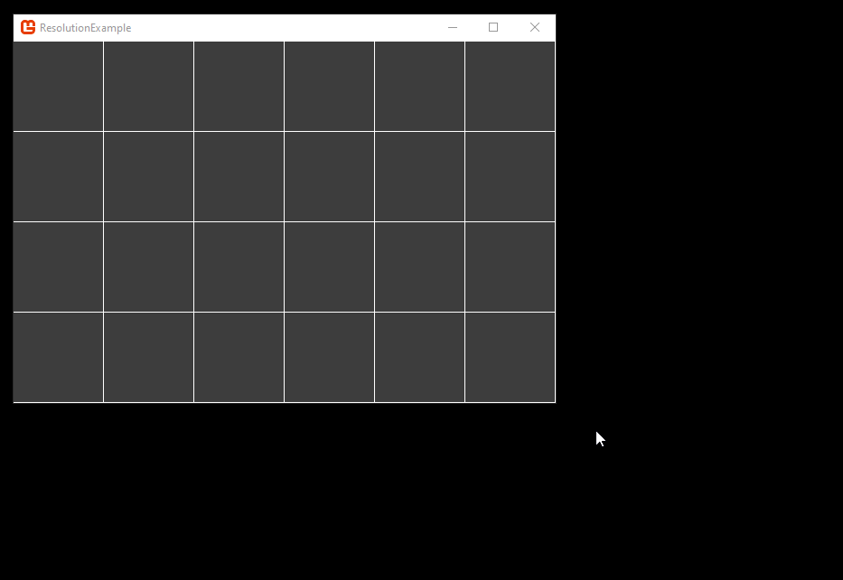

# Display Settings

### Introduction

FlatRedBall Editor provides a Camera window which can be used to set the game's resolution and various Camera settings. This can be accessed through the camera icon in the toolbar.



Keep in mind that when the game runs embedded in the FlatRedBall Editor, the Editor window may modify the resolution settings.

### Resolution

By default the resolution of the game is 800 pixels by 600 pixels.



This means that the game appears at this resolution when running on the desktop.


Notice that the resolution defines the _inner size_ of the game. On Windows, games with a title bar may be a little bit larger than the inner size. The resolution also controls how much of the _game world_ is visible. For example, if the game includes a grid of rectangles each sized 100x100, we can see that we can see 8 rectangles horizontally and 6 rectangles vertically.



This resolution can be changed in the editor by manually typing in a resolution value, or by using the dropdowns to select from a list of common resolution values.


Changing the values to 400x300 (from 800x600) results in the game running as shown in the following image:



Notice that the resolution impacts two things:

* The size of the window (when running on desktop)
* The visible area in game

### Fixed Aspect Ratio

The **Fixed Aspect Ratio checkbox** controls whether the game runs in a forced aspect ratio. By default this value is unchecked which means that the game will run in any aspect ratio rather than forcing a certain aspect ratio.&#x20;

If this option is checked checked, then the game will [letterbox](https://en.wikipedia.org/wiki/Letterboxing_\(filming\)) or [pillarbox](https://en.wikipedia.org/wiki/Pillarbox) to maintain the desired aspect ratio if the resolution does not match the aspect ratio.

For example, the following images shows a game with resolution 800x600 running with a forced fixed aspect ratio of 16:9. Note the gray area displays the game area.





If the game's aspect ratio (default values) do not match the calculated aspect ratio from the resolution width and height (as is the case here), the editor asks if the game coordinate width or height values should be preserved. In this case, the **Keep game coordinates height at 600** is selected, so the game always displays  600 units on the Y axis, and the width is adjusted to maintain an aspect ratio.

If the **Keep game coordinates width at 800** option is checked, then the game will always display 800 units wide, and will adjust the height to match the desired aspect ratio, as shown in the following images:




Notice that if the game resolution and aspect ratio do not match, the window will match the resolution but the game area will match the aspect ratio. This behavior can be important for games which have logic written for a specific aspect ratio such as spawning enemies off-screen.

For example, we can set the following values:

<figure><figcaption><p>Aspect ratio values not matching the game resolution</p></figcaption></figure>

These settings produce a game with the following properties:

* The game window displays 400 pixels in width
* The game window displays 600 pixels in height
* The game maintains a 16:9 aspect ratio
* The game will always display an in-game height of 600 units

<figure><figcaption><p>16:9 game displayed in a window that is 400x600</p></figcaption></figure>

### Perspective

The Perspective option controls whether the game is using a 2D (Camera Orthogonal is set to true) or 3D (Camera Orthogonal is set to false) perspective. By default FlatRedBall runs in 2D mode. In 2D, the play area matches the Resolution values. In 3D, the play area at Z=0 matches the Resolution values.


Cameras with 3D perspective result in objects with positive Z values drawing larger and objects with negative Z values drawing smaller. For example, the following image shows three sprites with Z values of -100, 0, and 100 (positive).


### Texture Filter

Texture filtering modifies the way textures are rendered by Sprites. By default, FlatRedBall uses **Point** filtering. Linear filtering applies a blur effect when objects Sprites are drawn larger than the native resolution, or if the game is zoomed in.

<figure><figcaption><p>Texture Filter options in the Display Settings tab</p></figcaption></figure>

The following image shows the difference between Point and Linear filtering:


Note that Linear filtering also applies to tilemap rendering which can cause pixel colors to "bleed".

### Fullscreen

The Fullscreen checkbox controls whether the game runs in fullscreen or windowed mode. If the game runs in fullscreen on a monitor which does not match the desired game resolution, the game will be zoomed to maintain the same game area. For example, the following image shows a game running at 800x600 resolution on a monitor at 1920x1080:


If the same game runs in fullscreen mode, it is zoomed as shown in the following image:



Notice that the game still displays 6 squares tall, each representing 100 units in-game; however, these 6 are _zoomed_ to display over 1080 screen pixels. Also, note that the game now runs in 16:9 aspect ratio (the aspect ratio of the 1920x1080 resolution), so it displays more game area horizontally. To preserve the same game area vertically and horizontally, the aspect ratio can be forced to 4:3.


Notice that letterboxing is used to preserve the desired 4:3 resolution.

#### Fullscreen vs Borderless

If a game runs in fullscreen mode, it technically is running at the same resolution as the display in _borderless mode_. This enables a game to alt-tab quickly, and eliminates the need to reload textures when the graphics device is lost due to the game being minimized.

### Allow Window Resizing

If Allow Window Resizing is checked, the game window can be resized by the user when running in windowed mode.

<figure><figcaption></figcaption></figure>

In the animation above the aspect ratio is not forced, so the game responds to resizes by keeping the height at 600 units (6 squares) while the width is adjusted to match the aspect ratio set from resizing the game. If the aspect ratio is forced then the game will add letterboxing and pillarboxing to maintain the forced aspect ratio as shown in the following animation:

<figure><figcaption></figcaption></figure>

### Scale

Scale controls the size of the window relative to its resolution. At **100%** scale (the default) the game window resolution matches the resolution **Resolution** values. The following image compares the same game with resolution 360x240 running at 50%, 100%, and 200% Scale:



The scale value impacts only the size of the window (and the internal resolution of the game), but the game still has the same number of in-game units.

Typically the Scale value is useful during development, but finished games rarely rely on the Scale value to control the size of the window for a number of reasons:

* If your game supports full screen mode, then the window will be sized to match the monitor's resolution, ovewriting the Scale value
* If the user can resize the game, then the window will adjust in response to resizing, also overwriting the Scale value

### Scale (Gum)

If your game includes a Gum project then the Display Settings tab will include a Gum Scale text box. By default this value is 100%, so the Gum pixels will match your game 1:1. Note that Gum Scale is a multiple to your Scale value above. This value should be left to 100% in most cases.

For example, under this setting a game of 800 pixels wide and 600 pixels tall would display Gum at native resolution, as shown in the following image:

<figure><figcaption><p>Gum displayed at 100%</p></figcaption></figure>

Changing the **Scale (Gum)** to 200% doubles the size of all Gum objects, as shown in the following image:

<figure><figcaption><p>Gum displayed at 200%</p></figcaption></figure>

Values less than 100% are also supported. The following image shows the same layout with the **Scale (Gum)** set to 50%:

<figure><figcaption><p>Gum displayed at 50%</p></figcaption></figure>

### On Resize - Preserve vs Increase Visible Area

The **On Resize** option sets whether the amount of in-game units visible should change when the game resizes. By default this value is set to **Preserve (Stretch) Area** which means the in-game units will stretch to preserve the bounds. For example in the following example the height of the in-game area remains 400 units regardless of how the window is resized.

<figure><figcaption></figcaption></figure>

Changing this value to **Increase Visible Area** enables more of the game world to be seen if the window is made larger.

<figure><figcaption></figcaption></figure>

Note that this may result in unexpected behavior if your game expects the visible area to be of a constant size.

### Changing Resolution and Camera Values in Initialize Code

FlatRedBall's camera window provides an easy way to set the default behavior of your game, and it can be used to change camera settings during development. Many games allow the user to customize the window (such as by setting if the game runs in full screen), and the resolution information is then saved in a configuration file. The generated code for camera settings allows changing the code-generated-assigned values prior to the window being created. To modify the settings in initialize:

1. Open your project in Visual Studio
2. Open **Game1.cs**
3. Find the following line of code in the Game1's Initialize method: CameraSetup.SetupCamera(SpriteManager.Camera, graphics);
4. Add code to assign values to CameraSetup.Data **before** the call to SetupCamera

For example, the following code could be used to set the values, assuming configurationData is a valid object:

```csharp
protected override void Initialize()
{
    #if IOS
    var bounds = UIKit.UIScreen.MainScreen.Bounds;
    var nativeScale = UIKit.UIScreen.MainScreen.Scale;
    var screenWidth = (int)(bounds.Width * nativeScale);
    var screenHeight = (int)(bounds.Height * nativeScale);
    graphics.PreferredBackBufferWidth = screenWidth;
    graphics.PreferredBackBufferHeight = screenHeight;
    #endif

    FlatRedBallServices.InitializeFlatRedBall(this, graphics);

    // assuming there is configuration data to load
    var configurationData = LoadConfigurationData();

    // assign the values before SetupCamera is called:
    CameraSetup.Data.ResolutionWidth = configurationData.ResolutionWidth;
    CameraSetup.Data.ResolutionHeight = configurationData.ResolutionHeight;
    CameraSetup.Data.IsFullScreen = configurationData.IsFullScreen;

    CameraSetup.SetupCamera(SpriteManager.Camera, graphics);
    ...
```

### Changing Resolution and Camera Values After Initialize

Camera and resolution values can be changed after initialize. Some games provide control over the resolution in a settings window. The generated CameraSetup object can be modified at any point in the game's execution. For example, the following code could be used to adjust the resolution and camera settings when the user presses the space bar:

```csharp
// In any screen:
void CustomActivity(bool firstTimeCalled)
{
    var keyboard = InputManager.Keyboard;
    
    if(keyboard.KeyPushed(Microsoft.Xna.Framework.Input.Keys.Escape))
    {
        CameraSetup.Data.ResolutionWidth = 500;
        CameraSetup.Data.ResolutionHeight = 300;
        CameraSetup.Data.AspectRatio = 3;
        CameraSetup.Data.AllowWidowResizing = false;
        CameraSetup.Data.Scale = 300;
        CameraSetup.Data.IsFullScreen = true;

        CameraSetup.ResetWindow();
        CameraSetup.ResetCamera();
    }
}
```

Notice that the above code calls both ResetWindow and ResetCamera . Typically modifications to the CameraSetup.Data require both to be called. The two functions are separated because generated code calls ResetCamera inbetween each screen.

### Toggling IsFullScreen

The CameraSetup object provides code for toggling between your game running full screen and windowed. Using CameraSetup to toggle full screen is the recommended way as it handles all associated settings such as changing the camera values. The following code shows how to toggle fullscreen and windowed when the space bar is pressed:

```csharp
if(InputManager.Keyboard.KeyPushed(Keys.Space))
{
   CameraSetup.Data.IsFullScreen = !CameraSetup.Data.IsFullScreen;
   CameraSetup.ResetWindow();
}
```
