# Live Edit

### Introduction

The Live Edit feature in FlatRedBall enables making a change to your game when in _edit mode_ and applying those changes without restarting your application. It enables a variety of types of editing, and this list is continually growing.

### Enabling Live Edit

To enable Live Edit in your game:

1.  Click the Editor Settings button. This brings up the Editor Settings tab

    
2.  Check the option to Enable Live Edit

    

Once this option is checked, FlatRedBall generates the necessary code to enable Live Edit in your game. This includes a connection between the FlatRedBall Editor and your game, using the port specified in the Port Number text box. Usually you do not need to change this port, but it can be changed if it conflicts with other applications. Once Live Edit is enabled, you can run your game and enable live edit in a number of ways.

*   Run in Edit Mode - You can directly launch your game by clicking the **Run in Edit Mode** button

    
*   Alternatively, you can launch your game in the FRB Editor...

    

    ... and then switch to edit mode

    
* Run your game in Visual Studio. FRB automatically detects when the game is running and displays the edit mode button. You can run your game in edit mode even if you didn't launch it through FRB

<figure>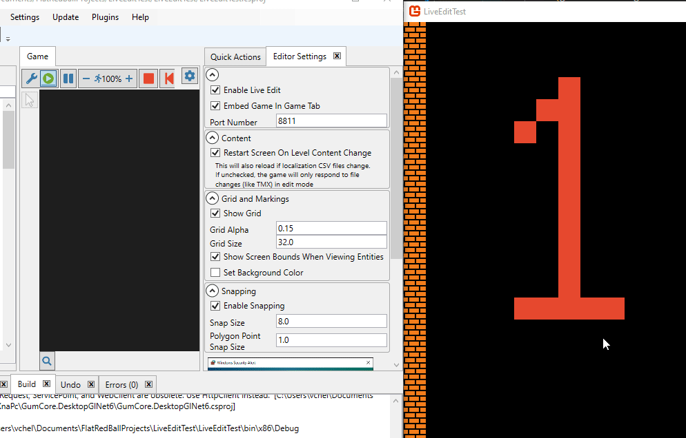<figcaption></figcaption></figure>

As shown above, you can tell that your game is in edit mode if it displays a grid. You can switch between Edit and Play mode anytime by toggling the play and edit buttons.

<figure><figcaption></figcaption></figure>

### Selecting and Previewing

If in edit mode, the selected level displays in the game. You can change selections and the game will switch what is displayed in realtime.

* Select a Screen (or Level)

<figure>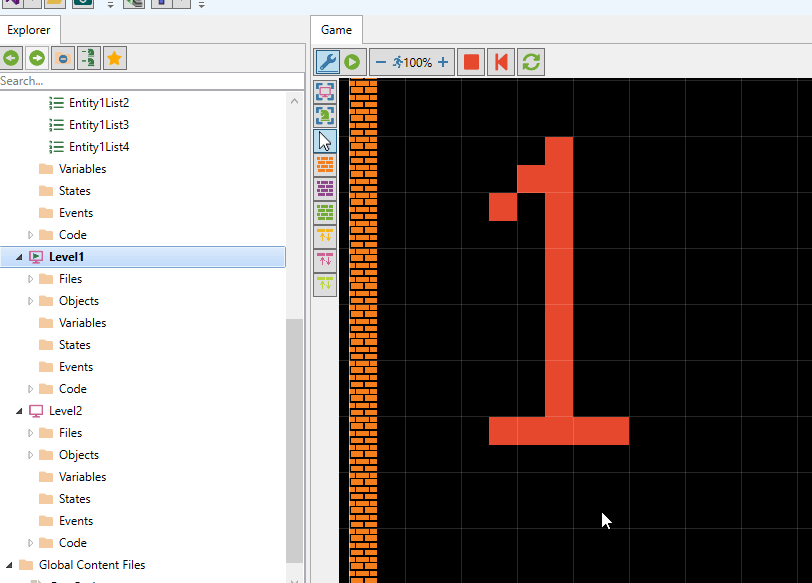<figcaption></figcaption></figure>

* Select an entity to view it in game. The game creates a preview screen allowing you to view and edit the entity by itself.

<figure><figcaption></figcaption></figure>

* Select an object in a Screen or Entity to highlight it

<figure><figcaption></figcaption></figure>

* Select a state to preview it

<figure><figcaption></figcaption></figure>

* States can also be previewed by selecting a state in the StateData editor grid to preview it as well

<figure>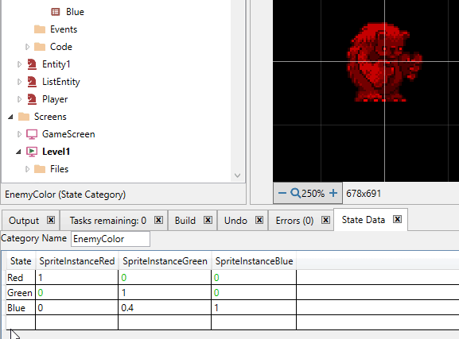<figcaption></figcaption></figure>

* Select an object in a screen by clicking on it in game and it will select in the tree view

<figure>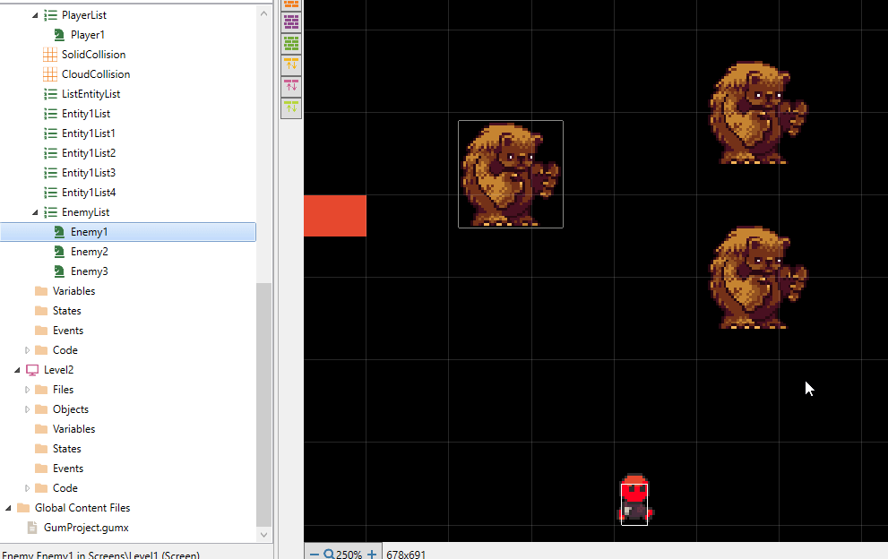<figcaption></figcaption></figure>

* Double-click to _punch through_ and select overlapping objects

<figure>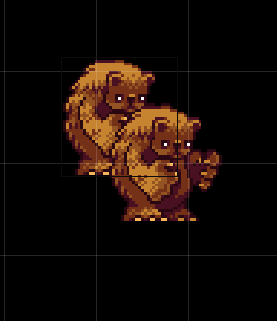<figcaption></figcaption></figure>

### Camera Controls

The Camera in Edit mode can be controlled using the following methods:

* Hold the middle mouse button to pan

<figure>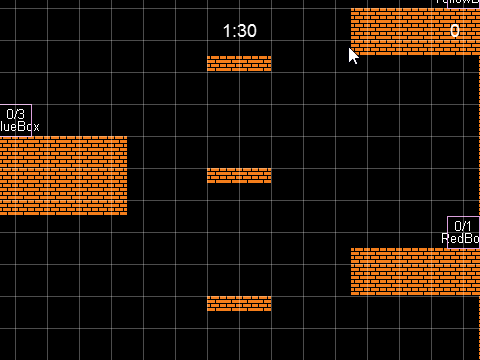<figcaption></figcaption></figure>

* Hold the CTRL key and press the arrow keys. Holding the arrow keys will continue to pan.

<figure><figcaption></figcaption></figure>

* Push+hold the left mouse button and move to the edge of the screen

<figure><figcaption></figcaption></figure>

* Scroll the mouse wheel to zoom in and out

<figure>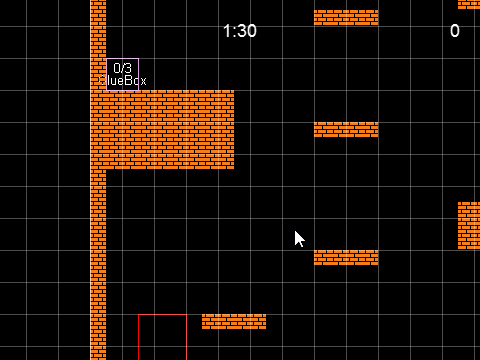<figcaption></figcaption></figure>

* Hold the CTRL key and press + or - to zoom in and out

<figure><figcaption></figcaption></figure>

### Moving and Changing Object Variables

Changes in FlatRedBall immediately apply if the game is in edit mode. The following edits are supported in Live Edit:

* Change a value (such as X or Y) in the Variables tab to see the change in your game

<figure><figcaption></figcaption></figure>

* Push+drag to move objects in the game - the variables will update automatically in Glue to match the new position

<figure>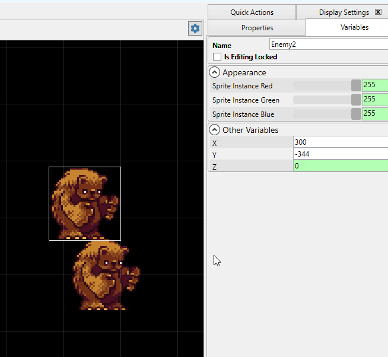<figcaption></figcaption></figure>

* Drag objects to the edge of the screen to pan the camera if they need to be placed off screen

<figure>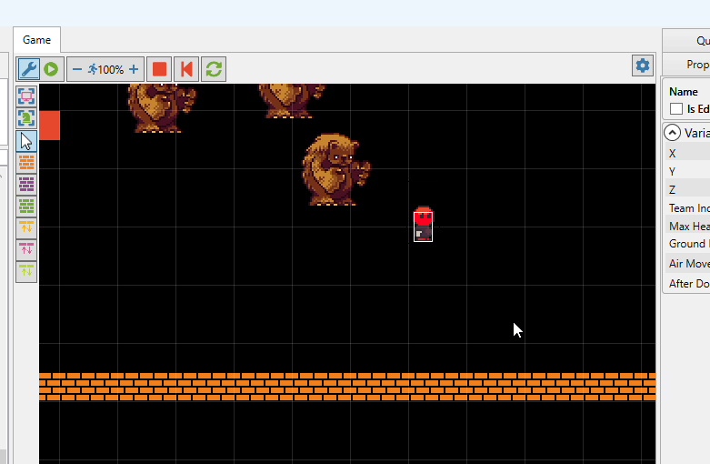<figcaption></figcaption></figure>

* Multiple objects can be selected and moved at once by holding down the CTRL key and clicking each object

<figure><figcaption></figcaption></figure>

* Pushing the left mouse button in a blank space and dragging results in a rectangle which can be used to select multiple objects

<figure><figcaption></figcaption></figure>

* Math operations can be used to change numerical values

<figure>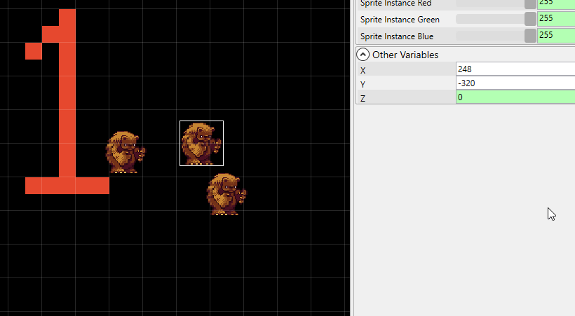<figcaption></figcaption></figure>

* Along with primitive types (such as numerical values), states can also be set on instances

<figure><figcaption></figcaption></figure>

### Creating New Objects

Creating a new object in FlatRedBall automatically updates the game with the new object. New objects can be added to levels or entities.

* New level objects can be added through the Add Object Quick Action

<figure>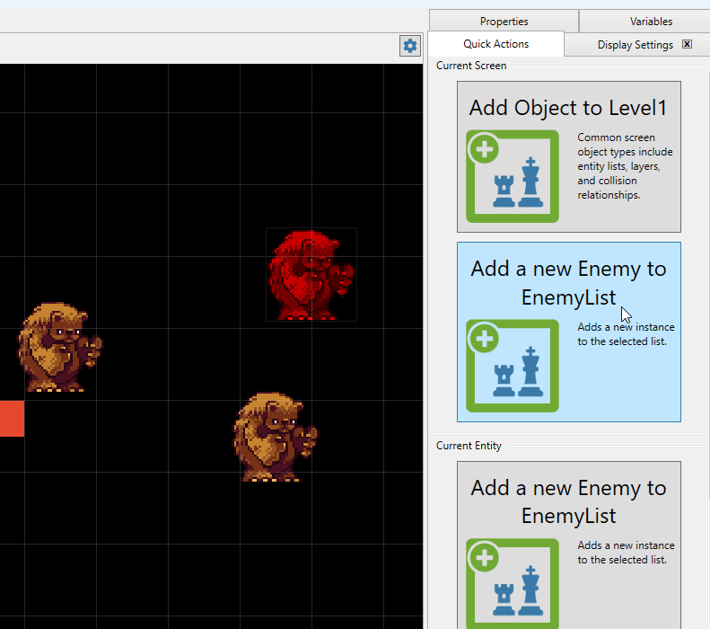<figcaption></figcaption></figure>

* Glue also supports Drag+drop to add objects to a level

<figure>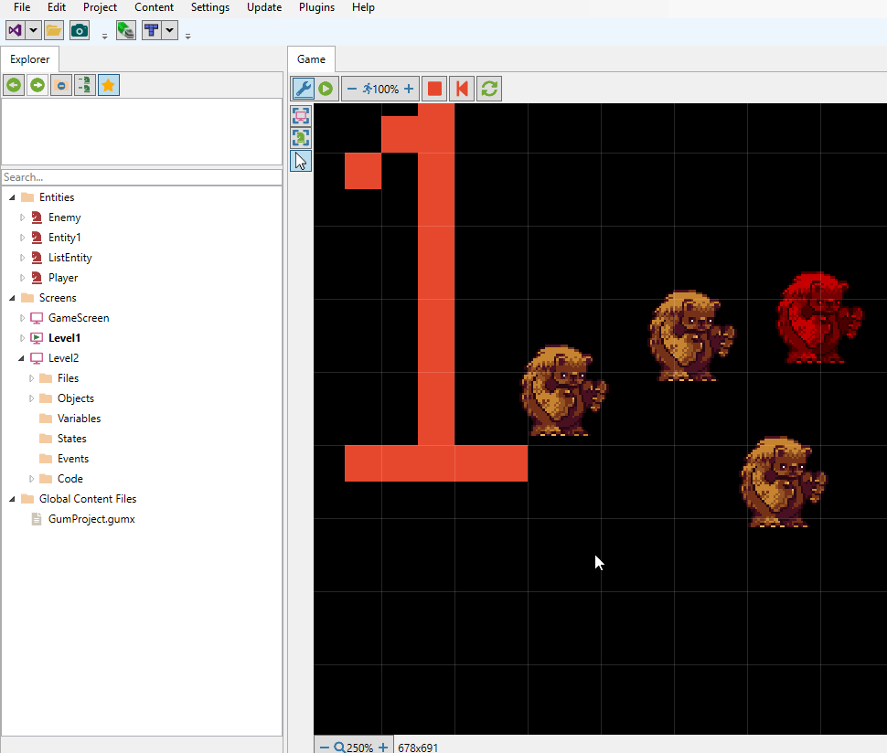<figcaption></figcaption></figure>

* New objects can also be added by selecting their list and using the Quick Action button

<figure><figcaption></figcaption></figure>

* New objects can be created by using the CTRL+C, CTR+V shortcut in game. This is especially useful when placing multiple objects in game. When pasting a grabbed object, the new object will be placed at the location of the crusor.

<figure><figcaption></figcaption></figure>

* Objects added to Entities will automatically appear on instances of that entity

<figure><figcaption></figcaption></figure>

### Working with Files

FlatRedBall supports adding files at runtime and automatically updating to changes.

* New files can be added from the file system to Screens or Entities. If these files are then referenced by an object (such as a Sprite), they will be displayed in game.

<figure>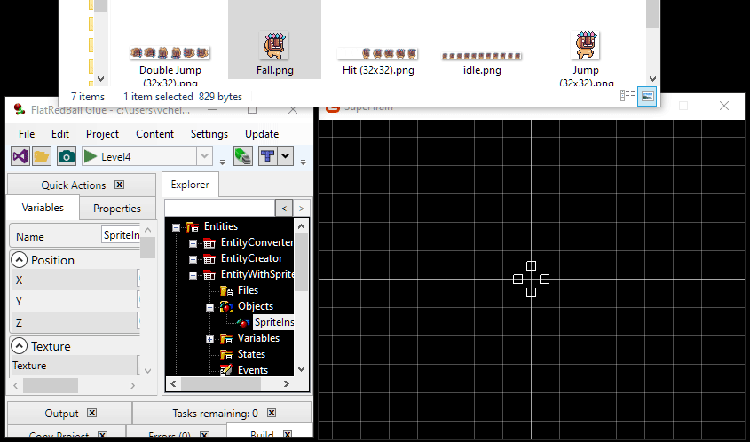<figcaption></figcaption></figure>

* External changes to files are automatically reloaded

<figure><figcaption></figcaption></figure>

* Changes to TMX files which can create entities and collision will automatically update these objects so they can be tested immediately. For example, painting collision tiles immediately allows testing the new level without restarting.

<figure>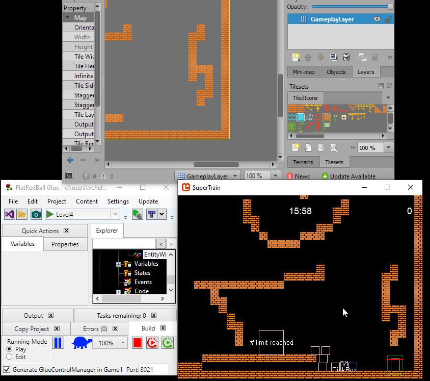<figcaption></figcaption></figure>

### Editing Polygons

Polygons can be edited in real time when your game is running in live edit.

*   Change the number of points by clicking the rectangle button or the button to create an equilateral polygon of a given number of points.\

    <figure><figcaption>
Set the number of points using the rectangle or set points button
</figcaption></figure>
*   Push+drag on a point to change its position or type in a desired value by selecting the point. The selected point has an animated rectangle selector.\

    <figure><figcaption>
Change point positions in the game window or by typing in new values in the Points tab
</figcaption></figure>
*   Reorder points by using the up and down arrow buttons.\

    <figure><figcaption>
Reorder polygon points with the up and down buttons
</figcaption></figure>
*   Adjust the size of a polygon by using the scale button. X and Y scaling can be performed independently.\

    <figure><figcaption>
Resizing polygon height and width
</figcaption></figure>
*   Points can be deleted by clicking on a particular point then pressing the delete key.\

    <figure><figcaption>
Delete points with the delete key
</figcaption></figure>
*   Hold the plus (+) key then click to add points to a polygon\

    <figure><figcaption>
Add points by holding down the plus key and clicking
</figcaption></figure>

