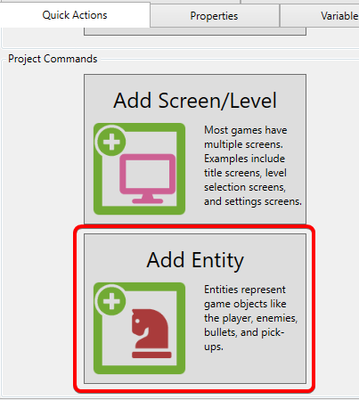

# glue-reference-baseentity

### Introduction

The BaseEntity property controls the inheritance of a given Entity. An Entity can inherit from another Entity, or it can inherit from a FlatRedBall type, like Sprite.

### Inheriting from other Entities

Entities can inherit from other Entities. Entity inheritance is the current recommended approach for creating a variety of common entities, such as multiple Enemy types in a game. To do this:

1.  Click on the Add Entity quick action

    
2.  Use the **Base Entity** dropdown to select the base entity

     Note that when a Base Entity is selected, most of the options are hidden since the new entity inherits those properties from its base.
3. Click **OK**

The new entity now inherits from the selected **Base Entity.**

#### Inheriting when Creating a New Entity

A new entity can be created as a derived entity in the new entity window.

### Inheriting from FlatRedBall Types

Entities can inherit from FlatRedBall types, such as Sprites. By default Entities inherit from PositionedObject, but this inheritance can be modified through Glue. The reason this feature exists is primarily to improve performance and reduce memory consumption. For more information, see the [Inheriting from FlatRedBall Types tutorial](glue-tutorials-inheriting-from-flatredball-types.md).
