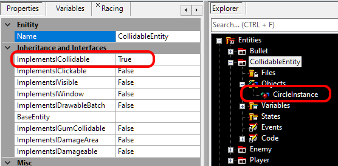

# Implements ICollidable

### Introduction

Entities which can collide with other entities or environments (such as terrain in a platformer) can have their ImplementsICollidable property set. Setting this property to true simplifies writing collision code. Furthermore, entities which implement ICollidable can freely change their collision shapes without having to change any collision code or collision relationships.

### Creating an ICollidable Entity

When creating a new Entity, FlatRedBall provides the option to mark it as ICollidable. The most common approach is to add a shape on the entity when creating it. For example, if the AxisAlignedRectangle check box is checked, the ICollidable check box is automatically checked.


### Making an Existing Entity an ICollidable Entity

If an entity is already created but not yet marked as a ICollidable, it can be marked as ICollidable in its **Properties** tab.

<figure><figcaption></figcaption></figure>

When marking an existing entity as ICollidable, be sure that your entity has a collidable object, such as a circle.



For more information on the ICollidable interface as defined in FlatRedBall, see the [ICollidable](../../api/flatredball/math/geometry/icollidable.md) page.

### Code Examples

Assuming that you are dealing with instances of entities which implement ICollidable, you can call CollideAgainst, CollideAgainstMove, and CollideAgainstBounce between them regardless of the shapes that they use for collision. The benefit of this is that you no longer have to explicitly access the collision objects in an Entity - you can write the code the same regardless of the shape type, and you do not have to change your code if you end up changing your shape objects in Glue.

#### CollideAgainst Example

CollideAgainst is useful when you only need to detect if two things are touching, but the objects do not need to be re-positioned in response to the collision. For example, the following code shows how to perform collision between a ship and a list of enemy bullets:

```lang:c#
foreach(var bullet in EnemyBullets)
{
    if(PlayerInstance.CollideAgainst(bullet))
    {
        bullet.Destroy();
        PlayerInstance.TakeDamage();
    }
}
```

#### CollideAgainstMove Example

CollideAgainstMove can be used to collide two objects, and re-position them according to their masses, as shown in the following code:

```
float firstMass = 1;
float secondMass = 1;
FirstBallInstance.CollideAgainstMove(SecondBallInstance, firstMass, secondMass);
```

Notice that the code above did not have to access the specific shape(s) in FirstBallInstance or SecondBallInstance to perform the collision.
