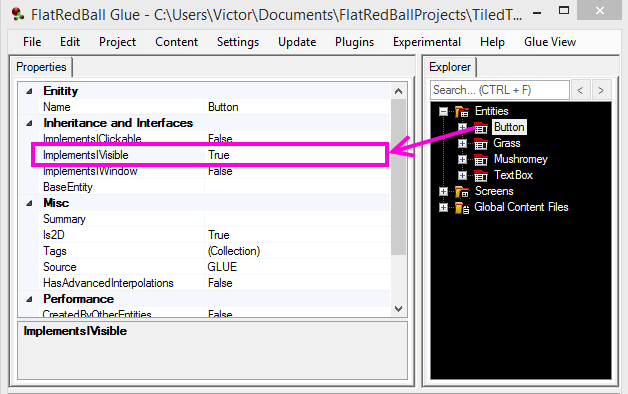

# Implements IVisible

### Introduction

The Implements IVisible property controls whether an entity implements the IVisible property. If true, the FlatRedBall Editor implements this interface in generated code. Most importantly, this provides a Visible property which can be used to toggle visibility. Entities which implement the IVisible interface also provide the Visible variable for tunneling.

<figure><figcaption></figcaption></figure>

### What is "IVisible"?

IVisible is a code interface defined in FlatRedBall. This interface primarily provides a Visible property. For information on working with IVisible in code, see the [IVisible page](../../frb/docs/index.php).
