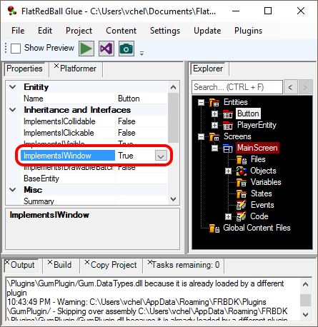
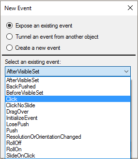
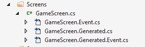
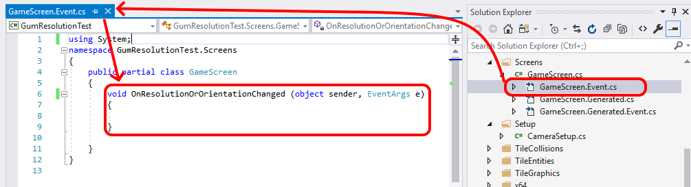

# events

### Introduction

Glue supports the addition of events to screens and entities. The most common types of events include:

* Responding to a variable changing. For more info see the [Variable Event page](../variables/glue-reference-createsevent.md).
* Responding to collision (on a CollisionRelationship)

Other objects such as IWindows can also expose events, but these are less common.

### IWindow Example

Note that IWindows are not used as often in modern FlatRedBall development due to the introduction of FlatRedBall.Forms. However, the following example does show how events can be used for custom implementations of IWindow. The events available to a screen, entity, or object depend on the respective container's properties. For example, if an entity implements IWindow (for more information, see the [Implements IWindow page](../../documentation/tools/glue-reference/entities/glue-reference-implements-iwindow.md)), the entity will have additional events available.

### Editing Event Code

Every event in Glue creates a corresponding method in your code project which can be edited in Visual Studio. For example, consider the example of a **GameScreen** which has an event **ResolutionOrOrientationChanged**:

The presence of this event will result in 2 new code files:

1. &#x20;GameScreen.Event.cs
2. GameScreen.Generated.Event.cs

As usual, the file with Generated in the name is a generated file which should not be edited because Glue may overwrite any manual changes. The non-generated file (GameScreen.Event.cs) can be freely edited to modify the logic associated with a given event.

