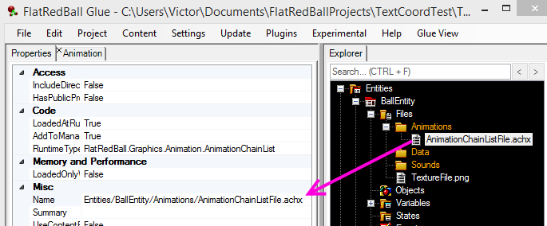
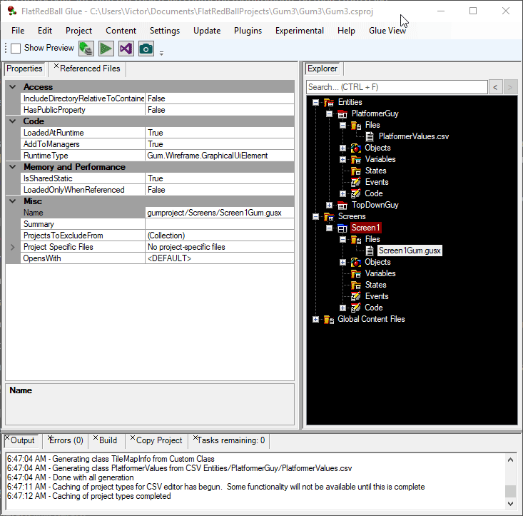

# Files

### Introduction

Files added to the FlatRedBall Editor are managed for you automatically, simplifying the game development process. When a file is added to the FRB Editor the following occurs:

* The file is listed in the tree view
* The file is added to the proper Visual Studio project(s)
* A static member is added for the file in the appropriate screen, entity, or global content
* Code for loading the file is generated automatically

### Supported File Types

* png (image files)
* achx (animation files)
* tmx (tiled map files)
* gusx (Gum screen files, usually automatically added when creating a new FRB Screen)
* mp3 (music)
* ogg (music)
* wav (sound)
* csv (spreadsheet files for data)

The following types are also supported, but are not commonly used in modern FlatRedBall game development

* scnx
* shcx
* emix
* splx
* nntx (node network files)

Additional files can be added to the FlatRedBall Editor and supported through plugins. For example, see the [Spine plugin](../../spine/) for supporting Spine files.

### Adding Files to FlatRedBall

FlatRedBall supports multiple ways to add a file to your project:

* Right-click on the Files folder and select to add a new file
* Right-click on the Files folder and select to add an existing file
* Drag+drop a file from a Windows Explorer window onto the desired Files folder in the FlatRedBall Editor

#### Adding Existing Files and the Content Folder

Usually if a file is loaded in your game, the File should be located relative to the Content folder of your project. This is important so that your game is portable. Therefore, whenever an existing file is added to your project, the FlatRedBall Editor checks if it is already inside the Content folder. If not, it is copied to the desired folder in a Screen, Entity, or Global Content Files.

If you would like to control the organization of your files, then you should always manually copy the files into your Content folder in their desired location first, and then add them to FlatRedBall. By using this approach, the files will remain in the same place after you add them to FlatRedBall. Otherwise, you can drag+drop files from anywhere (such as the desktop) and FlatRedBall will organize them based on where the files are dropped.

For example, if a file is located on the desktop then it will be copied to the game's content folder when it is drag+dropped. The original file is left untouched. Any modifications to the file should be made on the file inside the Content folder rather than the original file.

In this case the file is copied to the game's **Content/GlobalContent** folder. Note that the prefix "Content" is omitted in the Name property as this is assumed for all content.

<figure><figcaption><p>File copied from desktop to Global Content Files</p></figcaption></figure>

If the file is already a part of the project's Content folder, then it is not copied when drag+dropped into FlatRedBall.

<figure><figcaption><p>File in Content added without copying</p></figcaption></figure>

For convenience, existing files in the Content folder are shown when adding new files.

<figure><figcaption></figcaption></figure>

### Adding Files Through References

Some file types can reference other files. If FlatRedBall understands this file type, then only the root file must be added to the FlatRedBall project - all referenced files will be automatically added to your game project.

This feature is especially useful for file types which can reference lots of other files. For example, consider that a Gum project (.gumx) can reference dozens of other files such as texture files (.png) and font files (.fnt). By adding the .gumx file to your project (which is done automatically when creating a project with the New Project Wizard, all other files are automatically added to your project.

The following screenshot shows a typical game with the GumProject.gumx added to **Global Content Files**.

<figure><figcaption><p>GumProject.gumx in Global Content Files</p></figcaption></figure>

Every file referenced by the Gum project (and any of the Screens and Components in the Gum project) is automatically added to your game project (.csproj). For example, all font files are automatically added to the game project, as shown in the following screenshot from Visual Studio.

<figure><figcaption><p>Font files in Visual Studio</p></figcaption></figure>

### Adding Files Using Wildcards (\*)

The FRB Editor also supports adding files using a wildcard pattern. For more information on using wildcards, see the [Wildcard Files](wildcard-files.md) page.

### Accessing Files in Code

Files added through the FRB Editor can be accessed in code. Files added to **Global Content Files** can be accessed in any location through the `GlobalContent` class. Files added to screens and entities can safely be accessed within the respective screen or entity's custom code. Files from other screens or entities can be accessed so long as the owning screen or entity has had its `LoadStaticContent` method called prior to accessing the file.

Note that files can also be accessed through the generated "Type" class generated by FlatRedBall. For more information on derived types and accessing files, see the [Entity Variants Using Inheritance](../../tutorials/entity-variants-using-inheritance.md#accessing-derived-files) page.

#### Accessing Files in Their Screen or Entity

Files added to a Screen or Entity create a member which can be accessed in code. For example, if a .png file is added to an Entity, it can be used to assign a texture on a sprite. In the example below, the FlatRedBall Editor generates code for a Texture2D called MonsterTexture .


This Texture2D can be accessed in custom code, such as to assign a Sprite's Texture. Since MonsterTexture is a static Property of the Monster entity, access to this property is checked at compile time and auto complete displays it as an option when writing code.


#### Accessing Global Content Files

Global content files are loaded when the game first starts, and remain in memory for the remainder of a game's execution, so they can be accessed at any time. For example, the following file named MainSpriteSheet.png is part of Global Content Files.


This can be accessed anywhere in a game with the following code:

```csharp
var texture = GlobalContent.MainSpriteSheet;
// use texture as needed
```

### Shared Files

Single files can be shared across multiple Screens, Entities, and Global Content. For example, a file may be added to Global Content Files, but then also added to an Entity to be accessible by that Entity in the FlatRedBall Editor. This does not create a copy of the file - both Player and Global Content Files reference the same file on disk and in memory:

<figure><figcaption><p>Global file added to the Player Files folder</p></figcaption></figure>

Files can also be shared between entities and screens. For example, the following shows a single file shared between two entities:

<figure><figcaption><p>Single file shared between two Entities</p></figcaption></figure>

Notice that the file being moved is in the **Entities/Player** folder. When it is moved to Monster, the file in the Monster files is still named **Entities/Player.CharacterSpriteSheet.png**. The FlatRedBall Editor does not duplicate the file on disk when it is drag+dropped from one Entity to another. At runtime the image is only loaded once if both Player and Enemy are created in the same screen.

### File Folders

The "Files" tree node supports folders. To add a folder:

1. Right-click on the "Files" node
2. Enter the name of the folder
3. Click OK

This creates a folder both in the FlatRedBall Editor as well as on the file system.

<figure><figcaption><p>Folders in the Files folder</p></figcaption></figure>

### Name and Location

The Name of a file in the FlatRedBall Editor reflects its location. For example, the following shows a file located in the Animations folder of a Ball entity:

<figure><figcaption></figcaption></figure>

Shared files display the name of their location on disk. For example the following shows a file which is located in Global Content, but shared with an entity. When the shared copy is selected the file's actual location is show in the Name property:

<figure><figcaption></figcaption></figure>

Notice that the file above is located in **GlobalContent/ball.png**, but it appears in both the **Global Content Files** folder and the **Files** folder of **BallEntity**. To view a file in its location on disk, right-click and select **View in Explorer**.

<figure><figcaption><p>Right-click to view a file in explorer</p></figcaption></figure>

### Deleting Files

Files can be deleted by right-clicking on a file and selecting the Remove option.

<figure><figcaption><p>Right click remove option</p></figcaption></figure>

The Delete key on the keyboard also serves as a shortcut for removing the file.

If a file is removed, the FRB Editor scans the project to determine if the file is still referenced elsewhere. If no refernces are found, then FRB asks what you would like to do with the file.

<figure><figcaption><p>Options after removing a file</p></figcaption></figure>

* Nothing - this option removes the file from the FRB Editor, but the file remains part of the Visual Studio project and is not removed from disk. Select this option if you would still like to use this file in code. Note that you must manually load the file in custom code - the FRB Editor no longer generates any code for files which have been removed.
* Remove them from the project but keep the files - this option removes the file from the the FRB Editor and also from your game project (.csproj). Select this option if you do not want to use the file in your project, but you want to keep it on disk so you can access it later. Since the file is no longer part of Visual Studio, it will not be copied to your game's bin folder, so it cannot be loaded at runtime - even in custom code.
* Remove and delete the file - this option removes all traces of the file including the FRB Editor, your game project (.csproj), and on disk. Select this option if you are sure that you no longer need this file.

If FlatRedBall detects that a file is still used by your project, it does not display the dialog asking you what to do with the file.

For example, if the same file appears in two entities, it can be removed from one safely and FRB will not ask what to do with the file since it is still needed. The following animation shows a file which is part of both the Monster and Player entities. If removed from Monster, you will not be asked to remove it from your project or disk since it is still part of the Player entity.

<figure><figcaption><p>File removed from Monster, but still part of Player</p></figcaption></figure>

If the file were to also be removed from Player, then FRB would ask how to treat the file (nothing, remove from project, delete).

#### Deleting Files Referenced by Other Files

A file can have references from other files. For example, a .png file can be referenced by an .achx file. FlatRedBall understands file references in common file types such as .achx, .tmx, and gum files. Therefore, if a file is removed but still referenced by a different file, FRB will not ask about removing the file from Visual Studio or the file system.

For example, the Player's AnimationChainhListFile.achx references the CharacterSpriteSheet.png. If CharacterSpriteSheet is removed from the Player entity, the FRB Editor recognizes that it is still needed and does not ask about whether it should be deleted or removed from the game project.

<figure><figcaption><p>AnimationChain refrencing a file on disk</p></figcaption></figure>

