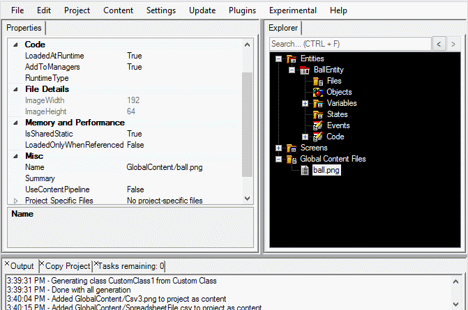
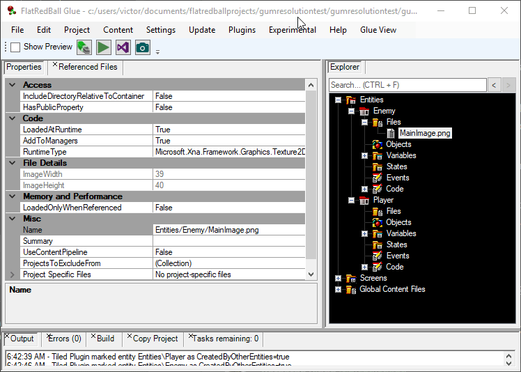

# Files

### Introduction

Files added to the FlatRedBall Editor will be managed for you automatically, simplifying the game development process. When a file is added to the FRB Editor the following occurs:

* The file is listed in the tree view
* The file is added to the proper Visual Studio project
* A static member is added for the file in the appropriate screen, entity, or global content
* Code for loading the file is generated automatically

### Supported File Types

* png (image files)
* achx (animation files)
* nntx (node network files)
* tmx (tiled map files)
* gusx (glue screen files, usually automatically added by Glue)
* mp3 (music)
* ogg (music)
* wav (sound)
* csv (spreadsheet files for data)

The following types are also supported, but are not commonly used in modern FlatRedBall game development

* scnx
* shcx
* emix
* splx

Additional files can be added to the FlatRedBall Editor and supported through plugins.

### Adding Files to FlatRedBall

FlatRedBall supports multiple ways to add a file to your project:

* Right-click on the Files folder and select to add a new file
* Right-click on the Files folder and select to add an existing file
* Drag+drop a file from a Windows Explorer window onto the desired Files folder in the FlatRedBall Editor

#### Adding Existing Files and the Content Folder

Usually if a file is loaded in your game, the File should be located relative to the Content folder of your project. This is important so that your game is portable. Therefore, whenever an existing file is added to your project, the FlatRedBall Editor checks if it is already inside the Content folder. If not, it is copied to the desired folder in a Screen, Entity, or Global Content Files.

If you would like to control the organization of your files, then you should always manually copy the files into your Content folder in their desired location, and then add them to FlatRedBall. By using this approach, the files will remain in the same place after you add them to FlatRedBall. Otherwise, you can drag+drop files from anywhere (such as the desktop) and FlatRedBall will organize them based on where the files are dropped.

For example, if a file is located on the desktop then it will be copied to the game's content folder when it is drag+dropped. The original file is left untouched. Any modifications to the file should be made on the file inside the Content folder rather than the original file.

In this case the file is copied to the game's **Content/GlobalContent** folder. Note that the prefix "Content" is omitted in the Name property as this is assumed for all content.

<figure><figcaption><p>File copied from desktop to Global Content Files</p></figcaption></figure>

If the file is already a part of the project's Content folder, then it is not copied when drag+dropped into FlatRedBall.

<figure><figcaption><p>File in Content added without copying</p></figcaption></figure>

For convenience, existing files in the Content folder are shown when adding new files.

<figure><figcaption></figcaption></figure>

### Accessing Files in Code

Files in Glue can be accessed in code. Files added to global content can be accessed in any location through the `GlobalContent` class. Files added to screens and entities can safely be accessed within the respective screen or entity's custom code. Files from other screens or entities can be accessed so long as the owning screen or entity has had its `LoadStaticContent` method called prior to accessing the file.

#### Accessing Files in Their Screen or Entity

Files added to a Screen or Entity create a member which can be accessed in code. For example, if a .png file is added to an Entity, it can be used to assign a texture on a sprite. In the example below, the FlatRedBall Editor generates code for a Texture2D called MonsterTexture .


#### Accessing Global Content Files

Global content files are loaded when the game first starts, and remain in memory for the remainder of a game's execution, so they can be accessed at any time. For example, the following CSV named EnemyInfo is part of global content:


This can be accessed anywhere in a game with the following code:

```lang:c#
var goblinInfo = GlobalContent.EnemyInfo["Goblin"];
var health = goblinInfo.Health;
```

### Shared Files

Single files can be shared across multiple Screens, Entities, and Global Content. For example, a file may be added to Global Content Files, but then also added to an Entity to be accessible by that Entity in the FlatRedBall Editor:&#x20;

<figure><figcaption><p>Global file added to the BallEntity Files folder</p></figcaption></figure>

Files can also be shared between entities and screens. For example, the following shows a single file shared between two entities:

<figure><figcaption><p>Single file shared between two Entities</p></figcaption></figure>

Notice that the file added to Player has a name of **Entities/Enemy/MainImage.png.** The FlatRedBall Editor does not duplicate the file on disk when it is drag+dropped from one Entity to another. At runtime the image is only loaded once if both Player and Enemy are created in the same screen.

### File Folders

The "Files" tree node supports folders. To add a folder:

1. Right-click on the "Files" node
2. Enter the name of the folder
3. Click OK

This will create a folder both in the FlatRedBall Editor as well as on the file system.&#x20;

<figure><figcaption><p>Folders in the Files folder on the BallEntity</p></figcaption></figure>

### Name and Location

The Name of a file in the FlatRedBall Editor reflects its location. For example, the following shows a file located in the Animations folder of a Ball entity: &#x20;

<figure><figcaption></figcaption></figure>

Shared files display the name of their location on disk. For example the following shows a file which is located in Global Content, but shared with an entity. When the shared copy is selected the file's actual location is show in the Name property: &#x20;

<figure><figcaption></figcaption></figure>

Notice that the file above is located in **GlobalContent/ball.png**, but it appears in both the **Global Content Files** folder and the **Files** folder of **BallEntity**. To view a file in its location on disk, right-click and select **View in Explorer**.

<figure><figcaption><p>Right-click to view a file in explorer</p></figcaption></figure>
