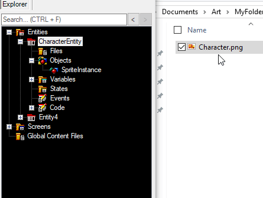

# Texture2D (.png)

### Introduction

Texture2D instances can be created through Glue by adding image files to entities, screens, or global content. By default, any image file added to Glue will be loaded when the containing screen/entity is created. Files added to Global Content can be accessed as soon as the game launches from any screen or entity.

### Example - Adding a Texture2D For a Sprite

Texture2D's which are added to a screen or entity can be accessed by objects in the same screen or entity. The following steps show how to add a Texture2D to an entity and reference it on a sprite:

1.  Create an entity with a Sprite object. See the [Sprites in Glue page](../../objects/object-types/glue-reference-sprite.md) for more information.

    
2. Drag+drop a .png file from any location on your computer onto the entity's Files object. Note that if the file is not located outside of your game's Content folder, the file will be copied.

<figure><figcaption></figcaption></figure>

3. Select the Sprite object
4. Locate the "Texture" property
5.  Use the drop-down to select the desired texture

    

The sprite will now use the selected texture.

### Example - Accessing a Texture2D in code

Texture2D instances added to Glue can be accessed in code. If a Texture2D is added to a screen then the custom code for that screen can access the Texture2D variable name matching the name of the file (excluding extension). Similarly, if a Texture2D is added to an entity, then the custom code for that entity can access the Texture2D as well. If a Texture2D is added to global content, then any code in the entire game can access the Texture2D at any time. For this example, consider the CharacterEntity shown in the example above. The custom code for CharacterEntity can access the Character PNG as follows:

```lang:c#
private void CustomInitialize()
{
    // This is a redundant set, since the SpriteInstance
    // already uses the Character texture. It simply shows
    // that custom code can access the Texture2D by file name
    // in a type-safe way.
    SpriteInstance.Texture = Character;
}
```

Similarly, files added to global content can be accessed in code through the GlobalContent object. For example, consider a file Background.png which could be added to global content:


This file could be accessed in code as shown in the following snippet:

```lang:c#
private void CustomInitialize()
{
    SpriteInstance.Texture = GlobalContent.Background;
}
```
