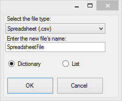
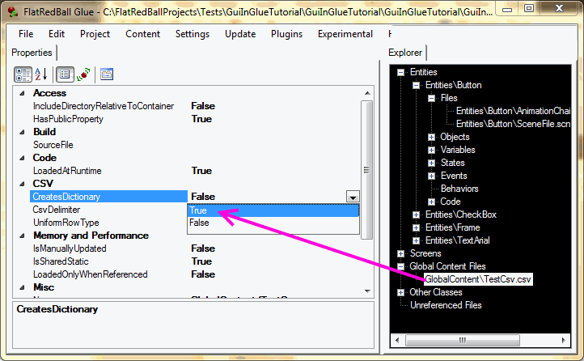

# CreatesDictionary

### Introduction

CreatesDictionary is a property that controls whether to deserialize a given CSV file to either a List or Dictionary. If you are accessing entries within a CSV according to some common key (such as the Name of an enemy type), then you should use the CreatesDictionary property to simplify access in code.&#x20;

CreatesDictionary can be set on a CSV file in its properties tab or when first adding a new CSV. The following shows the option for specifying Dictionary or List when creating a new CSV:

<figure><figcaption><p>Selecting Dictionary or List when adding a new CSV</p></figcaption></figure>

### "required" keyword

Dictionaries in code require a key. This is typically the Name property which is marked with the `required` keyword. For example, the following CSV marks the "Name" as required:&#x20;

<figure><figcaption><p>Example CSV with Name required property</p></figcaption></figure>

**Name is common** The most common key for data is "Name". Unless you have a reason to not use this, consider using "Name" as your required property.

If you have a CSV without a "required" field, then FRB cannot create a Dictionary out of the CSV. Just like any other CSV, once you have saved this file, the generated class will be added/updated.

### Setting CreatesDictionary" in the Properties Tab

CreatesDictionary can also be set to true in the Properties tab of a CSV file:

<figure><figcaption></figcaption></figure>

### Accessing the Dictionary in code

Now that you have created a CSV that has CreatesDictionary set to true, you can access the file in code and get instances using the Name property:&#x20;

<figure><figcaption></figcaption></figure>

### Concerns about using strings as keys

You may be wondering if it is a good idea to access objects using strings as the key. For example, let's consider the following line:

```
int damage = GlobalContent.TestCsv["Imp"].Damage;
```

As you may have realized, this can be an unsafe line of code. What if, for example, the CSV changes so that it no longer contains the "Imp" object? Then that code would compile, and the error would only be discovered if that particular piece of code was executed. In other words, there is a risk of having hidden bugs associated to this line of code. First, we should mention that the reason the code above uses the hardcoded "Imp" value is to show the connection between code and the CSV. In final game code this is not good practice. Fortunately this type of code is usually not necessary. Let's look at the two most common situations where values are retrieved:

#### Values in Lists

It is common to use values form CSVs in Lists. For example, let's say that the TestCsv used above is being used in a screen where the user picks which enemies to take into battle. Your code may look something like this:

```
foreach(var value in GlobalContent.TestCsv.Values)
{
   CreateButtonFor(value);
}
```

This would dynamically loop through the list and create UI elements for each item in the CSV. If an item is added or removed, your code would automatically adjust to this and only show which values are appropriately.

**Dictionary order is undefined.** The order of entries in a dictionary is not always the same as the order of entries in a CSV. For more information on retrieving the order, see [this page](../../../frb/docs/index.php).

#### Accessing values directly

In some cases you may need to access values directly. This can happen if:

* You need to set a default value for something in code
* You need to create a script in code, such as defining which enemies appear in a particular level

Fortunately the generated code creates const string values to allow you to access values in a compile-time-protected way. For example, the code above to access the imp could be more-safely done as follows:

```
int damage = GlobalContent.TestCsv[TestCsv.Imp].Damage;
```

The TestCsv class has one constant for each entry in the CSV, so the code above will work without any other code.
