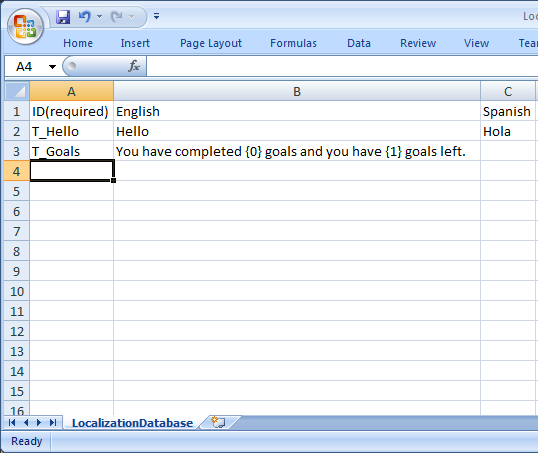

# IsDatabaseForLocalizing

### Introduction

FlatRedBall supports the use of a localization CSV file to simplify adding text to your game, whether your game uses a single or multiple langauges. The IsDatabaseForLocalizing property controls whether a CSV file is used as a localization file. When a spreadsheet is marked as IsDatabaseForLocalizing, the FlatRedBall Editor populates the LocalizationManager with the database when the CSV is loaded.

Because of the generated code that FlatRedBall writes automatically, creating a game that supports localization requires very manual code.&#x20;


Prior to FRB Editor (gluj) file version 14, generated code would make LocalizationManager.Translate calls. This functionality was inconsistent and difficult to work with, so as of file version 14, Translate must be called manually. For more information on this change, see the [gluj/glux document](../glujglux.md).


### Creating a Localization Database

First we'll create a spreadsheet file that will serve as a localization database. To do this:

1. Right-click on **Global Content Files**. Since most of your game probably uses text from this file, it should be in **Global Content Files** rather than a screen or entity.
2. Select **Add File**->**New File**
3. Select **Spreadsheet (.csv)** as the file type
4. Enter the name **LocalizationDatabase** for your new file. This name is not required, but recommended by convention.
5. Click OK

Next, set IsDatabaseForLocalizing to true:

1. Select the newly-created LocalizationDatabase file
2.  Change **IsDatabaseForLocalizing** to **True**

    

### Modifying the Spreadsheet

The next step is to begin filling out the database. To do this:

1. Double-click the file to open it in a spreadsheet editing program such as Excel or Open Office
2. Change the top-left cell to read "ID (required)". Make sure "required" is not capitalized.
3. Change the first row in the second column to say "English", or whatever you prefer your default language to be.
4.  Change the first row in the third column to say "Spanish" or the secondary language. You can continually add columns for any language you may want to support.&#x20;

    <figure><figcaption><p>Example CSV with languages</p></figcaption></figure>
5. Enter a string ID under the "ID" column. You may want to use a particular prefix to differentiate between string IDs and actual text - this can help you spot bugs in development. For this tutorial, I'll use "T\_" before IDs. Therefore, I'll enter "T\_Hello" for my first string.
6. Enter the English and Spanish versions of this string
7. Save the spreasheet

### Setting the Language

Before any localization can happen, you must tell the game which language to use. By default, the LocalizationManager uses index 0 as its default language. This column stores the IDs. The first language (which is English in our case) begins at index 1. Therefore, to have your database translated, you must set the language index. To do this:

1. Open Game1.cs (or whatever your Game class is named)
2. Find `GlobalContent.Initialize();` and add the following after it:

```csharp
// Sets it to English, assuming the 2nd column (0-based index) is English.
FlatRedBall.Localization.LocalizationManager.CurrentLanguage = 1;
```

Be sure that this is set **before** ScreenManager.Start is called, or else the Screen will be initialized prior to the language being set.

### Manually Translating Text

To translate text, you can use the LocalizationManager's Translate method. For example, if you wanted to translate the string ID "T\_Tutorial1" you could do so as follows:

```csharp
string translatedTutorialString = LocalizationManager.Translate("T_Tutorial1");
```

You could then use translatedTutorialString in your game, such as by assigning the string to a Gum object's Text property.

### Adding Variables to Translated Text

So far we've covered static translations. Of course, you may want to have variables embedded in your text. The LocalizationManager supports this through a syntax that is very similar to the string.Format method. To support variables in your text:

1.  Add an entry to your database spreadsheet using the { and } characters surrounding the variable index. For example, to inform the player of how many goals are left, you might enter: "You have completed {0} goals and you have {1} goals left."\
    &#x20;

    <figure><figcaption><p>Localization with variables</p></figcaption></figure>
2. In your code you can use the Translate overload which takes arguments to "format" the string. For example, your code may look like this:

```csharp
// assuming GoalsCompleted and GoalsLeft are valid variables:
string translatedGoalText = LocalizationManager.Translate("T_Goals", GoalsCompleted, GoalsLeft);
myTextObject.DisplayText = translatedGoalText;
```

### Comments

Comments can be added to the ID column by using the `//` syntax (similar to C#). Comments are ignored, allowing you to insert notes when creating localization files.

<figure><figcaption><p>Localization Comments</p></figcaption></figure>

### Multiple Entries Per ID

Games which display dialog using a dialog box may need to organize the dialog into mulitple pages. This is important to prevent sentences from being shown on multiple pages based on line wrapping. Also, games may include multiple speakers (see more info below).

Each string ID can contain multiple rows, wher each row serves as a different page. The following image shows three IDs. T\_Dialog1 has 7 separate strings, beginning with the first as "Sounds like something crashed!", and ending with "Or aliens!!"

<figure><figcaption><p>CSV file with dialog that has multiple strings</p></figcaption></figure>

To access the strings, the TranslateMultiple method can be used, as shown in the following code:

```csharp
var strings = LocalizationManager.TranslateMultiple("T_Dialog1");
foreach(var pageOfText in strings)
{
  // use the pageOfText here
}
```

### Adding Metadata to Localization

By convention the first column in a localization file is the ID, and subsequent columns are for each language. Ofen times dialog requires additional information, such as the speaker of dialog. Keep in mind that each column can be used however you like in your game. For instance, if your game displays dialog along with the name of a speaker, you may want to have a column for the speaker.

The following shows a real-world example of a localization file which includes a column for the speaker, whether to flip the profile, and whether the text is automatically skipped. Note that these columns do not have any built-in behavior on their own. They must be read in and applied in your custom code.

<figure><figcaption><p>Dialog with Speaker, Flip Profile, and Auto Skip</p></figcaption></figure>

