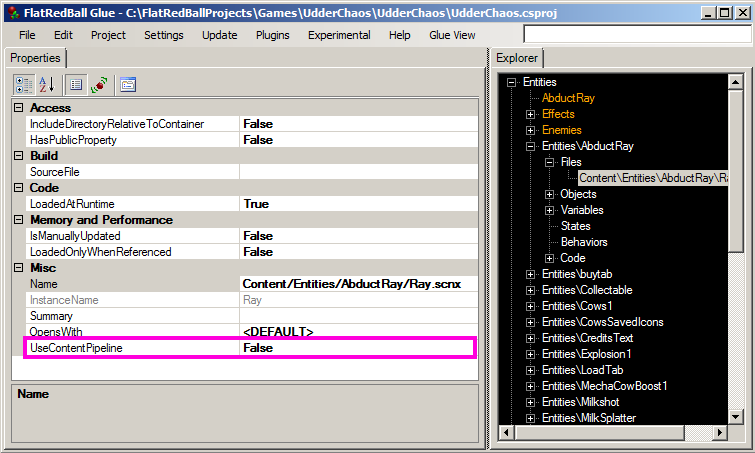

# UseContentPipeline

### Introduction

The UseContentPipeline property on files controls whether a file is loaded using the _content pipeline_. The content pipeline is a tool provided by MonoGame and Kni which converts raw files (such as .wav and .png) to processed files with the .xnb extension. By default most files do not use the content pipeline - they load _from-file_.


FNA does not provide a content pipeline, so if your project is of FNA type, then all files are loaded _from-file_. Keep in mind that .fx files must still be processed by a command line tool, but the FlatRedBall Editor handles this automatically. For more information on how .fx files are loaded see the [Effect page](file-types/effect-.fx.md).


### What is the content pipeline?

Files which are added to FlatRedBall (such as .achx or .png) are considered "raw" files. These are files which generally use a standard file format which can be edited in a variety of applications. For example, .png files can be opened in any image editing software. The .achx file format is a simple XML file which can be opened in the AnimationEditor and also in any text editor.

Content pipeline files are "processed" to create .xnb files. These files can be smaller, load faster, or use fewer resources. There is also a small security benefit to using the .xnb file format. Therefore you may want to use the content pipeline on your files prior to shipping your game.

Note that some files, such as .mp3, must use the content pipeline if you are targeting MonoGame, so you may not have a choice.

### Why should I not always use the content pipeline?

If .xnb files are smaller, faster, and safer you may wonder why FlatRedBall offers a from-file option, and why FlatRedBall defaults to from-file.

The first reason is that using the content pipeline can increase build time. By default files which are loaded from-file do not have to built when the game is built - they are simply copied to the output directory. This process is **much faster** than using the content pipeline. Another reason is not all files support a content pipeline option. For example, Gum and Tiled plugins produce files which are loaded "raw" and do not support using the content pipeline.&#x20;

The recommended approach is to use from-file loading whenever possible throughout development, and switch to using the content pipeline near the end of development for file formats which support it and if you need it. A few exceptions to this recommendation exist:

* MonoGame and Kni require some files to be loaded through the content pipeline such as .mp3 files.
* Web (Kni) project .png load times can be significantly reduced by using the content pipeline.

### Switching to the content pipeline

To switch to the content pipeline:

1. Select a file in your project
2. Change the "UseContentPipeline" property to True&#x20;

<figure><figcaption></figcaption></figure>

Your game will now load this file from content pipeline.

### Content pipelines and dependencies

Many files (like .achx files) depend on other files (like .png files). When you switch a file to use the content pipeline, the name of the file changes too. A file which used to be called "MyFile.png" (with extension) may get loaded as "MyFile" (no extension), and this impacts the name. Fortunately, FlatRedBall automatically handles this for you by generating a list of aliases. In other words, you can set your PNG's UseContentPipeline to true and everything should continue to work just like it did before.
