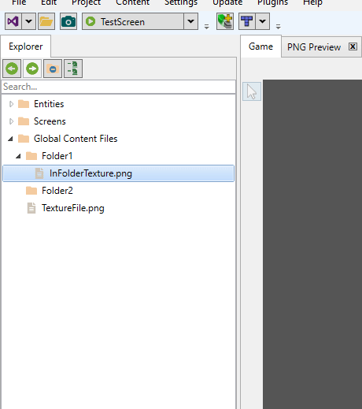

# IncludeDirectoryRelativeToContainer

### Introduction

The IncludeDirectoryRelativeToContainer property controls whether the generated code for a file includes the directory name in the property created. By default this is false, but setting it to true allows the addition of multiple files with the same name in the same screen, entity, or global content as long as the files are in different folders.

### Example - Changing IncludeDirectoryRelativeToContainer

As mentioned above, by default this value is false. Therefore, files added to folders will not include their folder in the generated property name. For example, consider the InFolderTexture.png file which is contained in Folder1


This produces the following code in GlobalContent:

```
public static Microsoft.Xna.Framework.Graphics.Texture2D InFolderTexture { get; set; }
```

Notice the name in code does not include Folder1. If this file is copied into Folder2, the FlatRedBall Editor renames the copy as to avoid naming conflicts.

<figure><figcaption></figcaption></figure>

The generated code matches the name:

```
public static Microsoft.Xna.Framework.Graphics.Texture2D InFolderTexture { get; set; }
public static Microsoft.Xna.Framework.Graphics.Texture2D InFolderTexture1 { get; set; }
```

If the IncludeDirectoryRelativeToContainer can be set to true so that the generated property includes the folder name.


Once this is set, the property generated includes the Folder1 prefix:

```
public static Microsoft.Xna.Framework.Graphics.Texture2D Folder1_InFolderTexture { get; set; }
```

This allows the same-named files to exist in different directories, because they will ultimately produce different property names. For example, copying the InFolderTexture.png file into Folder2 now results in the file copied without being renamed.

<figure><figcaption></figcaption></figure>

Each property is now uniquely qualified by its folder.

```
public static Microsoft.Xna.Framework.Graphics.Texture2D Folder1_InFolderTexture { get; set; }
public static Microsoft.Xna.Framework.Graphics.Texture2D Folder2_InFolderTexture { get; set; }
```
