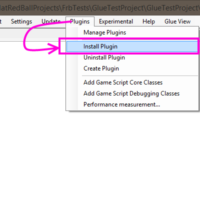
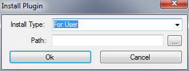

# Install Plugin

### Introduction

Plugins can be manually installed through the Install Plugin menu item. Plugins use the extension .plug.

### Installing Plugins

To install a plugin, select the Plugins->Install Plugin menu item. &#x20;

<figure><figcaption></figcaption></figure>

You will see the following window appear:&#x20;

&#x20;

<figure><figcaption></figcaption></figure>

Press the browse button (...) to select the .plug file you wish to install.

After selecting the plugin, click the "Ok" button. Glue needs to be restarted to apply the plugin.

### Verifying Installation

Once a plugin has been installed, the Manage Plugins window will list this plugin. For more information, see the [Manage Plugins page](../../../documentation/tools/glue-reference/menu/glue-reference-menu-plugins-manage-plugin.md).
