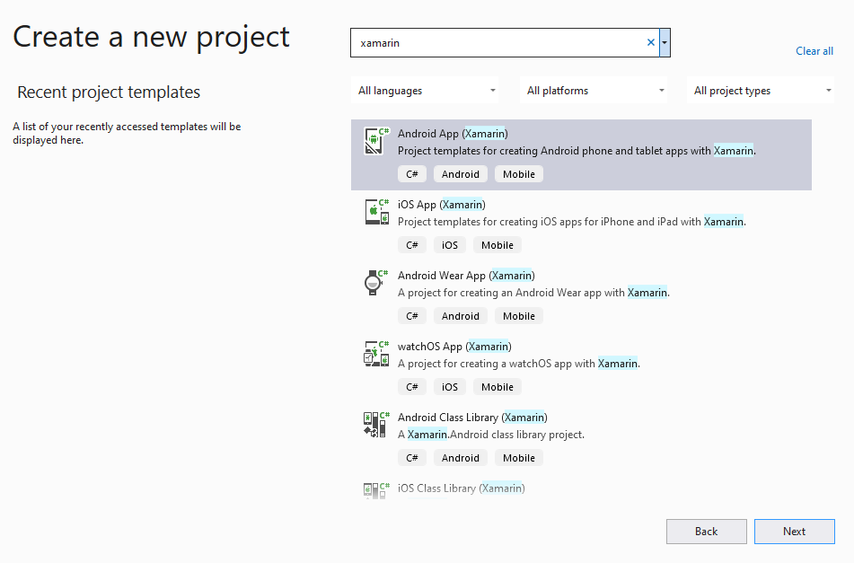

# android-setup

&#x20; To create FlatRedBall Android projects, you must:

1. Install Visual Studio as explained on the **FlatRedBall Downloads page**.
2.  In the Visual Studio Installer, check **Mobile development with .NET**

    
3. If it isn't already installed, click the button to install
4. Wait for the installation to finish.

Once you have finished installing, you can verify that you have Xamarin installed:

1. Open Visual Studio
2. Select **Create a new project**
3.  Search for Xamarin to make sure that Xamarin is installed. If you see search results for Android or iOS development, then it is installed

    

You're al set up. Now you can begin making Android applications. For information on creating a new Android project, see the [main Android page](../../../documentation/tools/glue-reference/multi-platform/glue-how-to-create-a-flatredball-android-project.md). &#x20;
