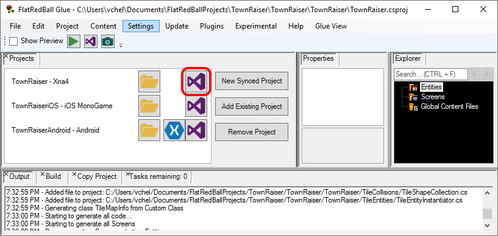
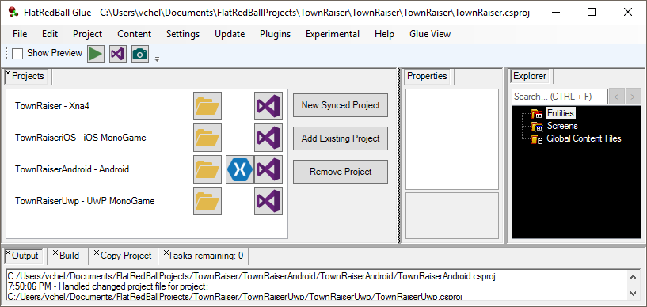

# Synced Projects

### Introduction

Synced Projects provide a way to create and keep multiple projects in sync when working with multiple platforms. Typically the main project is a DesktopGL project, and synced projects would be for other platforms such as Android or Web.

To open a project, click on the icon for the IDE for a given project. For example, the following icon can be used to open the TownRaiser XNA 4 Project:

### New Synced Project

New platforms can be added to an existing project at any point in development by adding a new synced project. To add a new synced project to an existing Glue project:

1.  Open the **Projects** tab by selecting **Project** -> **View Projects**\

    <figure><figcaption>
Projects tab
</figcaption></figure>
2. Click the **New Synced Project** button
3. The New Project window appears. Select the desired platform such as **Web (Browsers)**
4. Enter a name for the project. Typically the name matches the original project's name with the platform appended. For example, MyProjectWeb.
5.  Click the **Create Project!** button.

    

After creating the new synced project, it appears in the Projects tab.

Since FlatRedBall is designed to be syntactically identical across all platforms, most new synced projects compile and run with little or no modifications.

### Synced Project Behavior

New Synced Projects are created using a standard FlatRedBall template for the given platform. In other words, a synced project references FlatRedBall for the given platform in the same way as a new project.

Synced projects can reference pre-built FlatRedBall .dlls (directly or using NuGet), or they can be linked to FlatRedBall source. The following screenshot shows a FlatRedBall Web project linking to the FlatRedBall Engine.

<figure><figcaption>
Synced project linking FlatRedBall source projects
</figcaption></figure>

Synced projects automatically link all source files from the original project. This includes custom and generated code for screens, entities, and global content.&#x20;

<figure><figcaption>
Entity code files linked in a synced project
</figcaption></figure>

Content files are also linked by the synced project.

<figure><figcaption>
Content files in GlobalContent folder linked in a synced project
</figcaption></figure>

NuGet packages are not automatically synced across projects so if you have manually added a NuGet package to your main project, you may also need to add the same package or an alternative package to your synced projects.


Keep in mind that some NuGet packages are not available on all platforms. For example, NAudio does not work on non-windows platforms like Web. You may need to find alternative NuGet packages if one is not available on your target platform. Alternatively you can use conditional compilation symbols as explained in the [Mult-Platform](./#conditional-compilation-symbols) page.


