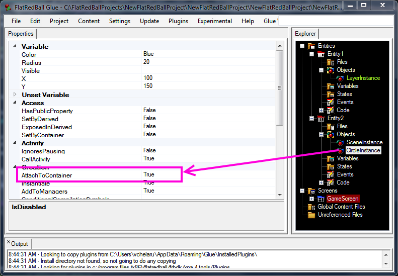

# AttachToContainer

### Introduction

The AttachToContainer property sets whether a contained object attaches to the Entity that contains it. By default this property is set to true for all objects contained in an Entity.

### Setting AttachToContainer to True

This property will appear on all objects which can be attached to their containers in Glue.

<figure><figcaption></figcaption></figure>

### AttachToContainer availability

AttachToContainer is only available on objects inside Entities.
