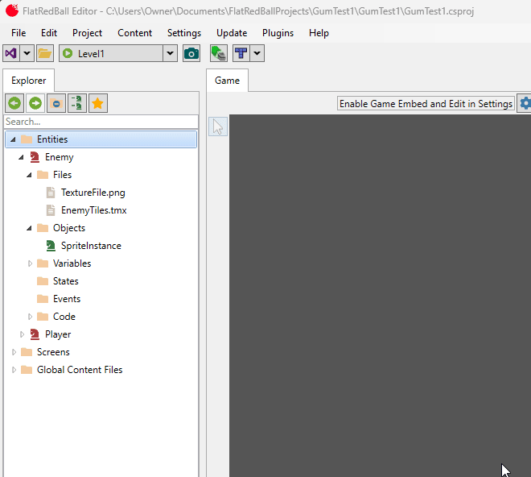

# SourceFile

### Introduction

The SourceFile sets the file that defines a given object.

<figure><figcaption>
Map in Level1 with its SourceType set to File and the SourceFile set to a TMX
</figcaption></figure>

The SourceFile property is a property which controls which file a given object is defined in. This value is only available if the object's [SourceType](../../frb/docs/index.php) is set to "File". If this value is available, then the drop-down lists all files in the containing Screen or Entity. The selected SourceFile determines the available [SourceName](../../frb/docs/index.php).

### SourceFiles in Screen Create References

If a file is added to a Screen, then it is automatically loaded when the Screen is loaded. If that file has a runtime representation, then the runtime representation is automatically created and added to the respective managers. For example, if a Tiled file (tmx) is added to a Screen, then the Tiled file is loaded and its runtime object (MapDrawableBatch) is added to the engine so that it will be drawn.

Therefore, for basic scenarios there is no need to create objects for a file - it will be fully functional just by being part of a Screen.

However, there are a number of situations where you may want to create an object that references the file - either in part or in whole. The following lists a few of these situations:

* A Map object is usually added to GameScreen to allow TileShapeCollections and TileNodeNetwork to reference tile types and layers. This Map has its SourceFile set to the TMX in each level. This is automatically added when creating your project with the wizard.
* A GumScreen object is usually added to GameScreen so that it can be added to a HudLayer. This is automatically added when creating your project with the wizard.
* Individual layers within a tmx file can be referenced for custom game code, such as to reference tiles for logic not provided by entities or TileShapeCollections.

As mentioned above, adding an object that references a file does not create a copy of the object - rather it references the already-loaded file so that the object can be customized in the FRB Editor, refernced by other objects in the FRB Editor, or referenced in code in a type-safe way.

### SourceFiles in Entites Create Copies

Objects in entities can also reference files, but these objects can create clones of the runtime object in the File. To understand why entities create clones, the first thing to remember is that files in both Screens and Entities create static objects in code.

For example, consider a file named TextureFile in the Enemy entity:

<figure><figcaption>
TextureFile in Enemy
</figcaption></figure>

This file produces a static property in the Enemy class with the matching name.

<figure><figcaption>
TextureFile static property in the enemy entity
</figcaption></figure>

Since the TextureFile (and all other files) are static, then all Enemy instances share the same File property. For file types which are often shared, such as Texture2Ds or SoundEffects, this behavior is convenient and sufficient for most games.

By contrast consider a type which has a runtime type, such as a Tiled file which loads into a MapDrawableBatch. If an entity references a TMX file, then it is likely that each instance of the Entity should have its own copy of a MapDrawableBatch. However, although this is likely, it is not guaranteed. Games may include references to files which may have runtime representatoins, but the game may not necessarily want this loaded and attached to the entity.

Objects which have their SourceFile set can control this behavior. To continue the TMX example, if no object is created, then the TMX is loaded into a MapDrawableBatch when the Entity is instantiated, but this loaded MapDrawableBatch does not get added to FlatRedBall. To have this MapDrawableBatch be drawn and attach to the entity, then an object must be created. By creating an object in an entity, this tells FlatRedBall that the game should create a copy of this MapDrawableBatch for each entity instance.

### Creating Objects from Files

To create an object from a file, you can drag+drop the file onto the Objects folder.

<figure><figcaption>
Creating an object from a TMX file
</figcaption></figure>

You can inspect and change the properties on the object in the Properties tab after its creation.

<figure><figcaption>
File properties displayed in the Properties window
</figcaption></figure>

You can identify whether an object is a clone of a file or a reference to a file by inspecting the generated code for the object. For example, the code above for the EntireFile in the Enemy class is assigned to a clone of the file as shown in the following screenshot of the Enemy.Generated.cs file:

<figure><figcaption>
Enemytiles cloned into the EntireFile object
</figcaption></figure>

### Example - Map in GameScreen and Levels

If your game was created with the wizard and if you have a GameScreen, then your game likely has a Map object defined in the GameScreen which is set from file in the derived Level screens. Map is a particularly interesting use case of File objects because it is defined in a game screen but its SourceFile is set on the derived instance.

The Map object in the GameScreen has its source type set to FlatRedBall type. Notice that it also has its SetByDerived property set to true. This combination tells FlatRedBall that this object should be declared in the GameScreen, and that it can be referenced by other objects, but that ultimately it is up to derived classes (Level screens) to instantiate the Map object.

<figure><figcaption>
Map is defined as a LayeredTileMap, but it will not be instantiated in GameScreen
</figcaption></figure>

Each level also has access to the Map object in the FlatRedBall Editor. By default, these derived Level screens instantiate the Map object by referencing the entire TMX.

<figure><figcaption>
Level1 Map instantiated by referencing the Level1Map.tmx
</figcaption></figure>

This _split definition_ (declaration in the base, instantiation in the derived) provides both flexibility and reusability. Each level is free to load its own TMX file, but the shared GameScreen can use the Map to define TileShapeCollections for collision, TileNodeNetworks for pathfinding, and to provide map bounds for the CameraControllingEntityInstance.

### Example - GumScreen in GameScreen

Projects created by the FlatRedBall wizard automatically create a GameScreen which includes a matching Gum screen. This Gum screen is defined in a .gusx file which is added to the GameScreen's Files.

<figure><figcaption>
GameScreenGum.gusx in GameScreen
</figcaption></figure>

As mentioned earlier, the addition of the GameScreenGum file to the GameScreen in the FlatRedBall Editor is all that is needed to have the Gum screen render and be interactive when the game is running. However, if this object is to be customized in the FlatRedBall Editor, then it must be added as an object. By default this is added as an object named GumScreen.

<figure><figcaption>
GumScreen object in GameScreen
</figcaption></figure>

The GumScreen object is created so that its layer can be set. For example, the following screenshot shows the GumScreen added to the HudLayer:

<figure><figcaption>
GumScreen added to the HudLayer
</figcaption></figure>
