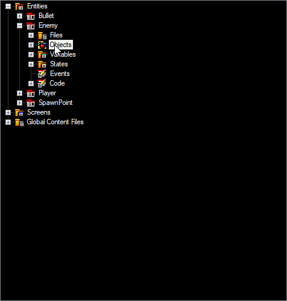

# Circle

### Introduction

The Circle object is commonly used for collision and as a placeholder graphic in game development. Circles can be added to entities which implement the ICollidable interface to act as the entity's collision shape.

### Adding a Circle

To add a circle to an existing entity:

1. Expand the entity
2. Right-click on the entity's **Objects** folder
3. Select **Add Object**
4. Verify the **FlatRedBall or Custom Type** option is selected
5. Select **Circle**
6. Click **OK**

<figure><figcaption></figcaption></figure>

### Adding a Circle to a New Entity

Circles can also be added to a new entity. To do this:

1. Right-click on **Entities**
2. Select **Add Entity**
3. Check the **Circle** option. Notice that this automatically checks the **ICollidable** check box.

