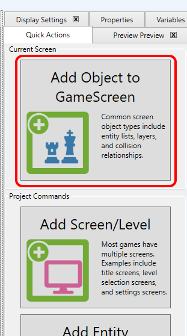
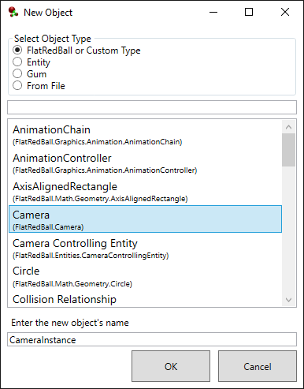

# Camera

### Introduction

Cameras can be added to Screens and Entities. New Camera objects (by default) represent the main Camera ([FlatRedBall.Camera.Main](../../../api/flatredball/camera/main.md)). If an object in an Entity is a [Camera](../../../api/flatredball/camera/), then this (by default) attaches the main Camera to the Entity. If an object in a Screen is a Camera, then this object serves as an alias for FlatRedBall.Camera.Main, but no attachment occurs.


Cameras which are aliases of Camera.Main are rarely added to FlatRedBall projects for two reasons:

1. Resolution is usually handled by the project's [display settings](../../camera.md)
2. Camera position and zoom is usually handled by a [CameraControllingEntity](cameracontrollingentity.md) instance


### Example - Adding a Camera to GameScreen

Cameras added to a Screen can be modified in the FlatRedBall Editor. By default, adding a Camera object to a Screen does not create a new Camera, but rather it provides access to the main Camera. For more information, see the IsNewCamera property below. To access the camera in a Screen:

1. Select the Screen to contain the object. To make changes for all levels, select the GameScreen.
2.  Click the **Add Object** button to add a new object to the screen

    
3.  Select Camera as the type and click OK

    

The new camera appears in the GameScreen. It can be modified to make changes to the game, including in edit mode. For example, the Background Color can be changed from Black to any desired color.

<figure><figcaption>
Camera Background Color can be changed in edit mode
</figcaption></figure>

### IsNewCamera

The IsNewCamera property only appears on Camera objects.

* If this property is false (the default value) then the Camera object is assigned to the main Camera (FlatRedBall.Camera.Main).
* If this property is true, this is a new Camera instance. This is not often used but can be used for split-screen games, or games which use multiple overlayed cameras for control over rendering

###
