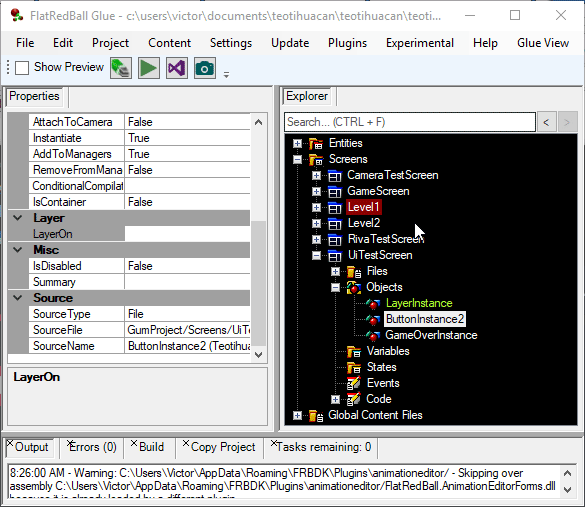

# Layer

### Introduction

Layers are a type of object which can be used to control the order in which visible objects in FlatRedBall are drawn. Most objects sort by their Z value. In other words, objects which are further from the Camera will draw behind objects which are closer to the Camera. Layers allow control over draw order without changing the Z of objects.

Layers are often used to draw certain categories of objects. For example, you may have regular game objects (such as trees, the ground, the sky), a Layer specifically for HUD elements (score, health, ammo), and another Layer for popup screens (pause screen, disconnected controller screen). Layers can also be used to draw visuals in 2D coordinates on top of a 3D Camera.

**For a general tutorial on Layers in Glue**, see the [Using Layers Glue Tutorial](../../../../frb/docs/index.php) page. **For information on using Layers in code**, see the [Layer](../../../../frb/docs/index.php) page.

### Creating a Layer in the FRB Editor

To create a Layer in the FRB Editor:

1. Select a Screen or Entity which will contain the Layer. Usually Layers are added to Screens.
2. Click the Quick Actions tab
3. Click the Add Object button
4. Select **Layer**
5. Click **OK**

<figure><figcaption></figcaption></figure>

### Layer Order

Layers are drawn in the same order that they are added in code. In other words, if Layer1 was added first, then Layer2, Layer1 would draw first, then Layer2 would be drawn on top of Layer1. Similarly, the order of Layers in Glue impacts the order that they are drawn. Layers draw top-to-bottom. Therefore, the first layer when looking at the list of elements in Glue will be drawn first, and any subsequent Layers will be drawn on top.

&#x20;&#x20;

<figure><figcaption></figcaption></figure>

You can adjust the order of layers by right-clicking on a Layer and selecting one of the options to move it:&#x20;

<figure><figcaption></figcaption></figure>

### Adding an Object to a Layer

To add an object to a layer:

1. Make sure you have a Layer in the same Screen as your object
2. Drag+drop the object onto the layer

<figure><figcaption></figcaption></figure>

You can verify that the layer was changed by looking at the **LayerOn** property. Entity instances can be moved to a layer in code using the [MoveToLayer](../../../entities/movetolayer.md) function.
