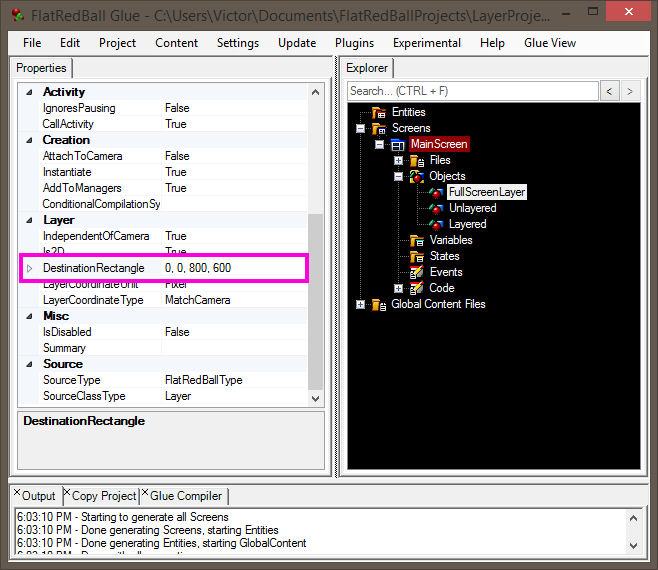
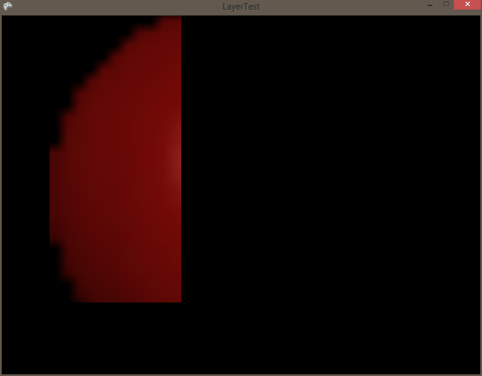

# DestinationRectangle

### Introduction

The DestinationRectangle can be used to make a Layer only draw to part of a Screen. This is often referred to as "masking" or "creating a mask". The DestinationRectangle property in Glue functions the same as in code. For a technical discussion on destination rectangles for Layers, see [this page](../../../../frb/docs/index.php).

### Example Usage

The DestinationRectangle can control the area of the screen where a Layer is drawn. By default the DestinationRectangle is blank in Glue, meaning that the Layer will occupy the same area on screen as the main Camera.

&#x20;&#x20;

<figure><figcaption></figcaption></figure>

This destination rectangle can be changed in Glue. To do this:

1. Right-click on "DestinationRectnagle" in Glue.
2.  An option for "Use Custom Rectangle" should appear\

    <figure><figcaption></figcaption></figure>
3.  Select this option and the Layer will be given a custom rectangle:

    <figure><figcaption></figcaption></figure>

Now that the DestinationRectangle value is there, we can modify it easily by changing one of the four values, or by expanding the DestinationRectangle and modifying each value independently: &#x20;

<figure><figcaption></figcaption></figure>

Consider a Sprite which takes up nearly the entire screen:

<figure><figcaption></figcaption></figure>

If this Sprite were put on the Layer, it would look like this:

<figure><figcaption></figcaption></figure>
