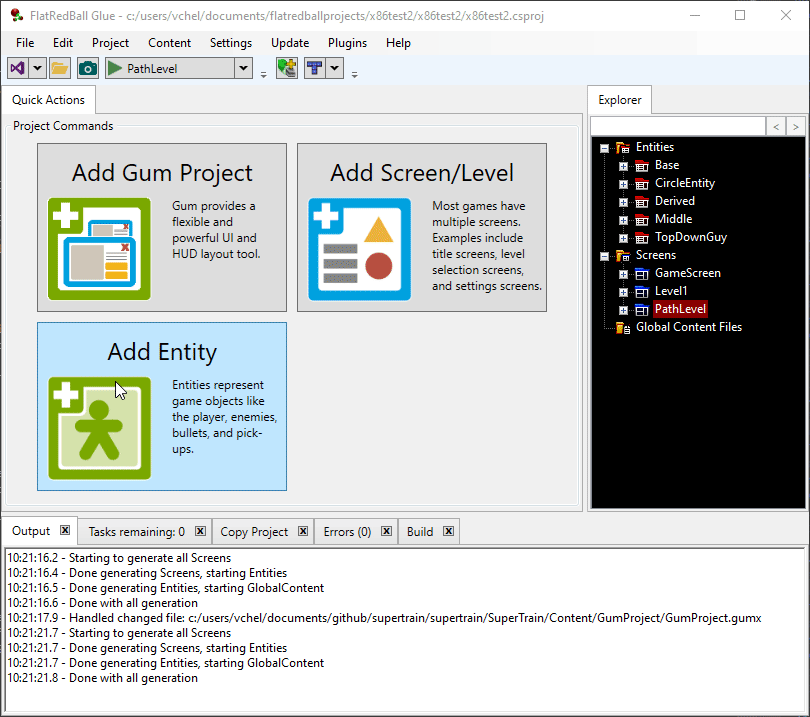
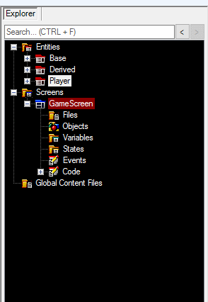
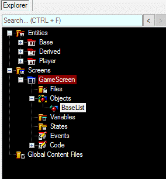

# PositionedObjectList

### Introduction

PositionedObjectLists in Glue represent lists of objects which can be positioned. Positioned objects include:

* Any Entity
* Circles
* AxisAlignedRectangles
* Texts
* Sprites

In code all of the objects mentioned above inherit from the [FlatRedBall.PositionedObject](../../../documentation/api/flatredball/positionedobject.md) class. The list above is just some of the most common types.

### Default Functionality - Glue Creates Lists in GameScreen

By default Glue will attempt to create lists for new entities automatically if the default options are left. For example, the following animation shows that Glue will add a new list to GameScreen when an entity called EnemyEntity is created.

<figure><figcaption></figcaption></figure>

### Creating a PositionedObjectList

Glue provides a number of methods for creating a new PositionedObjectList in a GameScreen

#### Option 1 - Add List to GameScreen Quick Action

If your game has a GameScreen, and if your GameScreen does not already contain a list for an entity, then the Quick Actions tab shows a button to add a list to the GameScreen. Clicking this button will automatically add the list to the GameScreen.

<figure><figcaption></figcaption></figure>

#### Option 2 - Right-Click Drag+Drop

Entity lists can be created by right-click drag+dropping an entity into a screen:

<figure><figcaption></figcaption></figure>

#### Option 3 - Right-click Add Object Menu

PositionedObjectLists can also be created through the regular right-click menu in an screen or entity's **Objects** node:

1. Right-click on **Objects**
2. Select **Add Object**
3. Make sure **FlatRedBall or Custom Type** is selected
4. Select **PositionedObjectList\<T>**
5. Select the type of list to create using the dropdown
6.  Enter the name of the list

    

### Adding to a List

Once a list has been created, instances of the list's type can be added:

1. Right-click on the list
2. Select **Add Object**
3. Glue will only ask for the new instance's name (the type will match the list type), so enter a name and click **OK** 

Instances can also be added to a list by first creating them outside of the list and dragging them onto the list. This is how instances of a derived entity type can be added to a list of a base type:

<figure><figcaption></figcaption></figure>

Instances (of the same type or of derived type) can be added to a list by dragging the entity directly on the list:

<figure><figcaption></figcaption></figure>
