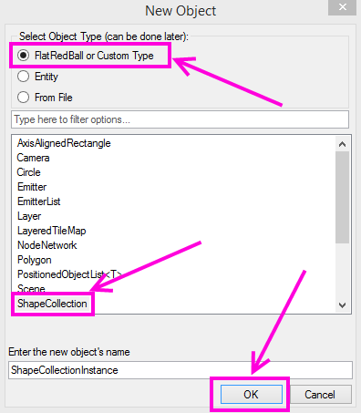

# ShapeCollection

### Introduction

The FlatRedBall Editor supports creating objects of type ShapeCollection. You can create a ShapeCollection by following these steps:

1. Right-click on Objects under a Screen or Entity
2. Select "Add Object"
3. Verify that "FlatRedBall or Custom Type" is selected.
4. Select "ShapeCollection"
5.  Click OK\

    <figure><figcaption>
Add a ShapeCollection through the New Object window
</figcaption></figure>

Note that FlatRedBall also supports the .shcx file format, but this is no longer recommended. The PolygonEditor tool is no longer maintained, and the recommended approach is to add a ShapeCollection as shown above and to modify the shapes using FlatRedBall's LiveEdit.

### Adding Shapes to a ShapeCollection in FlatRedBall

ShapeCollections can have shapes added manually. The ShapeCollection serves as a "list" of shapes, but unlike normal lists, the ShapeCollection can contain multiple types of objects.

To add a new shape to the ShapeCollection:

1. Right-click on the ShapeCollection instance
2. Select **Add Object**
3.  Select one of the shapes - notice that FlatRedBall filters the available types to the types allowed in a ShapeCollection.\

    <figure><figcaption></figcaption></figure>
4. Click OK

Your newly-created shape is added to ShapeCollection in the tree view.

<figure><figcaption>
New AxisAlignedRectangle in ShapeCollection
</figcaption></figure>

### ShapeCollection in code

For information on how to work with a ShapeCollection in code, see [the ShapeCollection page](../../../frb/docs/index.php).
