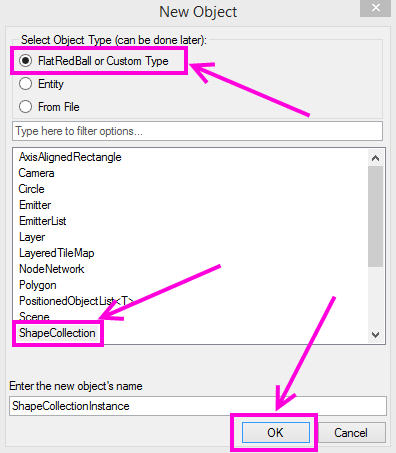

# ShapeCollection

### Introduction

The FlatRedBall Editor supports creating objects of type ShapeCollection. A ShapeCollection groups shapes of mixed types (rectangles, circles, polygons, and lines) so they can be treated as a single unit - collided against with one call, attached to a parent, and shown or hidden together. For a full description of the type, see [the ShapeCollection page](../../../api/flatredball/math/geometry/shapecollection/).

Note that entities which are created as ICollidable automatically have a ShapeCollection named Collision, and all shapes shapes are added to the default Collision shape collection. In this case you do not need to manually create a ShapeCollection. For more information, see the [Implements ICollidable](../../entities/glue-reference-implements-icollidable.md) page.

### Adding a ShapeCollection

To add a ShapeCollection:

1. Right-click on Objects under a Screen or Entity
2. Select **Add Object**
3. Verify that **FlatRedBall or Custom Type** is selected.
4. Select **ShapeCollection**
5.  Click **OK** 

    <figure><figcaption>
Add a ShapeCollection through the New Object window
</figcaption></figure>

Shapes in a ShapeCollection can be positioned and resized visually using FlatRedBall's LiveEdit.

### Adding Shapes to a ShapeCollection in FlatRedBall

ShapeCollections can have shapes added manually. The ShapeCollection serves as a "list" of shapes, but unlike normal lists, the ShapeCollection can contain multiple types of objects.

To add a new shape to the ShapeCollection:

1. Right-click on the ShapeCollection instance
2. Select **Add Object**
3.  Select one of the shapes - notice that FlatRedBall filters the available types to the types allowed in a ShapeCollection. 

    <figure><figcaption></figcaption></figure>
4. Click OK

Your newly-created shape is added to ShapeCollection in the tree view.

<figure><figcaption>
New AxisAlignedRectangle in ShapeCollection
</figcaption></figure>

### ShapeCollection in code

For information on how to work with a ShapeCollection in code, see [the ShapeCollection page](../../../api/flatredball/math/geometry/shapecollection/).
