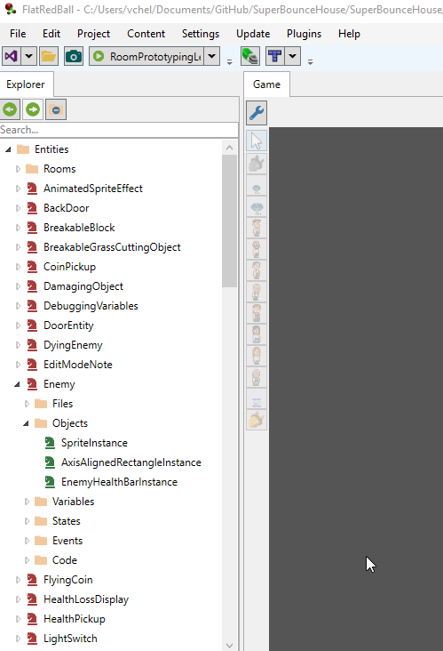

# Variables

### Introduction

Variables allow modifying built-in properties on objects (such as the position of an entity) or the creation and modification of new properties (such as a character's max movement speed). The FRB Editor includes three types of variables:

1. Tunneled variables - variables which can be added to a screen or entity that provide access to a variable of an object contained within the screen or entity
2. New variables - variables which do not have any built-in functionality, but which are added through the editor and used in custom code
3. Exposed variables - variables which are available in code but not available (by default) on an entity. Exposed variables expand the available variables on an entity or screen.

### Adding a Variable

Variables can be added to creens and entities by following these steps:

1. Expand an existing screen or entity
2. Right-click on the Variables folder
3.  Select **Add Variable**

    

This will bring up the **New Variable** window which is used to select the variable type and set options according to the selected variable type.

#### Expose an existing variable

Exposing an existing variable enables editing a variable which would otherwise only be available in code. The variable dropdown provides a list of available variables for the selected object. Note that this type of variable creation is rarely used.

#### Tunnel a variable in a contained object

Tunneled variables enable exposing a variable from a contained object to that it is editable at the entity level. For example, consider an Enemy entity with an AxisAlignedRectangle instance.

You may want to change the color of the AxisAlignedRectangle per instance (or through a State). To do this, you can _tunnel_ in to the variable. To do this:

1. Drag+drop the **AxisAlignedRectangleInstance** onto the **Variables** folder
2. Use the dropdown to select the desired variable - **Color**
3. Optionally - change the **Alternative Name**
4. Click **OK**

Note that variables can be tunneled by right-clicking on the Variables folder, but this drag+drop approach auto-selects the **Tunnel a variable in a contained object** option, and selects the object in the **Object** dropdown.

<figure><figcaption></figcaption></figure>

### Create a new variable

To add a new variable:

1. Right-click on the Variables folder
2. Click the **Create a new variable** option
3. Select the type such as **float**
4. Enter a name such as **MaxSpeed**
5. Click OK
