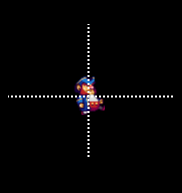

# Components in FlatRedBall Entities

### Introduction

Gum components can be added to FlatRedBall entities without any code or additional setup. A common example of needing a Gum component on a FRB entity is a health bar in a RTS game. Gum components can be thought of as containers which are "Gum on the inside, FlatRedBall on the outside". In other words, internally the Gum component uses the Gum coordinate and rendering system, but the component is attached to an entity which can be positioned like any other FlatRedBall object.

### Adding a Gum Component

Before adding a Gum component to an entity, your project must have a Gum project added. If not, you can add one by clicking the Gum icon.


For this example we will add a component called **HealthBar** to an entity named **Soldier**. It assumes that your project has a Gum component named HealthBar.


To add an instance of the HealthBar component to a FlatRedBall entity:

1. Expand the **Soldier** entity in FlatRedBall
2. Right-click on the **Objects** folder
3. Select **Add Object**
4. Verify the **FlatRedBall or Custom Type** category is selected
5. Select the type **HealthBarRuntime.** FRB provides options for every component in your Gum project, with the word **Runtime** appended to the name. Keep in mind that the search bar can help narrow down the options.
6. Click **OK**

<figure><figcaption></figcaption></figure>

An instance of the HealthBar component will now be a part of the entity and will be attached (moves with) the entity automatically.

<figure><figcaption></figcaption></figure>

### Changing Component Variables

Component variables can be changed in multiple locations depending on the needs of the project. If a component should be the same across the entire project, then its variables should be changed in Gum.


If the component requires changes specific to each entity, then the variables can be changed in FRB.


If a component requires instance-by-instance modifications, it can be modified in code just like any other component Gum object.


### Disabling Entity Attachment

As mentioned above, Gum objects which are added to FRB entities will automatically be attached. This can be disabled by detaching the Gum object from its parent. For example, to detach the HealthBarRuntimeInstance from its parent, the following code could be added to CustomInitialize :

```lang:c#
private void CustomInitialize()
{
    HealthBarRuntimeInstance.Parent = null;
}
```

### Changing Gum Components Attachment at Runtime

Gum components which are part of an entity are attached to the entity itself (which is a PositionedObject ). Gum component attachment can be changed at runtime. The following code changes the HealthBarRuntimeInstance so it is attached to the SpriteInstance instead of the entire entity.

```lang:c#
private void CustomInitialize()
{
    // Every Gum object in a Component has an attachment created for it
    var attachment = this.gumAttachmentWrappers.
        Find(item => item.GumObject == HealthBarRuntimeInstance);
    // Once we have the attachment, we can adjust it to be on the SpriteInstance
    // (or any FlatRedBall PositionedObject)
    attachment.FrbObject = SpriteInstance;

}
```

### Coordinates and Sizes

Gum provides a powerful layout system for positioning objects. Attached Gum objects can take full advantage of this coordinate system. To use Gum layout effectively we must first understand how Gum objects attach to FlatRedBall objects. For starters, consider a simple FRB entity with a single Sprite:


By default the origin of the object is its center. This can be visualized as shown in the following image: &#x20;

<figure><figcaption></figcaption></figure>

We can therefore visualize the behavior of a Gum object that is added to the entity. By default the component will be positioned at 0,0, and the default position values will make its top-left corner align with the center of the entity.


We can change this by adjusting the origin values:

* XOrigin = Center
* YOrigin = Center


Keep in mind that FlatRedBall entities do not have size values (width and height), so adjusting the width of the Gum object to be based on its parent width will result in the Gum object behaving as if its parent has Width and Height values of 0:

* Width = 0
* WidthUnits = RelativeToContainer
* YOrigin = Center


Even though the Gum object is attached to a FlatRedBall object, the Gum object is still drawn using the Gum coordinate system (relative to the FlatRedBall object position). For example, by default Gum objects move down when their Y value is increased (assuming YUnits is not set to inverted).

* XUnits = PixelsFromLeft
* YUnits = PixelsFromTop
* X = 20
* Y = 40


As shown above, Gum objects can be attached to Sprites within an entity. This provides the added benefit of being able to use the Sprite's size for layout. If the Gum object is attached to the sprite (using the code above), then the Gum object will (by default) position itself according to the top-left of the Sprite:

* XUnits = PixelsFromLeft
* YUnits = PixelsFromTop
* X = 0
* Y = 0


We can also reference the Sprite's dimensions by changing the WidthUnits and HeightUnits:

* XUnits = PixelsFromLeft
* YUnits = PixelsFromTop
* X = 0
* Y = 0
* WidthUnits = RelativeToContainer
* Width = 0
* HeightUnits = RelativeToContainer
* Height = 0


Keep in mind that the relationships are updated constantly, so if the Sprite changes size due to an animation, the Gum object will adjust automatically too.

### Attaching to Scalable Entities

Although entities do not have a size by default, entities can implement the IReadOnlyScalable interface to define their size. Implementing IReadOnlyScalable serves as an alternative to attaching to a FlatRedBall Sprite.&#x20;

IReadOnlyScalable can be implemented directly on the entity in custom code as shown in the following code:

```csharp
public partial class Player : IReadOnlyScalable
{
    public float ScaleX => 8;

    public float ScaleY => 16;
    ...
```

The code above returns a Scale of 8 and ScaleY of 16. Keep in mind that Scale values are measured from the center to the edge, so the values above would result in a width of 16 and a height of 32.

Note that FlatRedBall Sprites implement the IReadOnlyScalable interface. If your entity contains a FlatRedBall Sprite, you can use the Scale values from the Sprite in your IReadOnlyScalable implementation. The following code shows how to implement the IReadOnlyScalable interface on an entity called player which has a SpriteInstance:

```csharp
public partial class Player : IReadOnlyScalable
{
    public float ScaleX => SpriteInstance.ScaleX;

    public float ScaleY => SpriteInstance.ScaleY;

    ...
```

The example above shows a simple implementation. An actual implementation can have more features, such as having setters on the scale values, or creating width and height values which are not tied to the SpriteInstance.

### FlatRedBall.Forms in Entities

FlatRedBall.Forms (Gum) components can be added to FlatRedBall Entities just like any other component. If a FlatRedBall.Forms component should be positioned in world space, it can be added to an otherwise-empty entity type, then that entity can be used just like a normal entity.

For example, a DialogBox instance can be positioned in world space by creating an entity in FRB which contains a DialogBox component:

1.  Create a new Entity called DialogBoxContainer in FRB\


    <figure><figcaption><p>DialogBoxEntity</p></figcaption></figure>
2.  Add a DialogBoxRuntime instance to the DialogBoxContainer entity\


    <figure><figcaption><p>Add the DialogBoxRuntime (Gum component) to the DialogBoxEntity</p></figcaption></figure>
3.  For this demo, all of the code to show the dialog will exist in the Player code, so we need to access the internal DialogBoxRuntime (Gum component). Therefore, it should be marked as public. Select the DialogBoxRuntimeInstance object and change its scope to public.\
    \


    <figure><figcaption><p>Make the DialogBoxRuntimeInstance public</p></figcaption></figure>

The DialogBoxRuntime can now be used to show a dialog box on the player. For example, the following code can be added to the Player.cs in a standard platformer project:

```csharp
private void CustomActivity()
{
    if (InputManager.Keyboard.KeyPushed(Microsoft.Xna.Framework.Input.Keys.Enter))
    {
        ShowDialog();
    }
}

private async void ShowDialog()
{
    // Create a new instance:
    var dialogEntity = Factories.DialogBoxEntityFactory.CreateNew();
    // Set the position of the entity at the same place as the player. The rest of the positioning
    // can be done in "Gum coordinates" by accessing the Gum object.
    dialogEntity.Position = this.Position;

    // Access the Gum object - this is why it was made public
    var dialogGumObject = dialogEntity.DialogBoxRuntimeInstance;

    // make it centered horizontally on the player:
    dialogGumObject.XOrigin = RenderingLibrary.Graphics.HorizontalAlignment.Center;

    // make the bottom of the box align with the player
    dialogGumObject.YOrigin = RenderingLibrary.Graphics.VerticalAlignment.Bottom;
    // Move it up by the player Sprite's height
    dialogGumObject.Y = 0 - SpriteInstance.Height;

    // Access the Forms object through the FormsControl property...
    var formsDialog = dialogGumObject.FormsControl;
    // ...so that we can set its text and await for it to be dismissed.
    await formsDialog.ShowAsync(
        "Hello, this is some dialog. Can you believe it? How cool is this? It's so easy to give me movable dialog!");

    // Now that it has been dismissed, we can destroy it:
    dialogEntity.Destroy();
}

```

Whenever the enter key is pressed, a DialogBox instance is created and appears above the player.

<figure><figcaption><p>DialogBox shown above the player</p></figcaption></figure>


