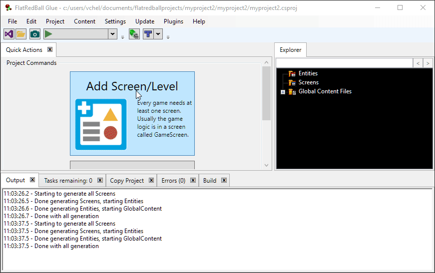

# Adding Gum Screens to FlatRedBall

### Introduction

Many games include a Gum screen for every Glue screen. Gum screens can be used for UI such as buttons and textboxes (usually using FlatRedBall.Forms) or can be used for read-only UI such as score and health display. Screens can be added in a variety of ways, depending on the state of your project.

### Automatic Gum Screen Addition on New Glue Screen

If you have an existing project which already has a Gum project, then by default your project will receive a new Gum screen any time you add a new Glue screen. &#x20;

<figure><figcaption></figcaption></figure>

This behavior is default, and it can be controlled by selecting the .gumx file.

### Adding New Gum Screens to Existing Glue Screens

If you have a Glue screen which does not have an associated Gum screen (for example, if the Screen was created before adding Gum to your project), then you can tell Glue to add a new Gum screen. To do this, select and right-click on the screen, and select the option to create a new Gum screen.

This option will create a new Gum screen and add it both to your Gum project and to the current Glue screen. Glue will follow the standard naming convention and append the word "Gum" to your Glue screen name.

### Adding an Existing Gum Screen to an Existing Glue Screen

If your project already has a Gum screen and a Glue screen and you would like to add the Gum Screen to the Glue screen, you can right-click on the Files and select the option to add the screen.

&#x20; &#x20;
