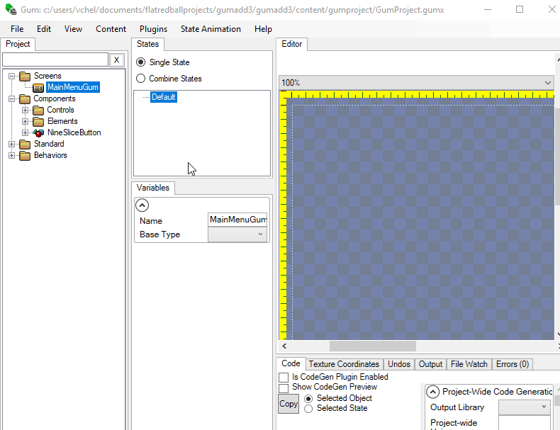

# Events on Gum Objects

### Introduction

So far we've discussed how to use Gum to create screens which can used and interacted with in your FlatRedBall game. This page discusses how to use events to attach custom code to common UI actions such as clicking.

### Gum and FlatRedBall.Forms

Gum objects can be used as UI objects. The most common way to build interactive UI is to use FlatRedBall.Forms - a UI system which mimics WPF in syntax but which uses Gum for the visuals. This tutorial (Events on Gum Objects) was created before FlatRedBall.Forms was available, so it provides instructions on how to build your own interactive Button which responds to clicks. For modern games we recommend using FlatRedBall.Forms instead of building new UI systems from the ground-up using Gum. For information on FlatRedBall.Forms, see the [FlatRedBall.Forms tutorials page](../../tutorials/flatredball-forms/). If you are interested in how the underlying event system works (which is not necessary for most games), feel free to continue reading this tutorial and the next tutorial. If you would like to skip the two events tutorials, you can click here to go to [tutorial 6 on Exposed Variables](tutorials-gum-exposed-variables.md).

### Similarities with IWindow

Although this tutorial is focused on Gum objects, the steps necessary for adding events to Gum objects is identical to the steps necessary for adding events to Entities which implement the IWindow interface. In fact, the GraphicalUiElement class implements the IWindow interface, so you can even add events to it in custom code. For more information on IWindow in Glue, see [the Implements IWindow page.](../../glue-reference/entities/glue-reference-implements-iwindow/)

### Importing a NineSliceButton

This tutorial will use a NineSliceButton, which can be imported from this file (right-click and save the file): [NineSliceButton.gucx](../../content/Tutorials/Gum/NineSliceButton.gucx) To import this file:

1. Save the file to disk somewhere - remember where you saved it.
2. Open Gum
3. Right-click on the Components folder
4.  Select "Import Component"

    
5. Browse for and select the **NineSliceButton.gucx** file that you saved
6. Click OK, and click OK if told that the file will be copied.

The Component should now appear in Gum:


Gum asks to copy your file so that your entire Gum project remains portable. If you would like to save your component, or import future components from the default Components folder, you can right-click on the **Components** folder and select **View in explorer**.


### Adding a Click event to the Button

Next, we need to mark the Button as being clickable. To do this in Gum:

1. Verify **NineSliceButton** is selected
2. Check the **HasEvents** check box


### Adding a NineSliceButton to your Screen

Now that you have a NineSliceButton component, you can add it to your Gum screen:

1. Select the **MainMenuGum** screen
2. Drag+drop the **NineSliceButton** into the edit window of Gum, or onto the MainMenuScreen in the tree view

<figure><figcaption></figcaption></figure>

### Accessing Gum Objects in Your Game

Once you have an object in a Gum screen, you can access it in code by using the GumScreen property which is part of every FlatRedBall screen. GumScreen is automatically generated to provide access to all Gum objects in the related screen. In this case, the screen is MainMenuGum. By typing GumScreen and a period, auto complete provides options for accessing Gum objects in your screen as shown in the following screenshot:


You can subscribe to the Click event by creating a method such as HandleClick, as shown in the following code snippet.

```csharp
void HandleClick(FlatRedBall.Gui.IWindow callingWindow)
{
    GumScreen.NinceSliceButtonInstance.Width++;
}
```

If you run the game now and click on the button you will notice that it gets wider every time it is clicked. Of course, this is not a very practical example. In a real game, you could move to the next screen or switch the logical or visual state of your game elements as appropriate.

**Where is my mouse cursor?** FlatRedBall projects have the mouse cursor invisible by default. To make the mouse cursor visible, see this page: [Microsoft.Xna.Framework.Game#Showing\_Cursor](../../frb/docs/index.php#Showing\_Cursor)

### Diagnosing Problems

The most common reason for events not firing is that the cursor is not actually detecting being over the Gum object with events. To check, you can add the following code in your Screen's CustomActivity:

```csharp
FlatRedBall.Debugging.Debugger.Write(FlatRedBall.Gui.GuiManager.Cursor.WindowOver);
```

Displaying the WindowOver may help you figure out why clicks are not occurring.

#### WindowOver Returns the Parent Window

This tutorial outlines the most basic situation - a single component "floating" in an empty screen. A common setup is to have components which are part of other components (such as a button which is part of a menu). For information on working with events and parent/child components, see the [next tutorial in this series](5-events-on-gum-objects-part-2.md).

#### Events on Components and Standard Elements (Non-Components)

|                   |            |                        |
| ----------------- | ---------- | ---------------------- |
| Gum Type          | Has Events | Expose Children Events |
| Circle            |            |                        |
| Colored Rectangle |            |                        |
| Component         | X          | X                      |
| Container         | X          | X                      |
| Nine Slice        |            |                        |
| Polygon           |            |                        |
| Rectangle         |            |                        |
| Sprite            |            |                        |
| Text              |            |                        |

As shown above, events such as Click are only available on Components and Containers. This means that a free-floating Sprite, ColoredRectangle, or Text object in a Gum screen will not have Gum events raised on it. Note that non-components (such as Containers) can contain instances of components (such as a list of stacked buttons), and those contained components can raise events. The next tutorial will cover events on children components in more depth. Furthermore, note that although a non-component will never raise events (and will not be set as the GuiManager.Cursor.WindowOver ), the HasCursorOver method will still properly check the cursor against the bounds of the calling object.

### Conclusion

Now that you know how to add events to Gum objects you can create a fully functional UI system by combining the visual editing power of Gum with the code generation and project structure features of Glue.
